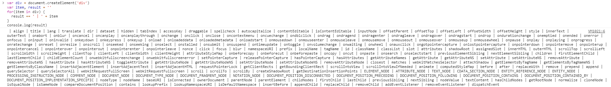

# Virtual DOM

`virtual dom`, 虚拟 `DOM`, 简称 `vdom`

用 `JS` 模拟 `DOM` 结构

`DOM` 变化的对比, 放在 `JS` 层来做

提高重绘性能

### 操作 DOM 代价太高

下面是创建一个 `div`

```js
var div = document.createElement('div')
var item, result = ''
for(item in div) {
  result += ' | ' + item
}
console.log(result)
```

打印结果如下:



- `DOM` 操作是昂贵的, `JS` 运行效率高

- 尽量减少 `DOM` 操作, 而不是 '推倒重来'

- `vdom` 可以解决这个问题

- 将 `DOM` 对比操作放在 `JS` 层, 提高效率

### 用 JS 模拟 DOM 结构

```html
<ul id="list">
  <li class="item">Item 1</li>
  <li class="item">Item 2</li>
</ul>
```

`DOM` 结构如上, 用 `JS` 模拟的 `vdom` 如下:

```js
{
  tag: 'ul',
  attrs: {
    id: 'list'
  },
  children: [
    {
      tag: 'li',
      attrs: { className: 'item' },
      children: ['Item 1']
    },
    {
      tag: 'li',
      attrs: { className: 'item' },
      children: ['Item 2']
    }
  ]
}
```