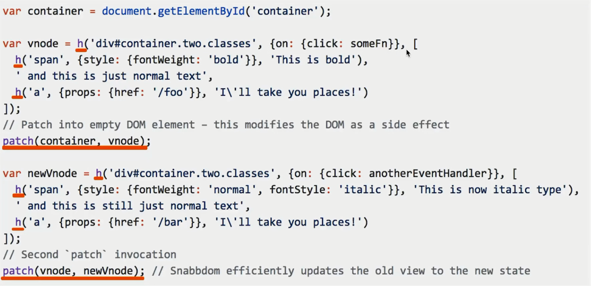
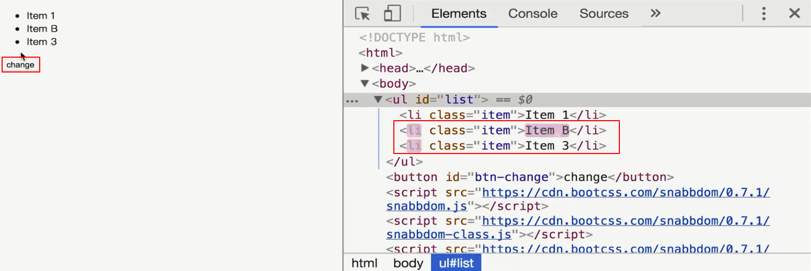
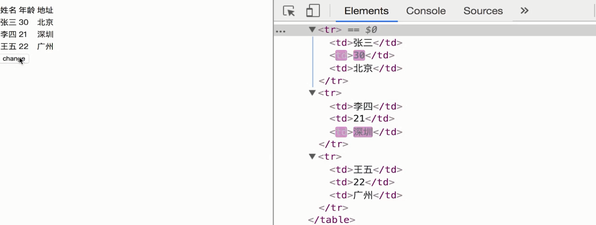

# Snabbdom - Vue 2.0 的虚拟 DOM 方案

`vue 2.0` 的 `虚拟 DOM` 就是基于 [snabbdom](https://github.com/snabbdom/snabbdom).

### snabbdom 核心

`h` 和 `patch` 函数.

`h('<标签名>', {...属性...}, [...子元素...])`

`h('<标签名>', {...属性...}, '...')`

`patch(container, vnode);` 第一次把所有元素生成一个 `vnode` 然后 `patch` 到一个空 `DOM` 元素.

`patch(vnode, newVnode);` 当数据源有所改变, 第二次渲染会重新生成 `newVnode`, `patch` 的时候会进行复杂的对比, 找出需要更新的部分再进行更新.



### snabbdom 原理

- 真实 `DOM` 如下:

```html
<ul id="list">
  <li class="item">Item 1</li>
  <li class="item">Item 2</li>
</ul>
```

- `snabbdom` 的  `h` 函数:

```js
var vnode = h('ul#list', {}, [
  h('li.item', {}, 'Item 1'),
  h('li.item', {}, 'Item 2'),
])
```

- `vdom` 如下:

```js
{
  tag: 'ul',
  attrs: {
    id: 'list'
  },
  children: [
    {
      tag: 'li',
      attrs: { className: 'item' },
      children: ['Item 1']
    },
    {
      tag: 'li',
      attrs: { className: 'item' },
      children: ['Item 2']
    }
  ]
}
```

### snabbdom 完整使用案例

```html
<!DOCTYPE html>
<html>
<head>
    <meta charset="UTF-8">
    <title>Document</title>
</head>
<body>
  <div id="container"></div>
  <button id="btn-change">change</button>

  <script src="https://cdn.bootcss.com/snabbdom/0.7.1/snabbdom.js"></script>
  <script src="https://cdn.bootcss.com/snabbdom/0.7.1/snabbdom-class.js"></script>
  <script src="https://cdn.bootcss.com/snabbdom/0.7.1/snabbdom-props.js"></script>
  <script src="https://cdn.bootcss.com/snabbdom/0.7.1/snabbdom-style.js"></script>
  <script src="https://cdn.bootcss.com/snabbdom/0.7.1/snabbdom-eventlisteners.js"></script>
  <script src="https://cdn.bootcss.com/snabbdom/0.7.1/h.js"></script>
  <script type="text/javascript">
    var snabbdom = window.snabbdom

    // 定义 patch
    var patch = snabbdom.init([
        snabbdom_class,
        snabbdom_props,
        snabbdom_style,
        snabbdom_eventlisteners
    ])

    // 定义 h
    var h = snabbdom.h

    // 定义容器
    var container = document.getElementById('container')

    // 生成 vnode
    var vnode = h('ul#list', {}, [
        h('li.item', {}, 'Item 1'),
        h('li.item', {}, 'Item 2')
    ])

    // 第一次 patch
    patch(container, vnode)

    document.getElementById('btn-change').addEventListener('click', function () {
        // 生成 newVnode
        var newVnode = h('ul#list', {}, [
            h('li.item', {}, 'Item 1'),
            h('li.item', {}, 'Item B'),
            h('li.item', {}, 'Item 3')
        ])
        // 第二次 patch
        patch(vnode, newVnode)
    })
  </script>

</body>
</html>
```

上面代码逻辑是: 利用 `snabbdom` 生成 `ul`, `ul` 下面有两个 `li`, 点击按钮在页面新增一个 `li` 并且改变第二个 `li` 的内容.

从下图可以看出点击按钮, 只有部分 DOM 高亮, 也就是部分发生了改变, 没有全部重新渲染.

**只会修改不同的部分.**



### snabbdom 表格案例

```html
<!DOCTYPE html>
<html>
<head>
    <meta charset="UTF-8">
    <title>Document</title>
</head>
<body>
  <div id="container"></div>
  <button id="btn-change">change</button>

  <script src="https://cdn.bootcss.com/snabbdom/0.7.0/snabbdom.js"></script>
  <script src="https://cdn.bootcss.com/snabbdom/0.7.0/snabbdom-class.js"></script>
  <script src="https://cdn.bootcss.com/snabbdom/0.7.0/snabbdom-props.js"></script>
  <script src="https://cdn.bootcss.com/snabbdom/0.7.0/snabbdom-style.js"></script>
  <script src="https://cdn.bootcss.com/snabbdom/0.7.0/snabbdom-eventlisteners.js"></script>
  <script src="https://cdn.bootcss.com/snabbdom/0.7.0/h.js"></script>
  <script type="text/javascript">
    var snabbdom = window.snabbdom
    // 定义关键函数 patch
    var patch = snabbdom.init([
        snabbdom_class,
        snabbdom_props,
        snabbdom_style,
        snabbdom_eventlisteners
    ])

    // 定义关键函数 h
    var h = snabbdom.h

    // 原始数据
    var data = [
        {
            name: '张三',
            age: '20',
            address: '北京'
        },
        {
            name: '李四',
            age: '21',
            address: '上海'
        },
        {
            name: '王五',
            age: '22',
            address: '广州'
        }
    ]
    // 把表头也放在 data 中
    data.unshift({
        name: '姓名',
        age: '年龄',
        address: '地址'
    })

    var container = document.getElementById('container')

    // 渲染函数
    var vnode
    function render(data) {
        var newVnode = h('table', {}, data.map(function (item) {
            var tds = []
            var i
            for (i in item) {
                if (item.hasOwnProperty(i)) {
                    tds.push(h('td', {}, item[i] + ''))
                }
            }
            return h('tr', {}, tds)
        }))

        if (vnode) {
            // re-render
            patch(vnode, newVnode)
        } else {
            // 初次渲染
            patch(container, newVnode)
        }

        // 存储当前的 vnode 结果
        vnode = newVnode
    }

    // 初次渲染
    render(data)


    var btnChange = document.getElementById('btn-change')
    btnChange.addEventListener('click', function () {
        data[1].age = 30
        data[2].address = '深圳'
        // re-render
        render(data)
    })

  </script>
</body>
</html>
```

**只会修改不同的部分.**

