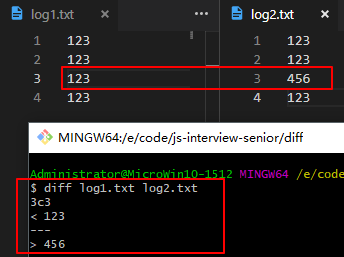
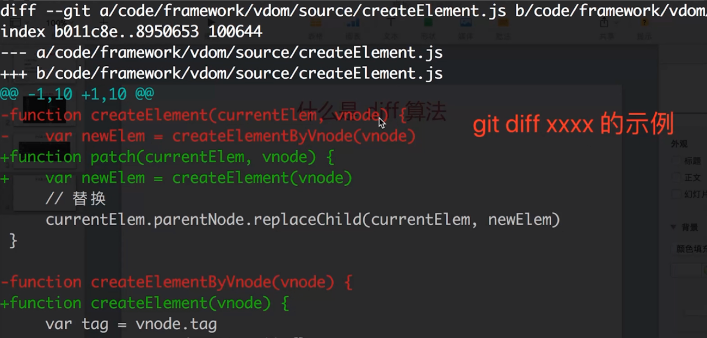
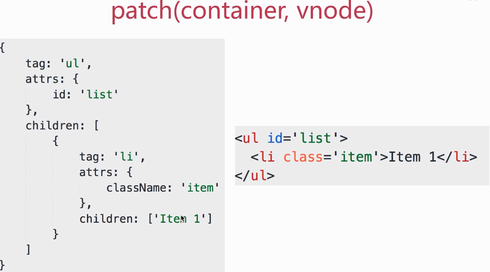
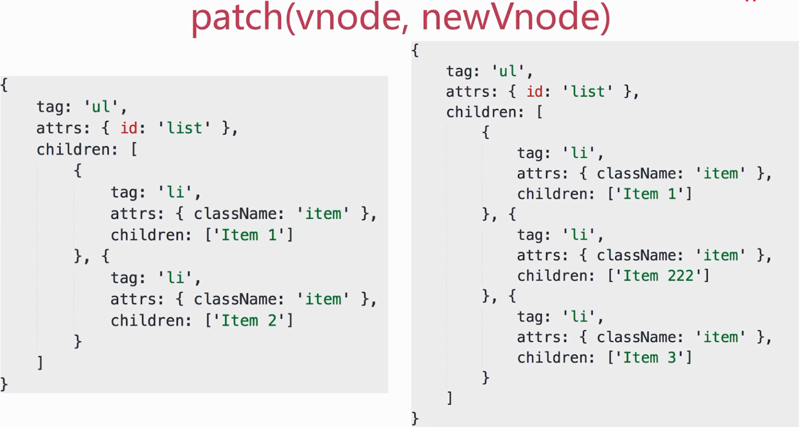
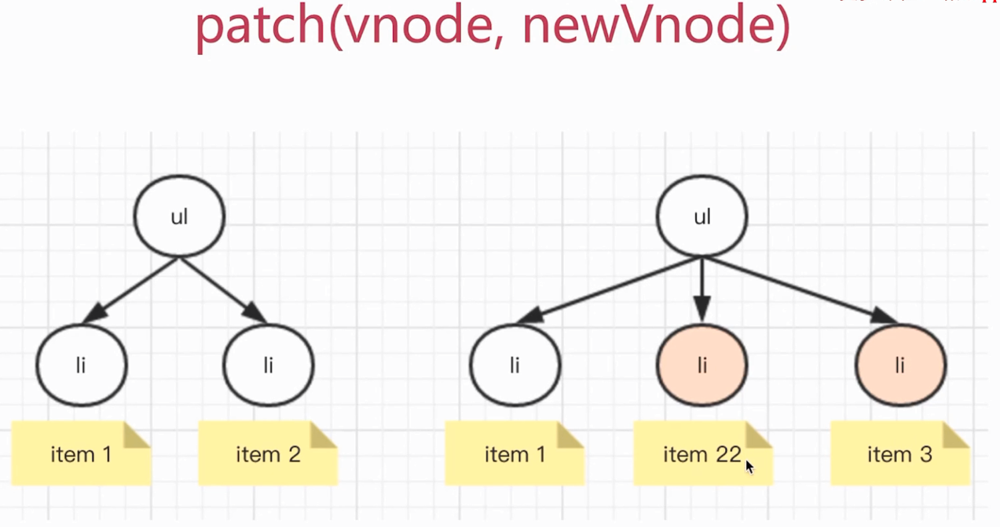

# diff 算法

系统自带的 `diff` 命令查看文本不同:



`git` 的 `diff` 命令查看修改的内容:



### vdom 为什么使用 diff 算法

- `DOM` 操作是 "昂贵的", 因此尽量减少 `DOM` 操作

- 找出本次 `DOM` 必须更新的节点来更新, 其他的不更新

- 这个 "找出" 的过程, 就需要 `diff` 算法

### patch(container, vnode) 把 vnode 生成真实 DOM



伪代码如下:

```js
function createElement(vnode) {
    var tag = vnode.tag  // 'ul'
    var attrs = vnode.attrs || {}
    var children = vnode.children || []
    if (!tag) {
        return null
    }

    // 创建真实的 DOM 元素
    var elem = document.createElement(tag)
    // 属性
    var attrName
    for (attrName in attrs) {
        if (attrs.hasOwnProperty(attrName)) {
            // 给 elem 添加属性
            elem.setAttribute(attrName, attrs[attrName])
        }
    }
    // 子元素
    children.forEach(function (childVnode) {
        // 给 elem 添加子元素
        elem.appendChild(createElement(childVnode))  // 递归
    })

    // 返回真实的 DOM 元素
    return elem
}
```

### patch(vnode, newVnode) 数据变化 newVnode 与 vnode





伪代码如下:

```js
function updateChildren(vnode, newVnode) {
    var children = vnode.children || []
    var newChildren = newVnode.children || []
    // 遍历现有的 children
    children.forEach(function (childVnode, index) {
        var newChildVnode = newChildren[index]
        if (childVnode.tag === newChildVnode.tag) {
            // 深层次对比，递归
            updateChildren(childVnode, newChildVnode)
        } else {
            // 替换
            replaceNode(childVnode, newChildVnode)
        }
    })
}

function replaceNode(vnode, newVnode) {
    var elem = vnode.elem  // 真实的 DOM 节点
    var newElem = createElement(newVnode)

    // 替换
}
```

`updateChildren` 不仅仅是以上:

- 节点新增和删除

- 节点重新排序

- 节点属性、样式、事件绑定

- 如何极致压榨性能

### diff 实现过程

- `patch(container, vnode)`

- `patch(vnode, newVnode)`

- `createElement`

- `updateChildren`