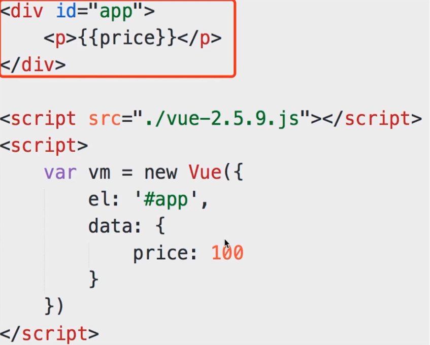
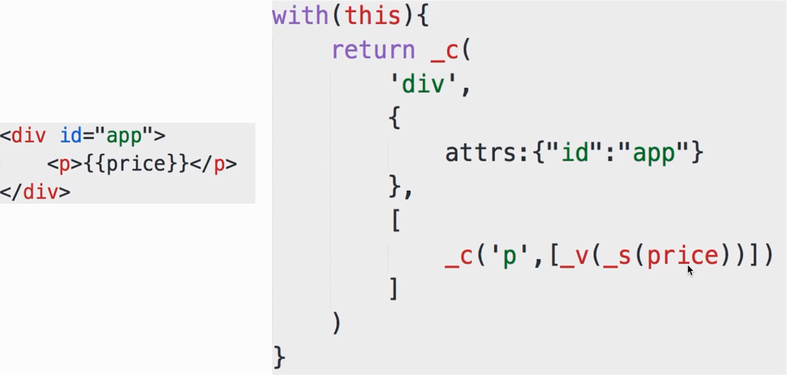

# Vue 的 render 函数

### with 的使用

`Vue` 为了让代码简洁用了 `with`.

```js {17}
var obj = {
  name: 'zhangsan',
  age: 20,
  getAddress: function () {
      alert('beijing')
  }
}

// function fn() {
//   alert(obj.name)
//   alert(obj.age)
//   obj.getAddress()
// }
// fn()

function fn1() {
  with(obj) {
    alert(age)
    alert(name)
    getAddress()
  }
}
fn1()
```

### render 函数

- 模版中所有信息都包含在 `render` 函数中

- `this` 即 `vm`

- `price` 即 `this.price` 即 `vm.price`, 即 `data` 中的 `price`

- `_c` 即 `this._c` 即 `vm._c`





```html
<!DOCTYPE html>
<html>

<head>
  <meta charset="UTF-8">
  <title>Document</title>
  <script src="./vue-2.5.13.js"></script>
</head>

<body>
  <div id="app">
    <p>{{price}}</p>
  </div>

  <script>
    var vm = new Vue({
      el: '#app',
      data: {
        price: 100
      }
    })

    // 以下是手写 render 函数
    function render() {
      with(this) { // this._c, this 就是 vm
        return _c(
          'div', {
            attrs: {
              'id': 'app'
            }
          },
          [
            _c('p', [_v(_s(price))])
          ]
        )
      }
    }

    function render1() {
      return vm._c( // vm._c
        'div', {
          attrs: {
            'id': 'app'
          }
        },
        [
          vm._c('p', [vm._v(vm._s(vm.price))])
        ]
      )
    }
  </script>
</body>

</html>
```