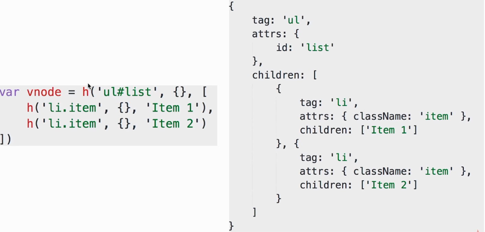
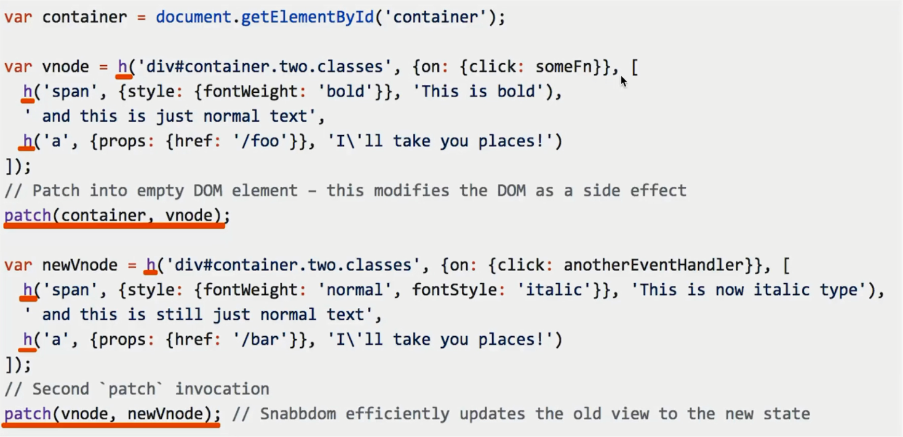
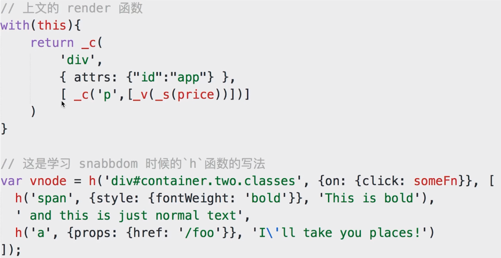
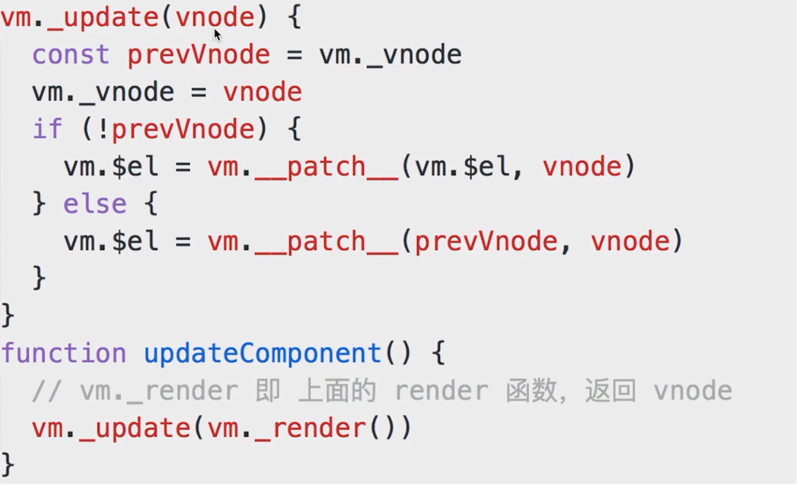

# Vue render 后模版生成 html

### snabbdom 的 h 函数和 patch 函数

`h` 函数:

`patch` 函数:

### Vue 中的 render 和 vdom

### Vue 中的 vm.__patch__ 和 vdom 的 patch

- `updateComponent` 中实现了 `vdom` 的 `patch`

- 页面首次渲染执行 `updateComponent`

- `data` 中每次修改属性, 执行 `updateComponent`

