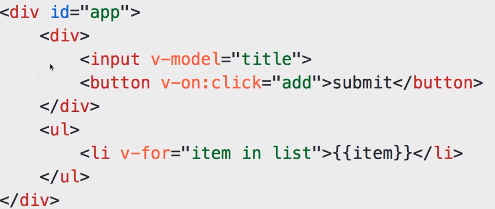
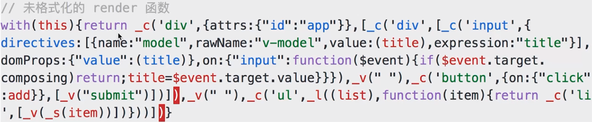
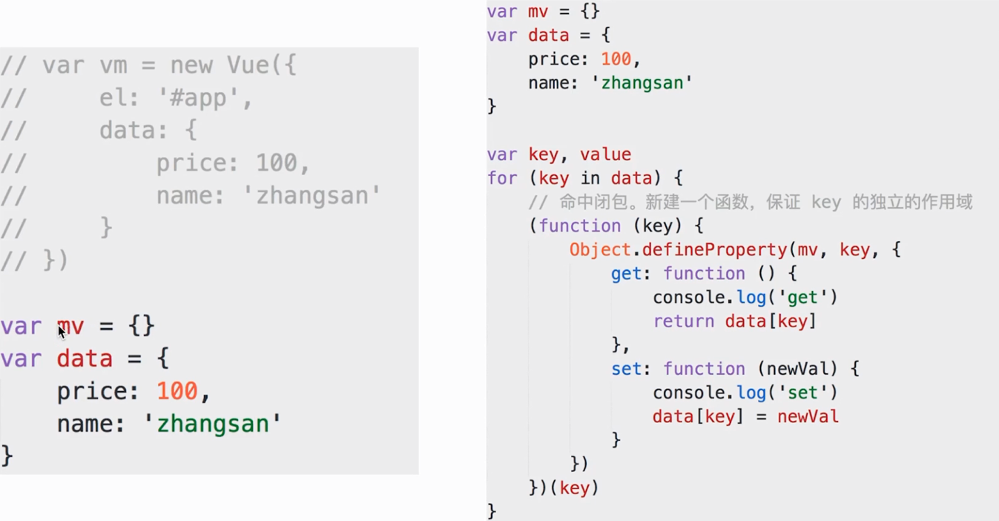
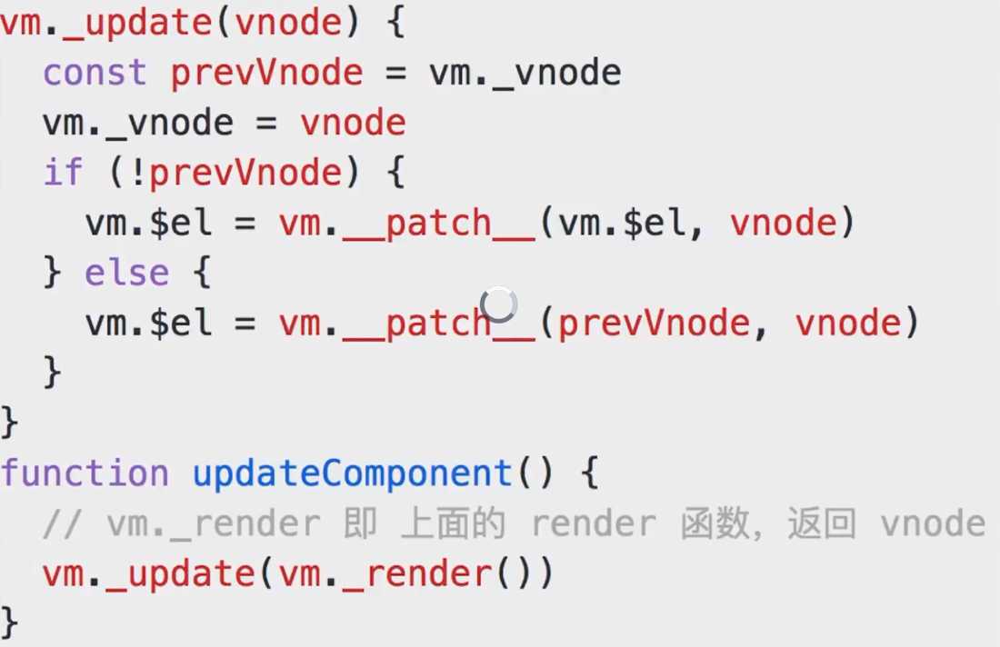
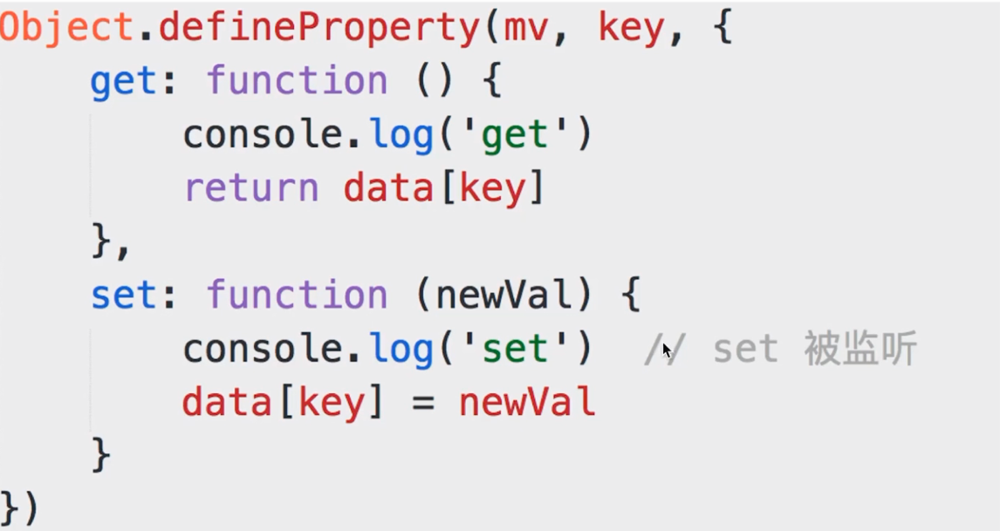
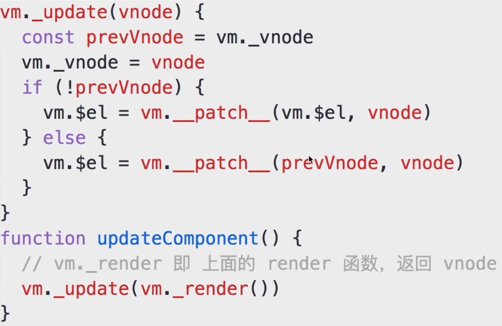

# Vue 的整个实现流程

- **第一步**: 解析模版成 `render` 函数

- **第二步**: 响应式开始监听

- **第三步**: 首次渲染, 显示页面, 且绑定依赖

- **第四步**: `data` 属性变化, 触发 `rerender`

- 修改属性, 被响应式的 `set` 监听到

- `set` 中执行 `updateComponent`

- `updateComponent` 重新执行 `vm._render()`

- 生成的 `vnode` 和 `prevVnode`, 通过 `patch` 进行对比

- 渲染到 `html` 中

