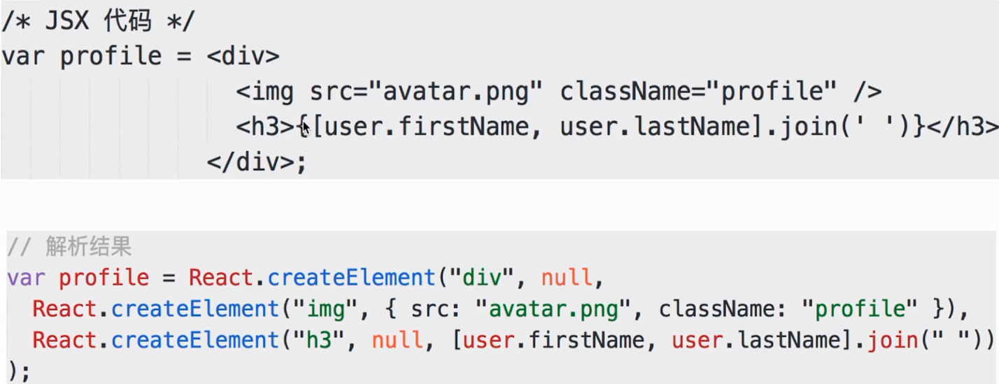
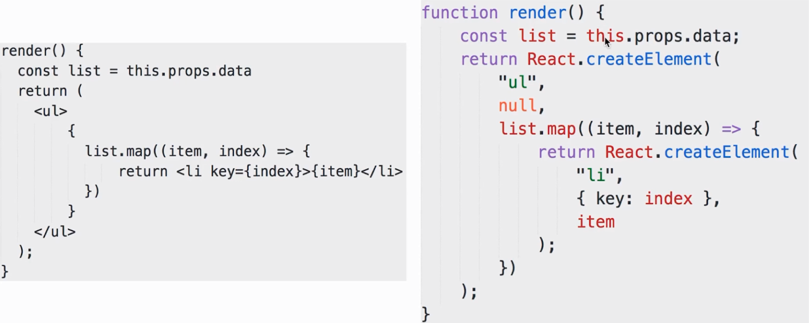
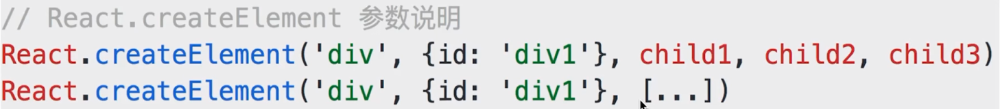

# JSX 本质

### JSX 语法

- `html` 形式

- 引入 `JS` 变量和表达式

- `if...else...`

- 循环

- `style` 和 `className`

- 事件

- `JSX` 语法根本无法被浏览器所解析

### JSX 解析

- `JSX` 其实是语法糖

- 开发环境会将 `JSX` 编译成 `JS` 代码

- `JSX` 的写法大大降低了学习成本和编码工作量

- 同时, `JSX` 也会增加 `debug` 成本



含有 `map` 的:





### JSX 独立的标准

- `JSX` 是 `React` 引入的, 但不是 `React` 独有的

- `React` 已经将它作为一个独立标准开放, 其他项目也可用

- `React.createElement` 是可以自定义修改的

- 说明: 本身功能已经完备; 和其他标准兼容和扩展性没有问题

### babel-plugin-transform-react-jsx

用 `babel-plugin-transform-react-jsx` 编译 `JSX`

```js
class Input extends Component {
  render() {
    return (
      <div>
          <input value={this.state.title} onChange={this.changeHandle.bind(this)}/>
          <button onClick={this.clickHandle.bind(this)}>submit</button>
      </div>
    );
  }
}
```

执行 `babel --plugins transform-react-jsx demo.jsx` 后输出如下:

```js
class Input extends Component {
  render() {
    return React.createElement(
      "div",
      null,
      React.createElement("input", { value: this.state.title, onChange: this.changeHandle.bind(this) }),
      React.createElement(
        "button",
        { onClick: this.clickHandle.bind(this) },
        "submit"
      )
    );
  }
}
```

- 解析 `JSX`

```js
var profile = <div>
  
  <h3>{[user.firstName, user.lastName].join(' ')}</h3>
</div>;
```

执行 `babel --plugins transform-react-jsx demo.jsx` 后输出如下:

```js
var profile = React.createElement(
  "div",
  null,
  React.createElement("img", { src: "avatar.png", className: "profile" }),
  React.createElement(
    "h3",
    null,
    [user.firstName, user.lastName].join(' ')
  )
);
```