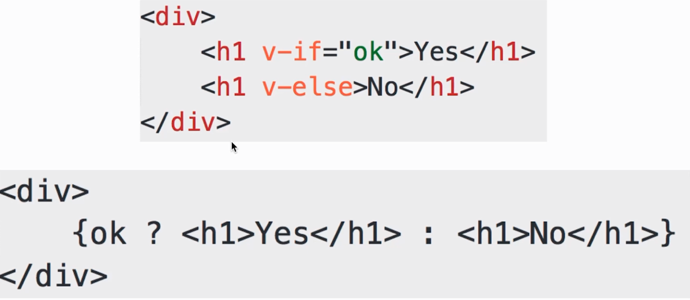
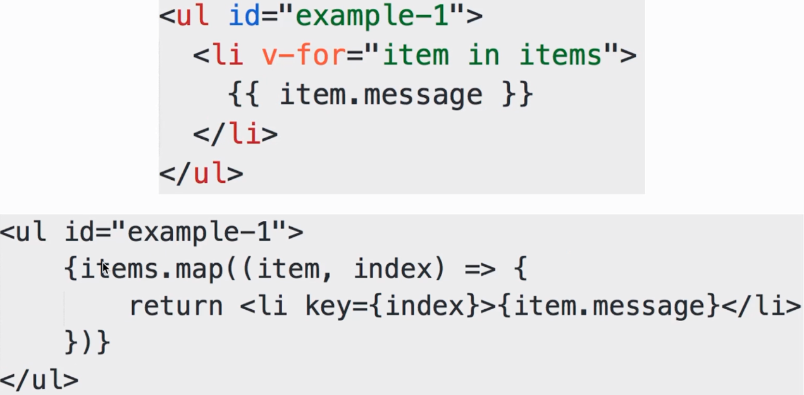

# React 和 Vue 对比

- 技术选型没有绝对的对与错

- 技术选型要考虑的因素非常多

- 要有自己的主见, 要有理由

### 两者的本质区别

- `Vue` - 本质是 `MVVM` 框架, 由 `MVC` 发展而来

- `React` - 本质是前端组件化框架, 由后端组件化发展而来

- 但这并不妨碍他们两者都能实现相同的功能

### 模版的区别

- `Vue` - 使用模版(最初由 `angular` 提出)

- `React` - 使用 `JSX`(已经标准化)

- 模版语法上, 更倾向于 `JSX`

- 模版分离上, 更倾向于 `Vue`

### 组件化的区别

- `React` 本身就是组件化, 没有组件化就不是 `React`

- `Vue` 也支持组件化, 不过是在 `MVVM` 上的扩展, 最最开始是没有组件化的

### 两者共同点

- 都支持组件化

- 都是数据驱动视图

### 选型

国内使用, 首推 `Vue`. 文档更易读、易学、社区够大

如果团队水平较高, 推荐使用 `React`. 组件化 和 `JSX`