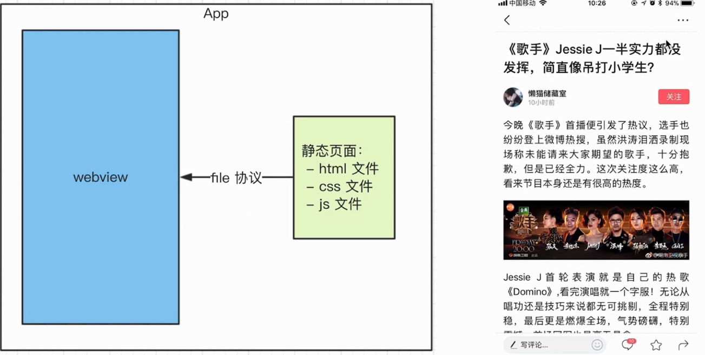

# Hybrid 介绍

- `hybrid` 即 "混合", 即前端和客户端的混合开发

- 需前端开发人员和客户端开发人员配合完成

- 某些环节也可能涉及到 `server` 端

### hybrid 存在价值

- 可以快速迭代更新 (无需 `app` 审核)

- 体验流畅(和 `Native` 的体验基本类似)

- 减少开发和沟通成本, 双端公用一套代码

### webview

- 是 `app` 中的一个组件(`app` 可以有 `webview`, 也可以没有)

- 用户加载 `h5` 页面, 即一个小型的浏览器内核

`webview` 你可以比作浏览器, 有很多种, 实现也不一样, 统称而已.

### file 协议

`file:///C:/baiduyundowload/index.html`, 注意开 `/` 的个数.

`file://` 协议规范

`/C:/baiduyundowload/index.html` 文件的路径

- `file` 协议: 本地协议, 快

- `http(s)` 协议: 网络加载, 慢

### hybrid 具体实现

- 不是所有场景都适合使用 `hybrid`

- 使用 `Native`: 体验要求极致, 变化不频繁(如头条的首页)

- 使用 `hybrid`: 体验要求高, 变化频繁(如头条的新闻详情页)

- 使用 `h5`: 体验无要求, 不常用(如举报、反馈等页面)

- 前端做好静态页面(`html` `js` `css`), 将文件交给客户端

- 客户端拿到前端静态页面, 以文件形式存储在 `app` 中

- 客户端在一个 `webview` 中

- 使用 `file` 协议加载静态页面

