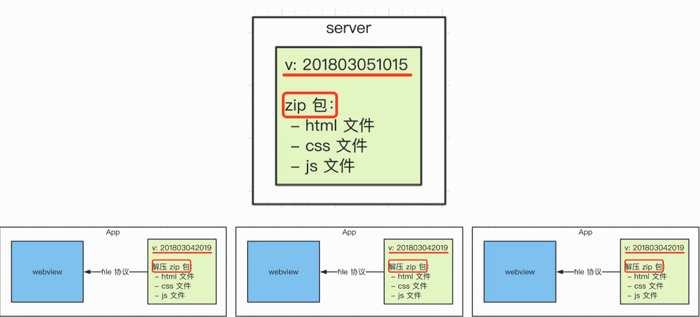

# Hybrid 更新上线流程

- 要替换每个客户端的静态文件

- 只能客户端来做(`app` 客户端是我们开发的)

- 客户端去 `server` 下载最新的静态文件

- 我们维护 `server` 的静态文件

### 完整流程

- 分版本, 有版本号, 如 201808081105

- 将静态文件压缩成 `zip` 包, 上传到服务端

- 客户端每次启动, 都去服务端检查版本号

- 如果服务端版本号大于客户端版本号, 就去下载最新的 `zip` 包

- 下载完成之后解压包, 然后将现有文件覆盖

