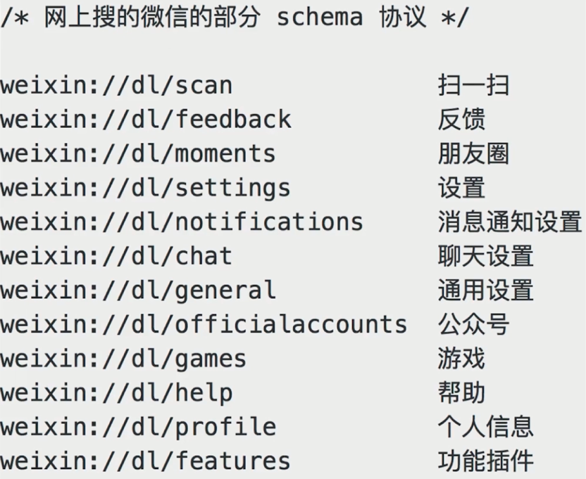

# JS 和客户端通讯

新闻详情页适用 hybrid, 前端如何获取新闻内容?

- 不能用 ajax 获取. 第一跨域, 第二速度慢

- 客户端获取新闻内容, 然后 JS 通讯拿到内容, 再渲染

### JS 和客户端通讯的基本形式

通讯的基本形式: 调用能力, 传递参数, 监听回调

对 `schema` 协议的理解和使用

调用 `schema` 代码的封装

内置上线的好处: 更快、更安全

- JS 访问客户端能力, 传递参数和回调函数

- 客户端通过回调函数返回内容


### schema 协议简介

- `schema` 协议: 前端和客户端通讯的约定




### schema 封装


- `schema.html`

```html
<!DOCTYPE html>
<html>
<head>
    <meta charset="UTF-8">
    <meta name="viewport" content="width=device-width, user-scalable=no, initial-scale=1">
    <title>Document</title>
</head>
<body>
    <button id="btn1">扫一扫</button>
    <button id="btn2">分享</button>

    <script type="text/javascript" src="./invoke.js"></script>
    <script type="text/javascript">
        // function invokeScan() {
        //     window['_invoke_scan_callback_'] = function (result) {
        //         alert(result)
        //     }

        //     var iframe = document.createElement('iframe')
        //     iframe.style.display = 'none'
        //     // iframe.src = 'weixin://dl/scan'  // 重要！
        //     iframe.src = 'weixin://dl/scan?k1=v1&k2=v2&k3=v3&callback=_invoke_scan_callback_'
        //     var body = document.body
        //     body.appendChild(iframe)
        //     setTimeout(function () {
        //         body.removeChild(iframe)
        //         iframe = null
        //     })
        // }

        document.getElementById('btn1').addEventListener('click', function () {
            // invokeScan()
            window.invoke.scan({}, function () {})
        })
        document.getElementById('btn2').addEventListener('click', function () {
            window.invoke.share({
                title: 'xxx',
                content: 'yyy'
            }, function (result) {
                if (result.errno === 0) {
                    alert('分享成功')
                } else {
                    alert(result.message)
                }
            })
        })
    </script>
</body>
</html>
```

- `invoke.js`

```js
(function (window, undefined) {

    // 调用 schema 的封装
    function _invoke(action, data, callback) {
        // 拼装 schema 协议
        var schema = 'myapp://utils/' + action

        // 拼接参数
        schema += '?a=a'
        var key
        for (key in data) {
            if (data.hasOwnProperty(key)) {
                schema += '&' + key + data[key]
            }
        }

        // 处理 callback
        var callbackName = ''
        if (typeof callback === 'string') {
            callbackName = callback
        } else {
            callbackName = action + Date.now()
            window[callbackName] = callback
        }
        schema += 'callback=callbackName'

        // 触发
        var iframe = document.createElement('iframe')
        iframe.style.display = 'none'
        iframe.src = schema  // 重要！
        var body = document.body
        body.appendChild(iframe)
        setTimeout(function () {
            body.removeChild(iframe)
            iframe = null
        })
    }

    // 暴露到全局变量
    window.invoke = {
        share: function (data, callback) {
            _invoke('share', data, callback)
        },
        scan: function (data, callback) {
            _invoke('scan', data, callback)
        }
        login: function (data, callback) {
            _invoke('login', data, callback)
        }
    }

})(window)
```

### 内置上线

- 将以上封装的代码打包, 叫做 `invoke.js` 内置到客户端

- 客户端每次启动 `webview`, 都默认执行 `invoke.js`

- 本地加载, 免去网络加载的时间, 更快

- 本地加载, 没有网络请求, 黑客看不到 `schema` 协议, 更安全