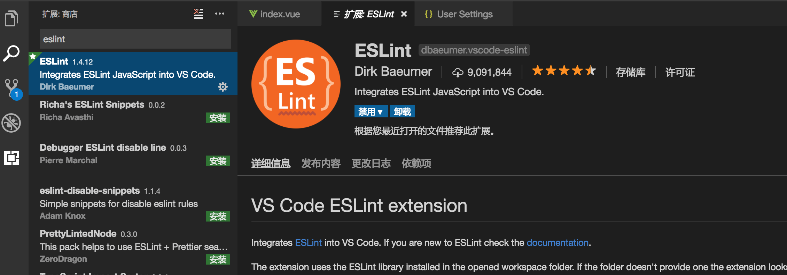
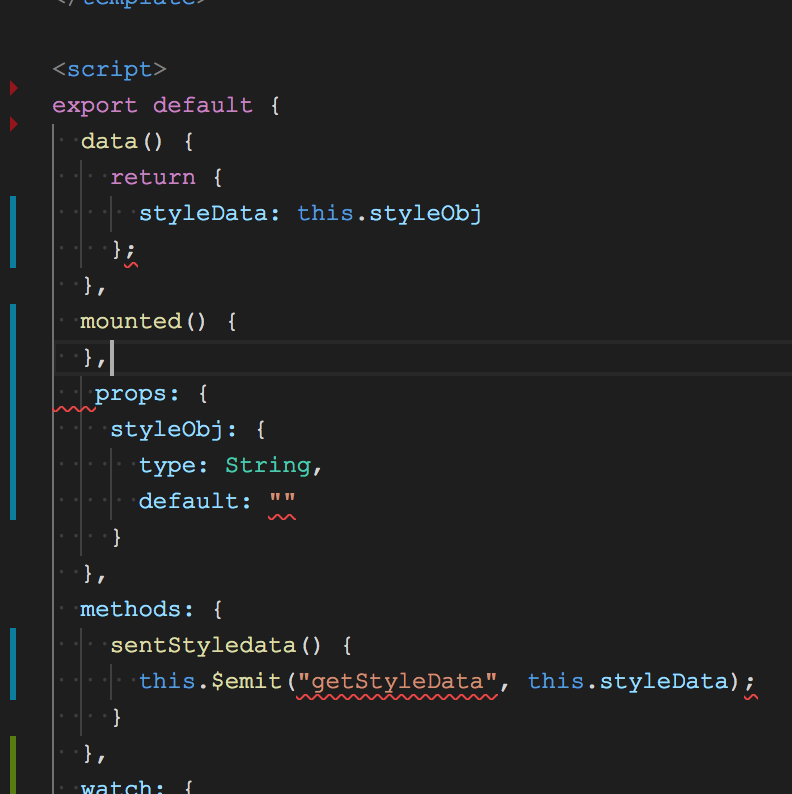
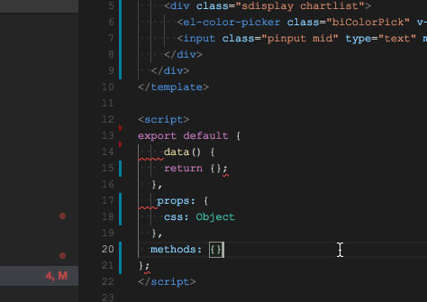

# eslint

[eslint 规则官网](https://eslint.org/docs/rules/)

## eslint 自动格式化

首先，在我们项目跟目录添加 `.eslintrc.js` 文件，用于校验代码，编写 `eslint` 相关规则，关于 `eslint` 的一些具体规则，请查看 `eslint` [文档](https://eslint.org/docs/rules/)

下面列一下我们项目中常用的 `eslint` 规则：

```js
module.exports = {
  root: true,
  parser: 'babel-eslint',
  extends: 'eslint:recommended',
  // required to lint *.vue files
  plugins: [
    'html'
  ],

  // add your custom rules here
  //it is base on https://github.com/vuejs/eslint-config-vue
  'rules': {
    'accessor-pairs': 2,
    'arrow-spacing': [2, {
      'before': true,
      'after': true
    }],
    'block-spacing': [2, 'always'],
    'brace-style': [2, '1tbs', {
      'allowSingleLine': true
    }],
    'camelcase': [0, {
      'properties': 'always'
    }],
    'comma-dangle': [2, 'never'],
    'comma-spacing': [2, {
      'before': false,
      'after': true
    }],
    'comma-style': [2, 'last'],
    'constructor-super': 2,
    'curly': [2, 'multi-line'],
    'dot-location': [2, 'property'],
    'eol-last': 2,
    'eqeqeq': [2, 'allow-null'],
    'generator-star-spacing': [2, {
      'before': true,
      'after': true
    }],
    'handle-callback-err': [2, '^(err|error)$'],
    'indent': [2, 2, {
      'SwitchCase': 1
    }],
    'jsx-quotes': [2, 'prefer-single'],
    'key-spacing': [2, {
      'beforeColon': false,
      'afterColon': true
    }],
    'keyword-spacing': [2, {
      'before': true,
      'after': true
    }],
    'new-cap': [2, {
      'newIsCap': true,
      'capIsNew': false
    }],
    'new-parens': 2,
    'no-array-constructor': 2,
    'no-caller': 2,
    'no-console': 'off',
    'no-class-assign': 2,
    'no-cond-assign': 2,
    'no-const-assign': 2,
    'no-control-regex': 0,
    'no-delete-var': 2,
    'no-dupe-args': 2,
    'no-dupe-class-members': 2,
    'no-dupe-keys': 2,
    'no-duplicate-case': 2,
    'no-empty-character-class': 2,
    'no-empty-pattern': 2,
    'no-eval': 2,
    'no-ex-assign': 2,
    'no-extend-native': 2,
    'no-extra-bind': 2,
    'no-extra-boolean-cast': 2,
    'no-extra-parens': [2, 'functions'],
    'no-fallthrough': 2,
    'no-floating-decimal': 2,
    'no-func-assign': 2,
    'no-implied-eval': 2,
    'no-inner-declarations': [2, 'functions'],
    'no-invalid-regexp': 2,
    'no-irregular-whitespace': 2,
    'no-iterator': 2,
    'no-label-var': 2,
    'no-labels': [2, {
      'allowLoop': false,
      'allowSwitch': false
    }],
    'no-lone-blocks': 2,
    'no-mixed-spaces-and-tabs': 2,
    'no-multi-spaces': 2,
    'no-multi-str': 2,
    'no-multiple-empty-lines': [2, {
      'max': 1
    }],
    'no-native-reassign': 2,
    'no-negated-in-lhs': 2,
    'no-new-object': 2,
    'no-new-require': 2,
    'no-new-symbol': 2,
    'no-new-wrappers': 2,
    'no-obj-calls': 2,
    'no-octal': 2,
    'no-octal-escape': 2,
    'no-path-concat': 2,
    'no-proto': 2,
    'no-redeclare': 2,
    'no-regex-spaces': 2,
    'no-return-assign': [2, 'except-parens'],
    'no-self-assign': 2,
    'no-self-compare': 2,
    'no-sequences': 2,
    'no-shadow-restricted-names': 2,
    'no-spaced-func': 2,
    'no-sparse-arrays': 2,
    'no-this-before-super': 2,
    'no-throw-literal': 2,
    'no-trailing-spaces': 2,
    'no-undef': 2,
    'no-undef-init': 2,
    'no-unexpected-multiline': 2,
    'no-unmodified-loop-condition': 2,
    'no-unneeded-ternary': [2, {
      'defaultAssignment': false
    }],
    'no-unreachable': 2,
    'no-unsafe-finally': 2,
    'no-unused-vars': [2, {
      'vars': 'all',
      'args': 'none'
    }],
    'no-useless-call': 2,
    'no-useless-computed-key': 2,
    'no-useless-constructor': 2,
    'no-useless-escape': 0,
    'no-whitespace-before-property': 2,
    'no-with': 2,
    'one-var': [2, {
      'initialized': 'never'
    }],
    'operator-linebreak': [2, 'after', {
      'overrides': {
        '?': 'before',
        ':': 'before'
      }
    }],
    'padded-blocks': [2, 'never'],
    'quotes': [2, 'single', {
      'avoidEscape': true,
      'allowTemplateLiterals': true
    }],
    'semi': [2, 'never'],
    'semi-spacing': [2, {
      'before': false,
      'after': true
    }],
    'space-before-blocks': [2, 'always'],
    'space-before-function-paren': [2, 'never'],
    'space-in-parens': [2, 'never'],
    'space-infix-ops': 2,
    'space-unary-ops': [2, {
      'words': true,
      'nonwords': false
    }],
    'spaced-comment': [2, 'always', {
      'markers': ['global', 'globals', 'eslint', 'eslint-disable', '*package', '!', ',']
    }],
    'template-curly-spacing': [2, 'never'],
    'use-isnan': 2,
    'valid-typeof': 2,
    'wrap-iife': [2, 'any'],
    'yield-star-spacing': [2, 'both'],
    'yoda': [2, 'never'],
    'prefer-const': 2,
    'no-debugger': process.env.NODE_ENV === 'production' ? 2 : 0,
    'object-curly-spacing': [2, 'always', {
      objectsInObjects: false
    }],
    'array-bracket-spacing': [2, 'never']
  }
}
```

本项目基本规范是依托于 `vue` 官方的 `eslint` 规则 `eslint-config-vue` 做了少许的修改。你也可以进行一些属于你自己的定制，

例如：目前使用缩进是 `2` 个空格，假如你觉得 `4` 个更顺眼，你可以如下修改

```js
  'indent': [4, 4, {
    'SwitchCase': 2 // 针对switch case的缩进
  }],
```

其次，`vscode` 中添加 `eslint` 和 `vetur` 插件：



安装好了之后，会自动根据你上面配置的规则进行代码检查，不合格的会高亮显示，如下图：



经过上面步骤，目前保存还不能自动格式化，下面说下如何自动格式化.

## 自动格式化

**window 电脑**：

文件 > 首选项 > 设置 打开 `VSCode` 配置文件

**mac 电脑**:

`code` -> 首选项 -> 设置

```js
{
  "editor.tabSize": 2,
  "files.associations": {
      "*.vue": "vue"
  },
  "eslint.autoFixOnSave": true,
  "eslint.options": {
      "extensions": [
          ".js",
          ".vue"
      ]
  },
"eslint.validate": [
    "javascript",{
        "language": "vue",
        "autoFix": true
    },"html",
    "vue"
],
  "search.exclude": {
      "**/node_modules": true,
      "**/bower_components": true,
      "**/dist": true
  },
  "emmet.syntaxProfiles": {
      "javascript": "jsx",
      "vue": "html",
      "vue-html": "html"
  },
  "git.confirmSync": false,
  "window.zoomLevel": 0,
  "editor.renderWhitespace": "boundary",
  "editor.cursorBlinking": "smooth",
  "editor.minimap.enabled": true,
  "editor.minimap.renderCharacters": false,
  "editor.fontFamily": "'Droid Sans Mono', 'Courier New', monospace, 'Droid Sans Fallback'",
  "window.title": "${dirty}${activeEditorMedium}${separator}${rootName}",
  "editor.codeLens": true,
  "editor.snippetSuggestions": "top",
}
```

这样，你就可以保存自动按照配置格式化代码了，体验如下：



## 关闭 eslint 检查

关于关闭 `eslint`，其实不是本节的内容，本节目的是开启，并自动格式化和检查！假如你实在是想关闭的话，设置方法如下：

1、`vue create` 的项目

在 `vue.config.js` 中

```js
lintOnSave: false
```

2、以前的项目，`vue init webpack` 的

`config/index.js` 文件。 将

```js
useEslint: true
```

设置为

```js
useEslint: false
```

即可

## 其他推荐

其他团队也有自己的代码规范方式例如饿了么团队：`https://www.npmjs.com/package/eslint-config-elemefe`

`vue` 团队：`https://github.com/vuejs/eslint-config-vue`

关于vscode扩展插件，目前通用的，不错的推荐看这篇文章：`varHarrie/varharrie.github.io#10`

::: tip 原文链接:
[https://github.com/confidence68/blog/issues/289](https://github.com/confidence68/blog/issues/289), by confidence68.
:::