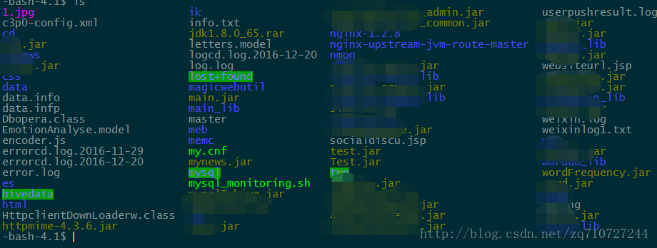
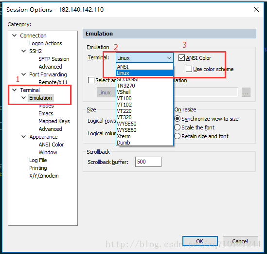
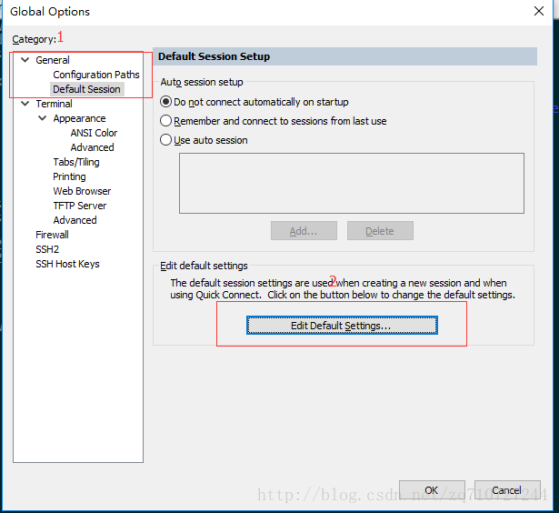
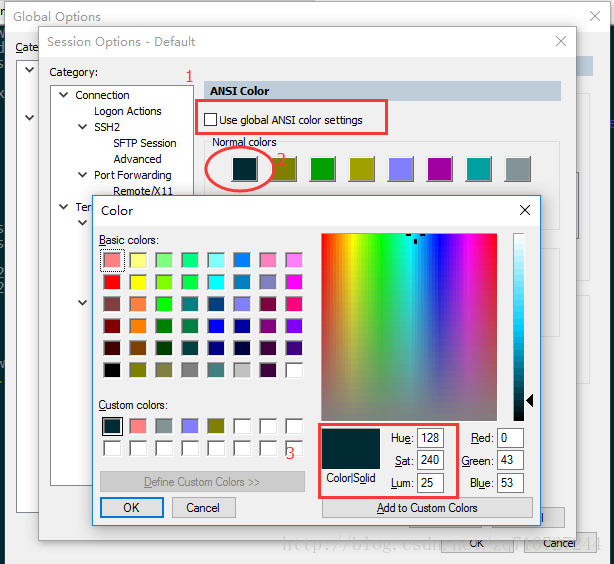
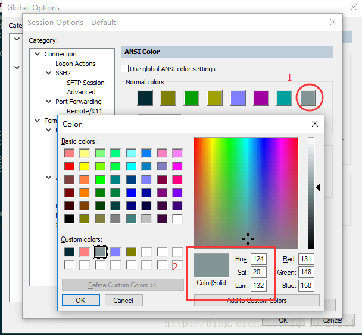
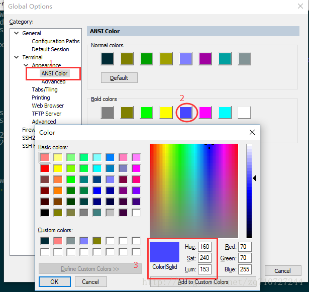
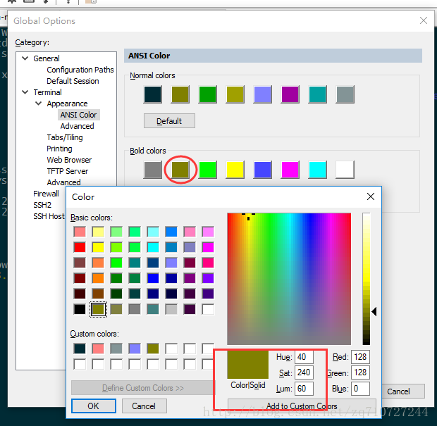
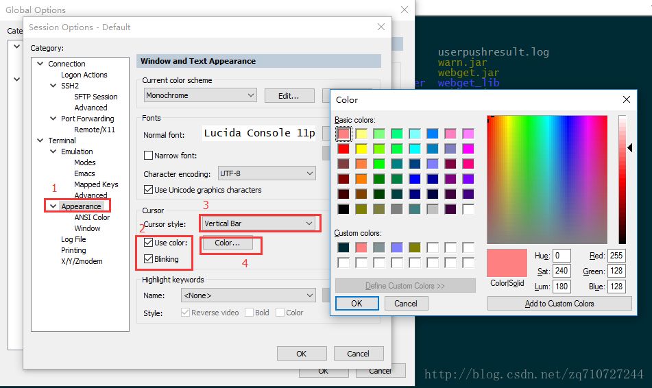

# SecureCRT 配色设置

- 效果图

- 设置背景颜色和字体颜色

选项(`Options`) -> 会话选项(`Sessions options`) -> 终端(`Terminal`) -> 仿真(`Emulation`)

选项(`Options`) -> 全局选项(`Global options`) -> 一般(`General`) -> 默认会话(`defualt session`) -> 点击 `Edit Defualt Setting`

进去第一步先将 `use global ANSI color settings` 的勾去掉，否则无法编辑这些颜色，第二遍点击第一个颜色块配置背景颜色，我用的颜色数据如第三步 `128`、`240`、`25`，也可以配置自己喜欢的颜色

接下来配置字体颜色，点击最后一块颜色块步骤同样，如图：

**注意设置完之后要将之前取消的勾点上！！**

- 配置文件夹等颜色

选项(`Options`) -> 全局选项(`Global options`) -> 终端(`Terminal`) -> 外观(`Apperance`) -> ANSI颜色(`ANSI Color`)

点击第二行的第五个颜色块，修改文件夹颜色：

同样的操作第二块颜色块，修改压缩包和 `jar` 包的颜色：

如果文件夹等颜色设置完之后没有效果，可以在设置背景颜色和字体颜色那里第二行的颜色块进行同样的操作试试看！

设置完之后发现光标看着很不方便所以顺便把光标设置了一下：

第2步把两项勾上，后面一项是设置光标闪烁，第3步是设置鼠标样式，下拉框选择有长的短的粗的细的，第4步点击`color` 设置自己想要的颜色就OK了！

:::tip 原文链接
[SecureCRT配色推荐和永久设置](https://blog.csdn.net/zq710727244/article/details/53909801)
:::