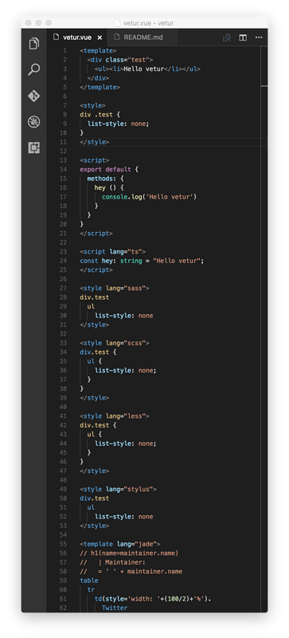
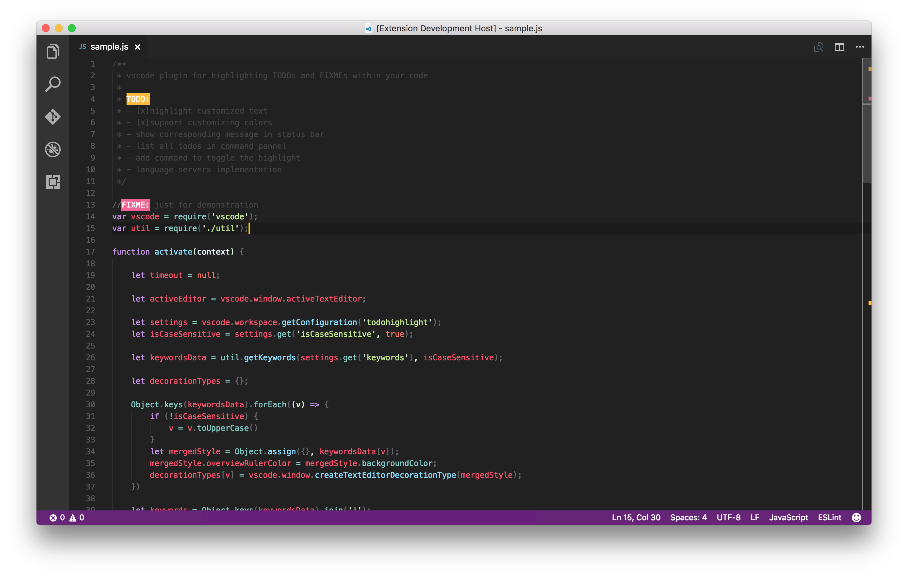
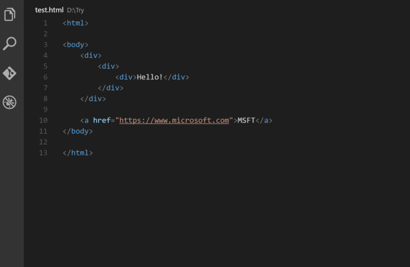
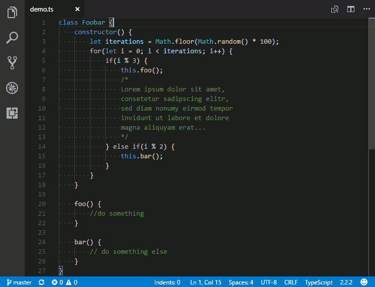
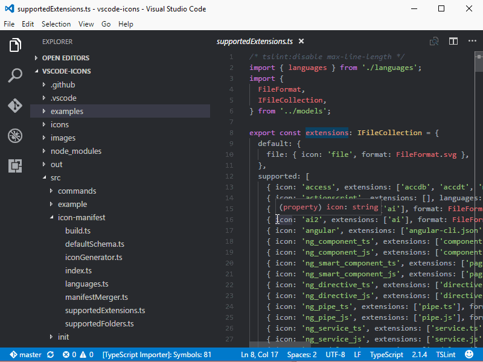
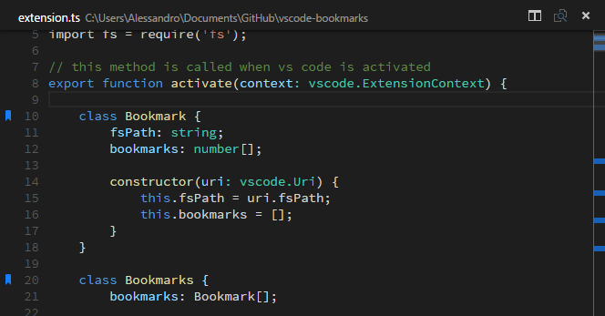
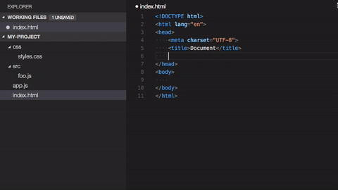
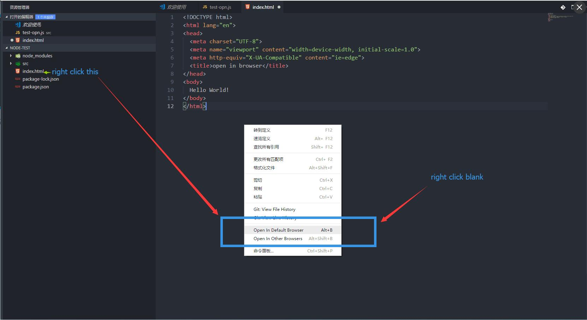
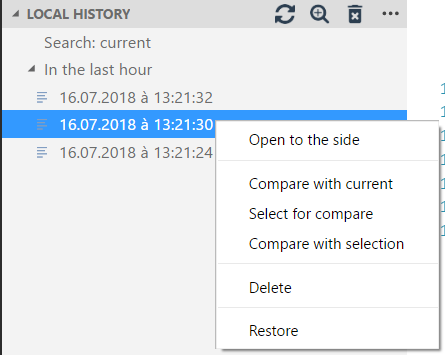

# vscode 插件

[官方-插件库地址](https://marketplace.visualstudio.com/search?target=VSCode&category=Themes&sortBy=Downloads)

## vetur 配置 vue

## filesize 文件大小

## Bracket Pair Colorizer 括号配对着色

## Indent Rainbow 彩虹缩进

## Todo Highlighter 高亮

## Import Cost 导入查看大小

## Auto Close Tag 自动闭合标记

## Auto Rename Tag 自动闭合标记

## Indenticator 缩进指示器

## VSCode Icons 图标

## Live Server 本地开发服务器

## Bookmarks 标记

## Path Intellisense 路径提示

## Settings Sync 设置同步

## open-in-browser 用浏览器打开

## fileheader 文件作者信息

## Local History 本地历史

## GitLens 配置git

## Prettier for VSCode 代码格式化

## markdownlint 语法检查