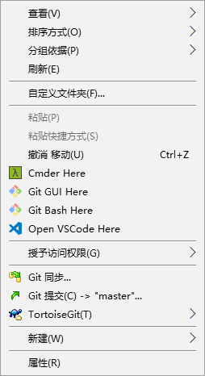

# windows 下右键 vscode 打开

新建 `vscoe.reg` 文件, 内容如下:

其中 `C:\\soft\\MicrosoftVSCode\\Code.exe` 修改为你 `vscode` 安装目录, 然后双击执行文件.

```bash
Windows Registry Editor Version 5.00

[HKEY_CLASSES_ROOT\Directory\Background\shell\VSCode]
@="Open VSCode Here"
"Icon"="C:\\soft\\MicrosoftVSCode\\Code.exe"

[HKEY_CLASSES_ROOT\Directory\Background\shell\VSCode\command]
@="C:\\soft\\MicrosoftVSCode\\Code.exe ."

[HKEY_CLASSES_ROOT\Directory\shell\VSCode]
@="Open VSCode Here"
"Icon"="C:\\soft\\MicrosoftVSCode\\Code.exe"

[HKEY_CLASSES_ROOT\Directory\shell\VSCode\command]
@="C:\\soft\\MicrosoftVSCode\\Code.exe %1"
```

