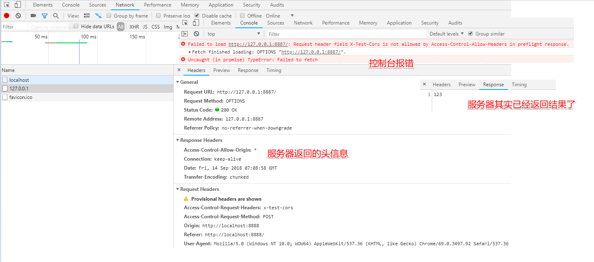
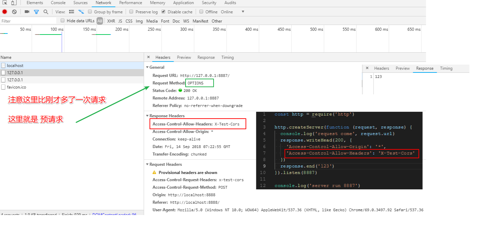
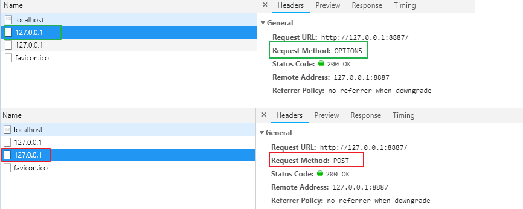
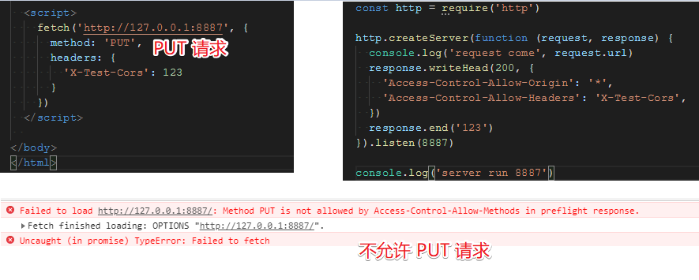
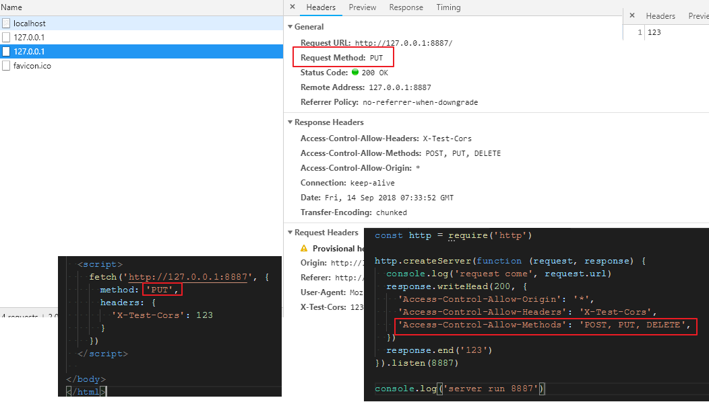

# CORS 跨域限制以及预请求验证

### X-Test-Cors

- `server.js` 不变

```js
const http = require('http')
const fs = require('fs')
http.createServer(function (request, response) {
  console.log('request come', request.url)

  const html = fs.readFileSync('test.html', 'utf-8')
  response.writeHead(200, {
    'Content-Type': 'text/html'
  })
  response.end(html)
}).listen(8888)

console.log('server run 8888')
```

- `server2.js` 不变

```js
const http = require('http')

http.createServer(function (request, response) {
  console.log('request come', request.url)
  response.writeHead(200, {
    'Access-Control-Allow-Origin': '*'
  })
  response.end('123')
}).listen(8887)

console.log('server run 8887')
```

- `test.html`

修改为 `fetch` 方式, 设置 `headers: { 'X-Test-Cors': 123 }`

```html
<!DOCTYPE html>
<html lang="en">
<head>
  <meta charset="UTF-8">
  <title>Document</title>
</head>
<body>
  <script>
    fetch('http://127.0.0.1:8887', {
      method: 'POST',
      headers: {
        'X-Test-Cors': 123
      }
    })
  </script>
</body>
</html>
```

- 浏览器报错信息:

```js
Failed to load http://127.0.0.1:8887/: Request header field X-Test-Cors is not allowed by Access-Control-Allow-Headers in preflight response.
(index):24 Fetch finished loading: OPTIONS "http://127.0.0.1:8887/".
(anonymous) @ (index):24
(index):1 Uncaught (in promise) TypeError: Failed to fetch
```



### CORS 预请求

- 跨域时, 允许的方法只有 `GET` `HEAD` `POST`.

- 跨域时, 允许的 `Content-Type` 有 `text/plain` `multipart/form-data` `application/x-www-form-urlencoded`

- 其他限制:

请求头限制

`XMLHttpRequestUpload` 对象均没有注册任何事件监听器

请求中没有使用 `ReadableStream` 对象

### 增加 'Access-Control-Allow-Headers': 'X-Test-Cors'

其他文件不变, `server2.js` 增加 `'Access-Control-Allow-Headers': 'X-Test-Cors'`

```js
const http = require('http')

http.createServer(function (request, response) {
  console.log('request come', request.url)
  response.writeHead(200, {
    'Access-Control-Allow-Origin': '*',
    'Access-Control-Allow-Headers': 'X-Test-Cors'
  })
  response.end('123')
}).listen(8887)

console.log('server run 8887')
```

- 浏览器对跨域请求的预请求

会先发送一个 `OPTIONS` 请求, 服务端根据不同的 `methods` 进行不同的操作.

利用 `OPSTIONS` 请求获得服务端认可, 实际发送 `POST` 请求





- 设置 `Methods`





- 设置 `Max-Age`

`'Access-Control-Max-Age': '1000',` 表示 `1000 s` 不需要再发预请求.

```js
const http = require('http')

http.createServer(function (request, response) {
  console.log('request come', request.url)
  response.writeHead(200, {
    'Access-Control-Allow-Origin': '*',
    'Access-Control-Allow-Headers': 'X-Test-Cors',
    'Access-Control-Allow-Methods': 'POST, PUT, DELETE',
    'Access-Control-Max-Age': '1000',
  })
  response.end('123')
}).listen(8887)

console.log('server run 8887')
```