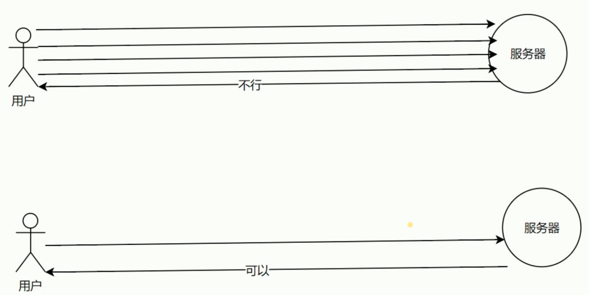
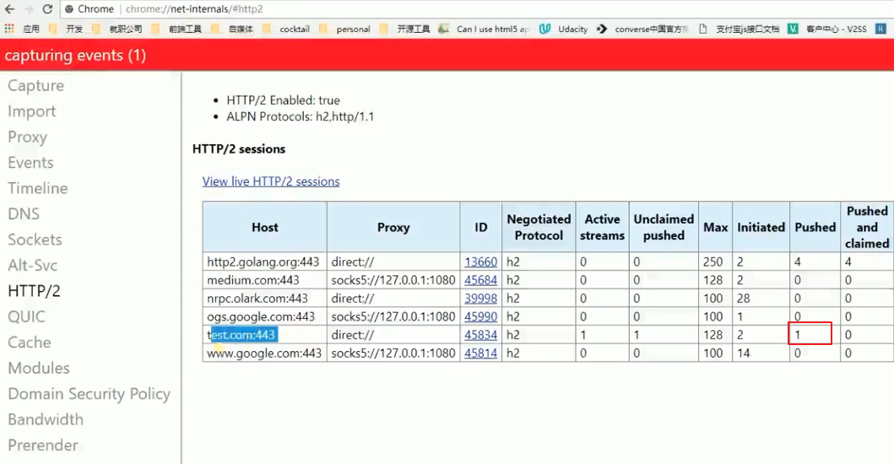

# HTTP2 优势 和 Nginx 配置 HTTP2

我们做 `Node` 开发只要做 `HTTP/1.1` 就好了, 用 `Nginx` 处理 `HTTP2`.

### 优势

信道复用

分帧传输 (不一定要按顺序发送)

`Server Push`, 主动向客户端推送



### 推送实例

- `server.js`

`'Link': '</test.jpg>; as=image; rel=preload'`, 这里的路径跟 `html` 图片的路径保持一致.

`rel=preload` 服务端推送.

```js
const http = require('http')
const fs = require('fs')

http.createServer(function (request, response) {
  console.log('request come', request.url)

  const html = fs.readFileSync('test.html', 'utf8')
  const img = fs.readFileSync('test.jpg')
  if (request.url === '/') {
    response.writeHead(200, {
      'Content-Type': 'text/html',
      'Connection': 'keep-alive',
      'Link': '</test.jpg>; as=image; rel=preload'
    })
    response.end(html)
  } else {
    response.writeHead(200, {
      'Content-Type': 'image/jpg',
      'Connection': 'keep-alive' // or close
    })
    response.end(img)
  }

}).listen(8888)

console.log('server listening on 8888')
```

- `test.html`

`` 与上面 `server.js` 的图片路径保持一致.

```html
<!DOCTYPE html>
<html lang="en">
<head>
  <meta charset="UTF-8">
  <meta name="viewport" content="width=device-width, initial-scale=1.0">
  <meta http-equiv="X-UA-Compatible" content="ie=edge">
  <title>Document</title>
</head>
<body>
  
</body>
</html>
```

### Nginx 开启 HTTP2

```bash
server {
  listen       443 http2;
  server_name  test.com;
  http2_push_preload on;

  ssl on;
  ssl_certificate   ../certs/214758036890959.pem;
  ssl_certificate_key  ../certs/214758036890959.key;

  location / {
  proxy_cache my_cache;
  proxy_pass http://localhost:8888;
  proxy_set_header Host $host;
  add_header Strict-Transport-Security max-age=200;
  }
}
```



### HTTP2 性能测试网站

[性能测试网站](https://http2.akamai.com/demo/http2-lab.html)