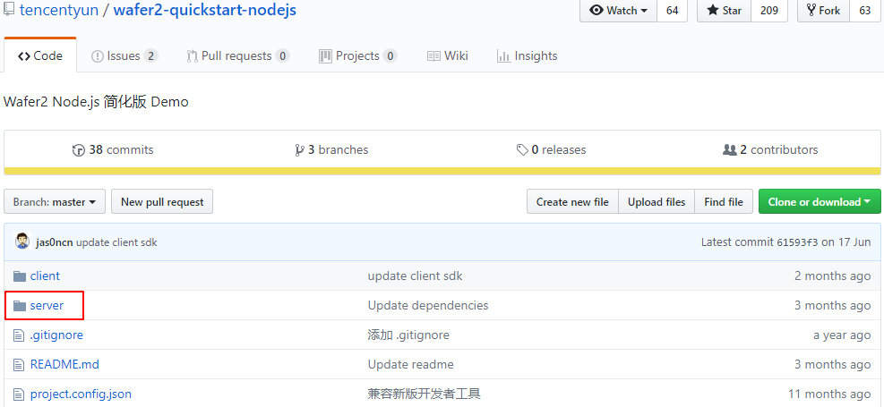
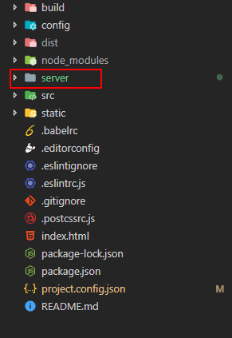

# 本地服务端开发环境搭建

### 下载官方服务端代码

点击下载 [wafer2-quickstart-nodejs](https://github.com/tencentyun/wafer2-quickstart-nodejs) 仓库, 我们这里只用 `server` 文件夹的代码.



### 拷贝 server 文件夹到 mpvue 项目

拷贝 `server` 文件夹到前面 `vue init mpvue/mpvue-quickstart mpvue-project` 命令生成的 `mpvue-project` 工程目录下:



### 配置 server

参照腾讯官方文档 [本地如何搭建开发环境](https://cloud.tencent.com/document/product/619/12794).

- 配置 `config.js`

打开 `server/config.js` 添加以下配置：

```js
const CONF = {
    // 其他配置 ...
    serverHost: 'localhost',
    tunnelServerUrl: '',
    tunnelSignatureKey: '27fb7d1c161b7ca52d73cce0f1d833f9f5b5ec89',
    // 腾讯云相关配置可以查看云 API 密钥控制台：https://console.cloud.tencent.com/capi
    qcloudAppId: '您的腾讯云 AppID',
    qcloudSecretId: '您的腾讯云 SecretId',
    qcloudSecretKey: '您的腾讯云 SecretKey',
    wxMessageToken: 'weixinmsgtoken',
    networkTimeout: 30000
}
```

- 生成密钥

在 [API 密钥控制台](https://console.cloud.tencent.com/cam/capi) 生成密钥, 得到 `SecretId`, 和 `SecretKey`.

在 [账户信息](https://console.cloud.tencent.com/developer) 查看 `AppID`.

### 安装 mysql 数据库

`windows` 和 `mac` 下安装方法不同, 自行搜索安装.

### 新建数据库

在 `server/config.js` 中默认数据库名字是 `cAuth`, 所以你不想改的话就创建一个 `cAuth` 数据库.

```js
mysql: {
    host: 'localhost',
    port: 3306,
    user: 'root',
    db: 'cAuth', // 数据库名
    pass: '', // 你的数据库密码
    char: 'utf8mb4'
},
```

### 运行服务端

- 进入 `server` 目录

- `npm install` 安装依赖

- `npm run dev` 运行服务端

- `http://localhost:5757` 浏览器访问, 测试

端口默认是 `5757` , 在 `server/config.js` 可修改.