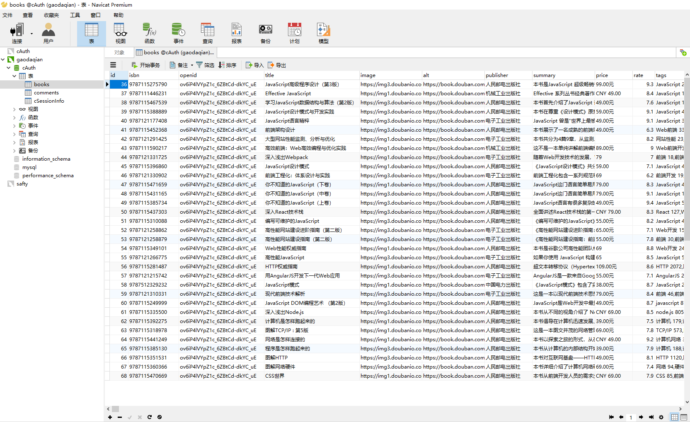
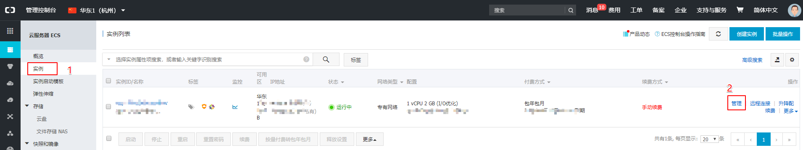
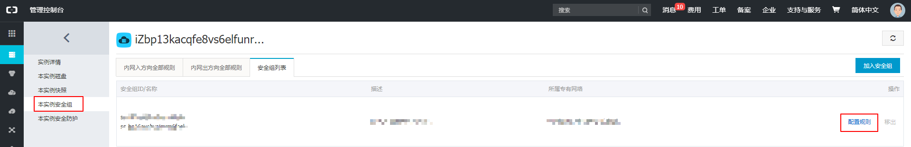
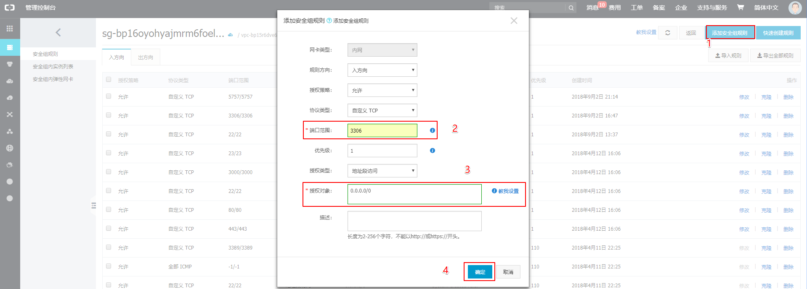
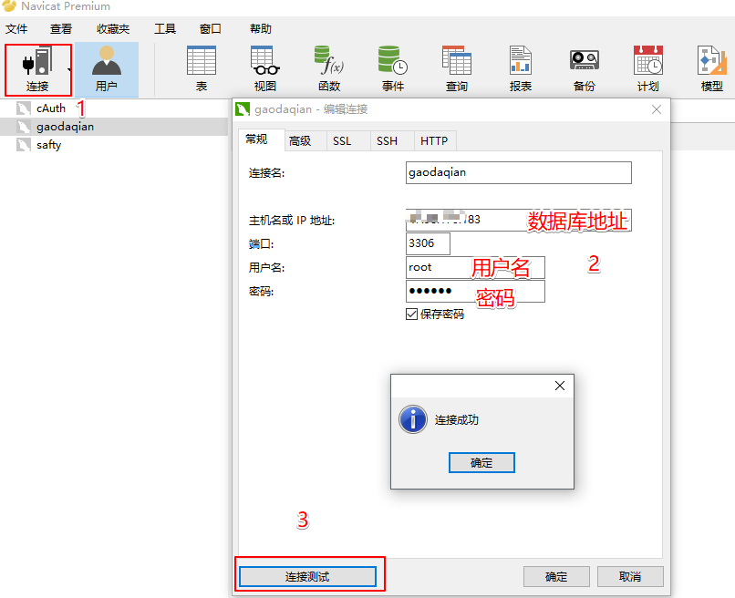

# Navicat 图形化远程操作数据库

每次远程连接到阿里云服务器, 再用命令行操作数据库, 麻烦不方便, 我这里用的是 `Navicat` 连接 `mysql` 的客户端. [Navicat](http://www.formysql.com/)



### 设置远程连接权限

`mysql` 默认是 `localhost` 才能连接, 每次远程连接到阿里云服务器就是用的 `localhost`, 但我们远程的话就要额外配置了.

- 关闭防火墙

```bash
# 关闭 iptables
[root ~]# iptables -F
[root ~]# iptables -t nat -F

# 关闭 selinux
[root ~]# setenforce 0
```

- 设置 `mysql` 远程连接账户权限

```bash
# 连接数据库
[root ~]# mysql -uroot -p

# 任何远程主机都可以用 root 用户访问数据库  
MariaDB [(none)]> GRANT ALL PRIVILEGES ON *.* TO 'root'@'%'WITH GRANT OPTION;

# 刷新生效
MariaDB [(none)]> flush privileges;
```

- 最关键一步, 设置阿里云安全组规则

阿里云安全组默认没有设置 `3306` 端口的入站规则, 我们要加上, 不然访问不到.

管理控制台 -> 云服务器 ECS -> 实例 --> 管理



本实例安全组 -> 配置规则



添加安全组规则 -> 端口范围 `3306` -> 授权对象 `0.0.0.0/0` -> 确定



### Navicat 连接测试

