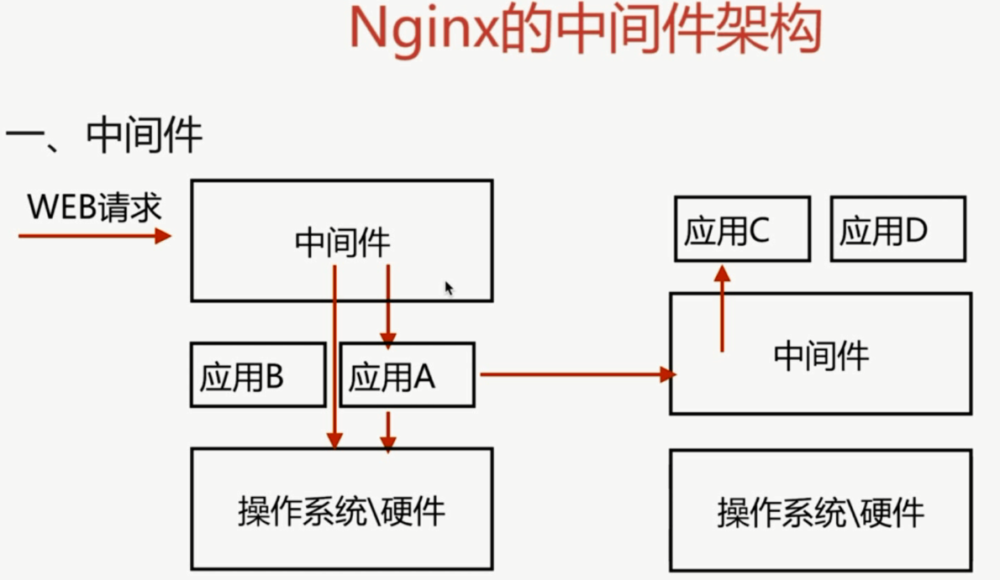
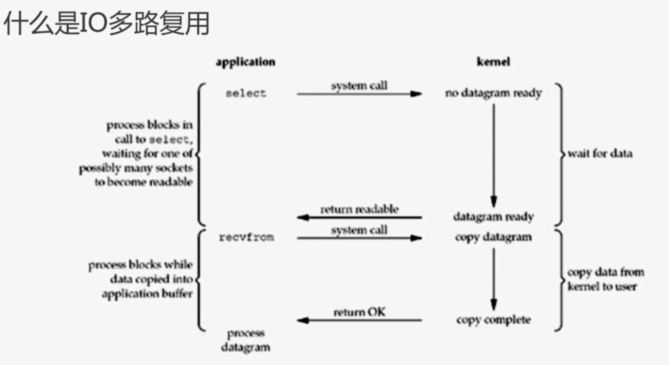
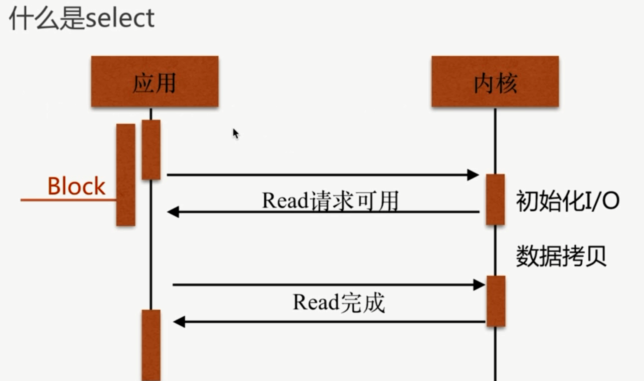
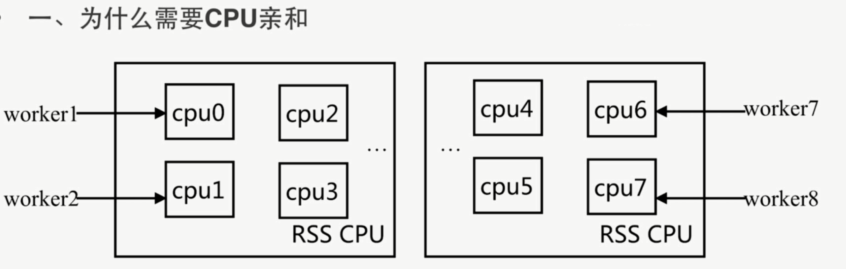
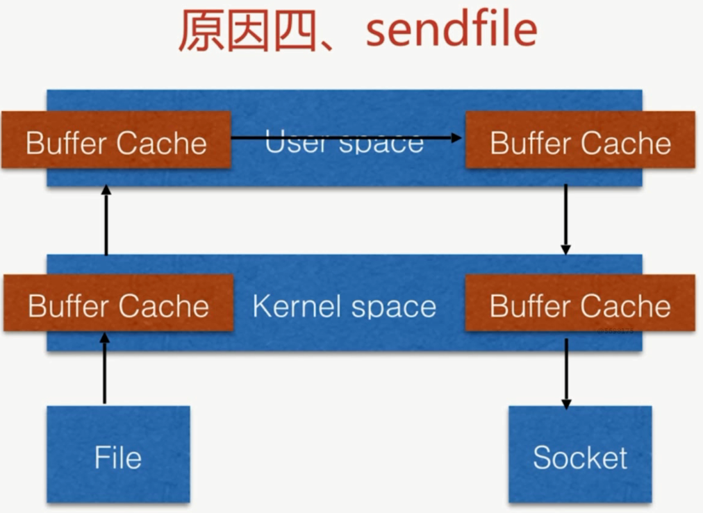
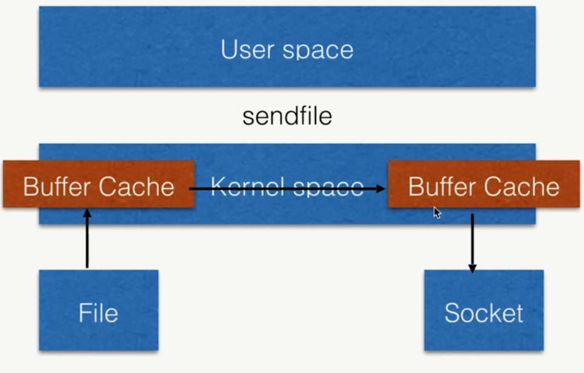

# Nginx 介绍

## Nginx 概述

`Nginx` 是一个开源且高性能、可靠的 `HTTP` 中间件、代理服务.

## 常见 HTTP 服务

- `HTTPD`, `Apache` 基金会

- `IIS`, 微软

- `GWS`, `Google`

## Nginx 特性

### `IO` 多路复用 `epoll`

`I/O` 多路复用:

多个描述符的 `I/O` 操作都能在一个线程内并发交替地顺序完成, 这就叫 `I/O` 多路复用, 这里的 "复用" 指的是复用同一个线程.

`epoll`:

`IO` 多路复用的实现方式 `select`、`poll`、`epoll`

`select` 缺点:

能够监视文件描述符的数量存在最大限制(24个)

线性扫描效率低下

`epoll` 模型:

每当 FD 就绪, 采用系统的回调函数之间将 FD 放入, 效率更高

最大连接无限制

### 轻量级

- 功能模块少

- 代码模块化

### CPU 亲和(affinity)

是一种把 `CPU` 核心和 `Nginx` 工作进程绑定方式, 把每个 `worker` 进程固定在一个 `CPU` 上执行, 减少切换 `CPU` 的 `cache miss`, 获得更好的性能.

### sendfile

从原来通过 `User space` 用户控件传输变成直接 通过 `kernel space` 内核空间传输.

