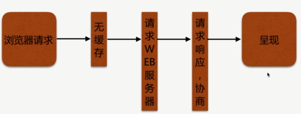
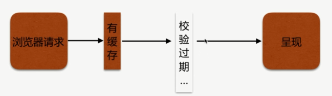

# Nginx 静态资源 WEB 服务之浏览器缓存

HTTP 协议定义的缓存机制, `Expires`; `Cache-control` 等.

## 浏览器无缓存

## 客户端有缓存

## 校验过期机制

校验是否过期: `Expires (HTTP 1.0)`、`Cache-control(max-age) HTTP 1.1`

协议中 `Etag` 头信息校验: `Etag`

`Last-Modified` 头信息校验: `Last-Modified`