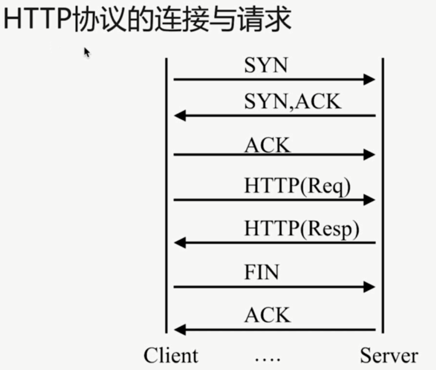

# 连接和请求限制



- HTTP 协议的连接与请求

`HTTP 1.0`: `TCP` 不能复用

`HTTP 1.1`: 顺序性 `TCP` 复用

`HTTP 2.0`: 多路复用 `TCP` 复用

`HTTP` 请求建立在一次 `TCP` 连接基础上

一次 `TCP` 请求至少产生一次 `HTTP` 请求

- `nginx` 连接限制

```bash
# 开辟的连接存储空间名字和大小, 以 name 为 key
Syntax: limit_conn_zone key zone=name:size;
Default: ---
Context: `http`
```

```bash
# 需要结合上面 zone 使用, number 就是并发限制
Syntax: limit_conn zone number;
Default: ---
Context: http, server, location
```

```bash
    # remote_addr 表示客户端地址, 同一个 ip 每秒一个 rate
    # 一个会话 1M, binary_remote_addr 比 remote_addr 少 10 个字节
    limit_conn_zone $binary_remote_addr zone=conn_zone:1m;
    limit_req_zone $binary_remote_addr zone=req_zone:1m rate=1r/s;

server {
    listen       80;
    server_name  localhost;

    location / {
        root /opt/app/code;
        # 同一个 ip 只允许一个连接
        limit_conn conn_zone 1;
        # 延迟响应, 达到限制后, 会延迟再发送三个.
        limit_req zone=req_zone burst=3 nodelay;
        #limit_req zone=req_zone burst=3;
        #limit_req zone=req_zone;
        index  index.html index.htm;
    }
}
```

- `nginx` 请求限制

```bash
# 开辟的连接存储空间名字和大小, 以 name 为 key
Syntax: limit_req_zone key zone=name:size rate=rate;
Default: ---
Context: `http`
```

```bash
Syntax: limit_req zone=name [burst=number][nodelay];
Default: ---
Context: http, server, location
```