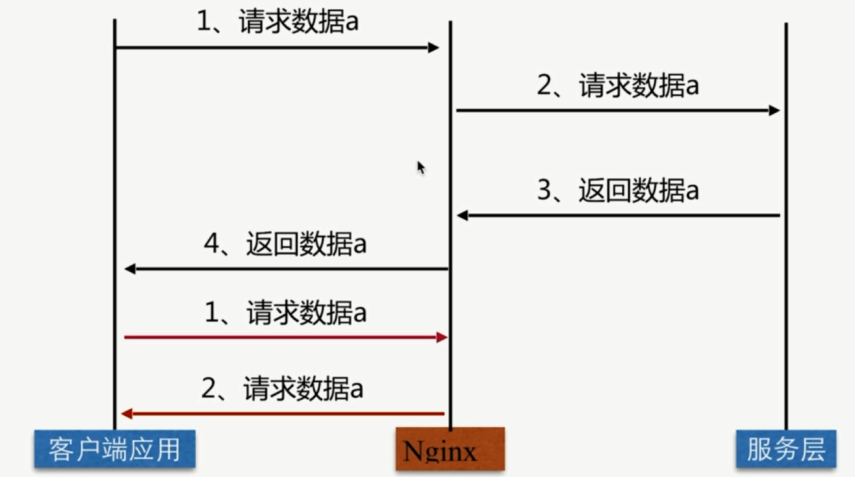
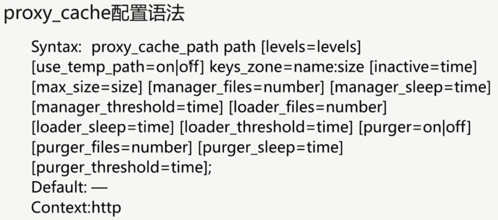

# `proxy_cache` Nginx 代理缓存

### 缓存类型

- 客户端缓存

- `Nginx` 代理缓存

- 服务端缓存


### Nginx 代理缓存



### proxy_cache 配置



```bash
Syntax: proxy_cache zone | off;
Default: proxy_cache off;
Context: http, server, location
```

### 缓存过期周期

```bash
# code 状态码
Syntax: proxy_cache_valid [code...] time;
Default: ---
Context: http, server, location
```

### 缓存的纬度

```bash
Syntax: proxy_cache_key string;
Default: proxy_cache_key $scheme$proxy_host$request_uri;
Context: http, server, location
```

### Nginx 代理缓存配置案例

```bash
    # imooc
    upstream imooc {
        server 116.62.103.228:8001;
        server 116.62.103.228:8002;
        server 116.62.103.228:8003;
    }
    # keys_zone 名字 imooc_cache
    # 存放在 /opt/app/cache
    # levels=1:2 两层目录分级
    # 10m 大小, 1m 可以存 8000个 key
    # max_size 最大 19G
    # inactive 60分钟不活跃就去掉
    # use_temp_path 临时文件
    proxy_cache_path /opt/app/cache levels=1:2 keys_zone=imooc_cache:10m max_size=10g inactive=60m use_temp_path=off;

server {
  listen       80;
  server_name  localhost jeson.t.imooc.io;

  access_log  /var/log/nginx/test_proxy.access.log  main;
  
  location / {
      # imooc_cache
      proxy_cache imooc_cache;
      # imooc
      proxy_pass http://imooc;
      # 状态码 200 和 304 是 12小时过期
      proxy_cache_valid 200 304 12h;
      # 其他的 10 分钟过期
      proxy_cache_valid any 10m;
      # proxy_cache_key
      proxy_cache_key $host$uri$is_args$args;
      # 给客户端头信息, 告诉客户端是否命中
      add_header  Nginx-Cache "$upstream_cache_status";  
      # 如果出现错误, 跳过这一台访问下一台
      proxy_next_upstream error timeout invalid_header http_500 http_502 http_503 http_504;
      include proxy_params;
  }
  ...
```

### 清理指定缓存

- `rm -rf` 缓存目录内容

- 第三方扩展模块 `ngx_cache_purge`

### 让部分页面不缓存

```bash
Syntax: proxy_no_cache string ...;
Default: ---
Context: http, server, location
```

```bash {9,10}
  location / {
      proxy_cache imooc_cache;
      proxy_pass http://imooc;
      proxy_cache_valid 200 304 12h;
      proxy_cache_valid any 10m;
      proxy_cache_key $host$uri$is_args$args;
      add_header  Nginx-Cache "$upstream_cache_status";  
      proxy_next_upstream error timeout invalid_header http_500 http_502 http_503 http_504;
      proxy_no_cache $cookie_nocache $arg_nocache $arg_comment;
      proxy_no_cache $http_pragma $http_authorization;
      include proxy_params;
  }
  ...
```