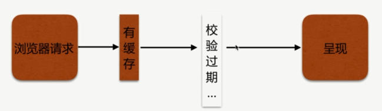
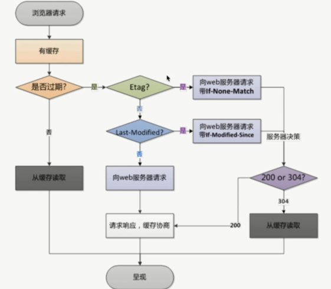
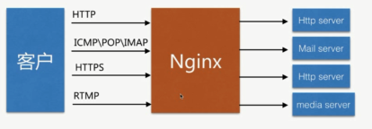

# Nginx 静态资源 WEB 之常用配置

HTTP 协议定义的缓存机制, `Expires`; `Cache-control` 等.

## 浏览器无缓存


## 客户端有缓存



## 校验过期机制

校验是否过期: `Expires (HTTP 1.0)`、`Cache-control(max-age) HTTP 1.1`

协议中 `Etag` 头信息校验: `Etag`

`Last-Modified` 头信息校验: `Last-Modified`



## Nginx 配置缓存

- 配置语法 `expires`

添加 Cache-Control、Expires 头

```md
Syntax: expires [modified] time;
        expires epoch|max|off;
Default: expires off;
Context: http, server, location, if in location
```

```bash
location ~ .*\.(htm|html)$ {
  expires 24h;
  root  /opt/app/code;
}
```

## Nginx 跨域配置

跨域可能发生 `CSRF` 攻击


但是实际需求需要跨域

```md
Syntax: add_header name value [always];
Default: ---;
Context: http, server, location, if in location
```

`Access-Control-Allow-Origin`

```bash
location ~ .*\.(htm|html)$ {
  add_header Access-Control-Allow-Origin ss.xx.com;
  add_header Access-Control-Allow-Methods GET,POST,PUT,DELETE,OPTIONS;
  root  /opt/app/code;
}
```

或者

```bash
location ~ .*\.(htm|html)$ {
  add_header Access-Control-Allow-Origin *;
  add_header Access-Control-Allow-Methods GET,POST,PUT,DELETE,OPTIONS;
  root  /opt/app/code;
}
```

## 防盗链

防止资源被盗用, 信息安全和性能

- 防盗链设置思路

区别哪些请求是非正常的用户请求

基于 `http_refer` 防盗链配置模块

`valid_referers` 支持 `ip`、域名、正则

```md
Syntax: valid_referers none|blocked|server_names|string ...;
Default: ---;
Context: server, location
```

```bash
location ~ .*\.(jpg|gif|png)$ {
  valid_referers none blocked 116.62.103.228 gaodaqian.com ~wei\.png;
  if ($invalid_referer) {
      return 403;
  }
  root  /opt/app/code/images;
}
```

- 测试

`curl -I` 发起一个请求, 只展示请求头

`curl -e` 就是加上 `http_refer`

```bash
[root ~]# curl -I http://gaodaqian.com/wei.png
HTTP/1.1 200 OK
Server: nginx/1.12.2
Date: Mon, 27 Aug 2018 14:58:47 GMT
Content-Type: image/png
Content-Length: 244044
Last-Modified: Tue, 08 Aug 2017 09:17:24 GMT
Connection: keep-alive
ETag: "598981a4-3b94c"
Accept-Ranges: bytes

[root ~]# curl -e "http://www.baidu.com" -I http://gaodaqian.com/wei.png
HTTP/1.1 403 Forbidden
Server: nginx/1.12.2
Date: Mon, 27 Aug 2018 14:58:49 GMT
Content-Type: text/html
Content-Length: 169
Connection: keep-alive

[root ~]# curl -e "http://gaodaqian.com" -I http://wusibo.com/wei.png
HTTP/1.1 200 OK
Server: nginx/1.12.2
Date: Mon, 27 Aug 2018 15:01:38 GMT
Content-Type: image/png
Content-Length: 244044
Last-Modified: Tue, 08 Aug 2017 09:17:24 GMT
Connection: keep-alive
ETag: "598981a4-3b94c"
Accept-Ranges: bytes
```

配置文件中设置了 `gaodaqian.com` 过来的可以, 所以 `http_refer` 为 `http://www.baidu.com` 时 `403 Forbidden`, 而 `http_refer` 为 `http://gaodaqian.com` 是 `200 OK`

这里只是简单地配置, `http_refer` 规则不是很完善, 更多高级规则需要其他模块支持.

## Nginx 代理服务




- 正向代理

科学上网


- 反向代理

负载均衡


- 正向反向区别

区别在于代理的对象不一样

正向代理代理的对象是客户端

反向代理代理的对象是服务端

- 配置语法

```md
Syntax: proxy_pass URL;
Default: ---;
Context: location, if in location, limit_except
```

`http`, `http://localhost:8000/uri/`

`https`, `https://192.168.1.1:8000/uri/`

`socket`, `http://unix:/tmp/backend.socket:/uri/`

- 反向代理配置方式

```bash
server {
    # 默认监听 gaodaqian.com 的 80 端口
    listen       80;
    server_name  localhost gaodaqian.com;

    location / {
        root   /usr/share/nginx/html;
        index  index.html index.htm;
    }
    # 当访问 test_proxy.html 反向代理到本机 8080端口
    location ~ /test_proxy.html$ {
        proxy_pass http://127.0.0.1:8080;
    }
}
```

用 `netstat -luntp|grep nginx` 命令查看 `nginx` 监听的端口

- 正向代理配置

```bash
server {
    listen       80;
    server_name  localhost gaodaqian.com;

    # http_x_forwarded_for 携带有代理信息, 判断是否匹配 ip
    location / {
        if ( $http_x_forwarded_for !~* "^116\.62\.103\.228") {
            return 403;
        }
        root   /opt/app/code;
        index  index.html index.htm;
    }
}
```

```bash
server {
    listen       80;
    server_name  localhost gaodaqian.com;

    # DNS
    resolver 8.8.8.8;
    # 通过 gaodaqian.com 正向代理去访问你要访问的地址+参数
    location / {  
        proxy_pass http://$http_host$request_uri;
    }  
}
```

## 配置缓冲区

```md
Syntax: proxy_buffering on|off;
Default: proxy_buffering on;
Context: http, server, location
```

扩展: proxy_buffer_size、proxy_buffers、proxy_busy_buffers_size

## 跳转重定向

301

```md
Syntax: proxy_redirect default;
proxy_redirect off;proxy_redirect redirect replacement;
Default: proxy_redirect default;
Context: server, location
```

## 头信息

```md
Syntax: proxy_set_header field value;
Default: proxy_set_header Host $proxy_host;
         proxy_set_header Connection close;
Context: http, server, location
```

扩展: proxy_hide_header、proxy_set_body

## 超时

```md
Syntax: proxy_connect_timeout time;
Default: proxy_connect_timeout 60s;
Context: http, server, location
```

扩展: proxy_read_timeout、proxy_send_timeout

## 真实服务器配置

新建 `proxy_params` 文件

```bash
proxy_redirect default;

proxy_set_header Host $http_host;
proxy_set_header X-Real-IP $remote_addr;

proxy_connect_timeout 30;
proxy_send_timeout 60;
proxy_read_timeout 60;

proxy_buffer_size 32k;
proxy_buffering on;
proxy_buffers 4 128k;
proxy_busy_buffers_size 256k;
proxy_max_temp_file_size 256k;
```

通过 `include` 加载其他配置文件

```bash
location / {
  # 把同级的 proxy_params 配置加载进来
  include proxy_params;
}
```