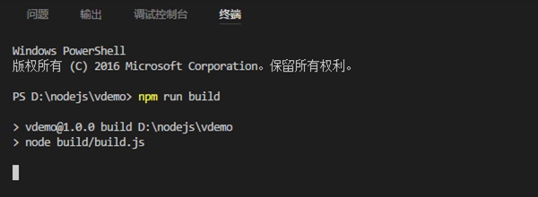
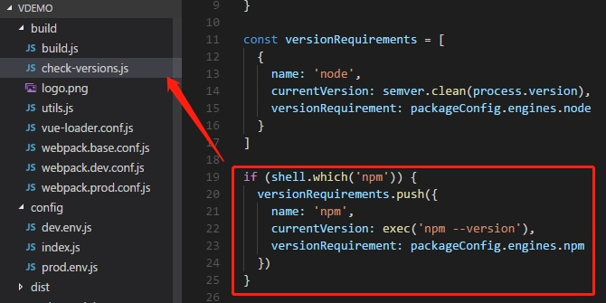
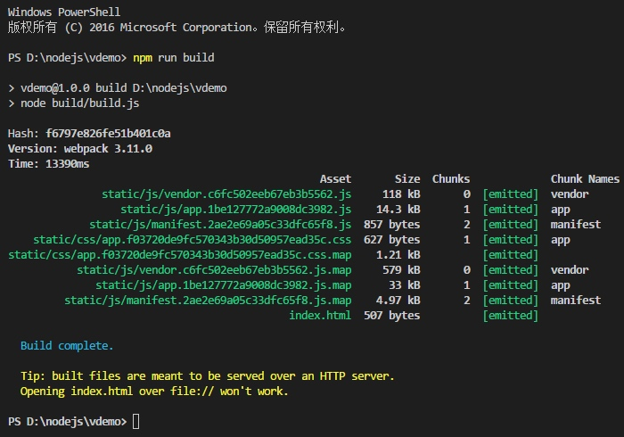

# npm run build 卡死

- `npm run build` 卡住

当执行 `npm run build` 打生产包时, 界面卡住如下:

- 关闭 `npm` 检查

注释掉 `build/check-versions.js` 文件中的检测代码

- 设置国内镜像

执行 `npm config set registry http://registry.cnpmjs.org` 修改为淘宝源

- 成功

- 参考链接

[解决 npm run build 卡住问题](http://www.195440.com/?p=1141)