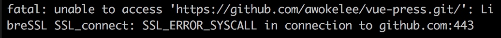
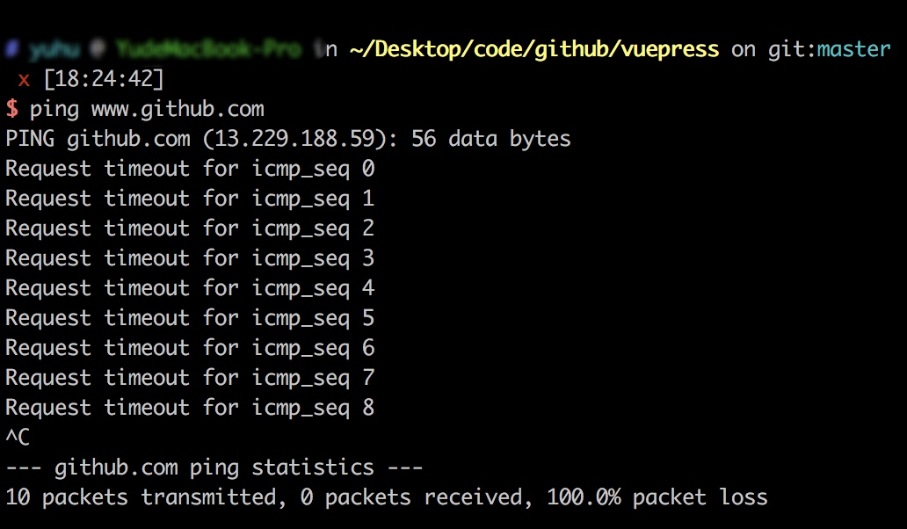
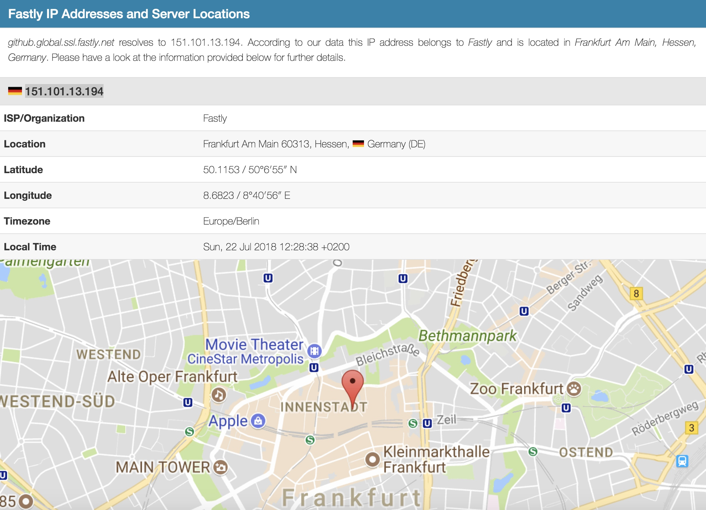
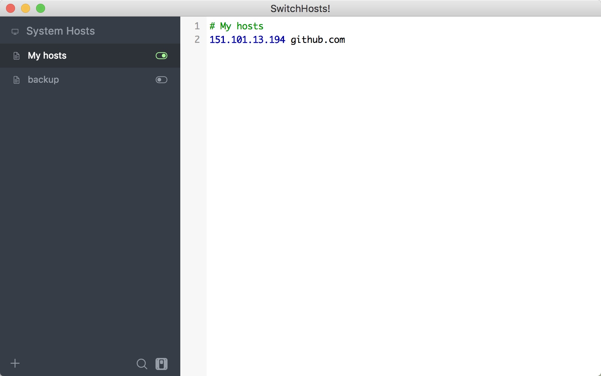
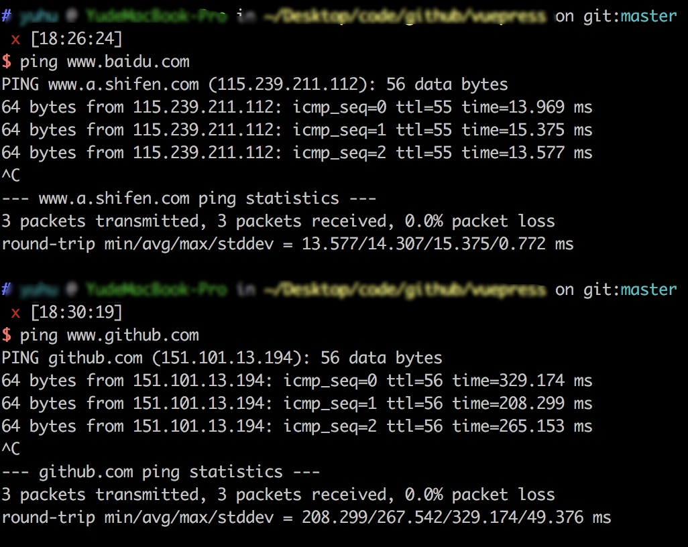
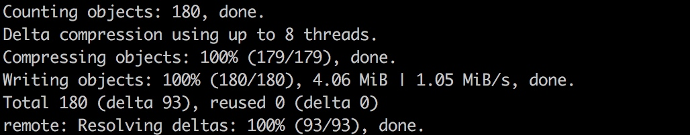

# GitHub 超时

- 提交代码到 `github`, 控制台提示如下

`ping github.com` 超时

- 修改 `host`

在 `http://github.global.ssl.fastly.net.ipaddress.com/` 查到 `github` `ip` 为 `151.101.13.194`

修改 `host`

- 再试试 `ping githu.com`, 发现ok

- 提交代码 ok

