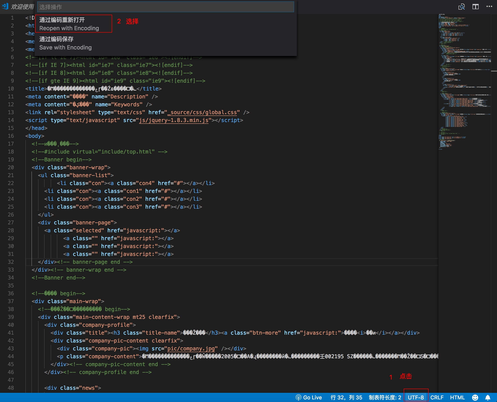
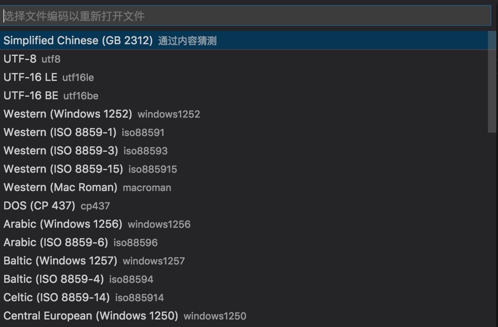
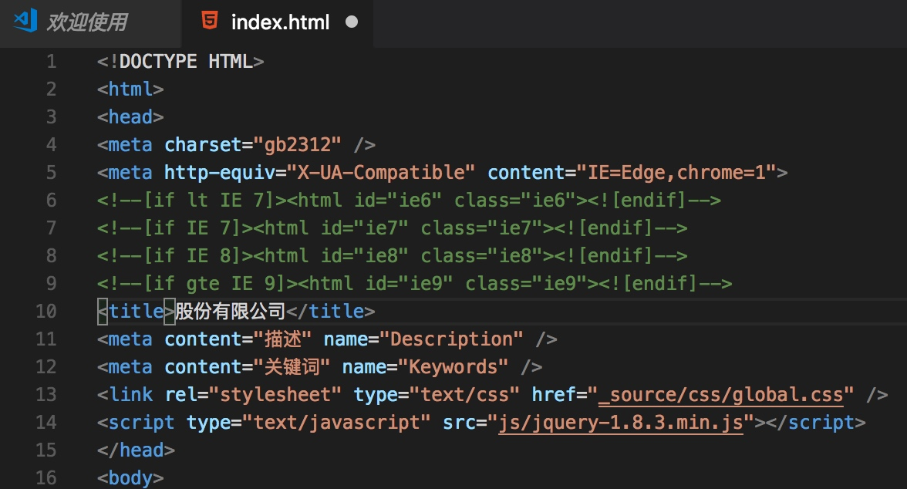
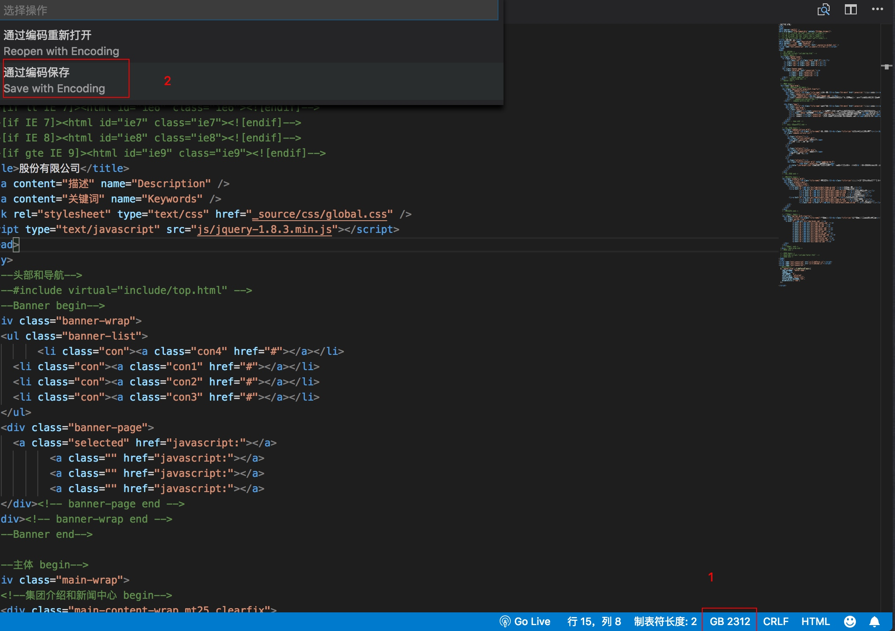

# 打开文件乱码处理

- 打开 html 乱码如下:

- 原因分析

从 `vscode` 右下角可以看到编辑器编码为 `utf-8`, 目前文件显示为乱码, 则需要将 `html` 编码格式进行更改, 看到 `html` `head` 中有 `charset="gb2312"`, 尝试用 `gb2312` 编码打开文件

选择 `gb2312` 编码打开后 不再乱码

- 更改编码格式

大部分编辑器和浏览器 默认 `utf-8` 居多, 选择保存为 `utf-8` 编码

选择 `utf-8`

文件已经是 `utf-8` 了, 最后设置 `<meta charset="utf-8" />` 告诉浏览器以 `utf-8` 编码解析该网页

最后测试正常, 无乱码.