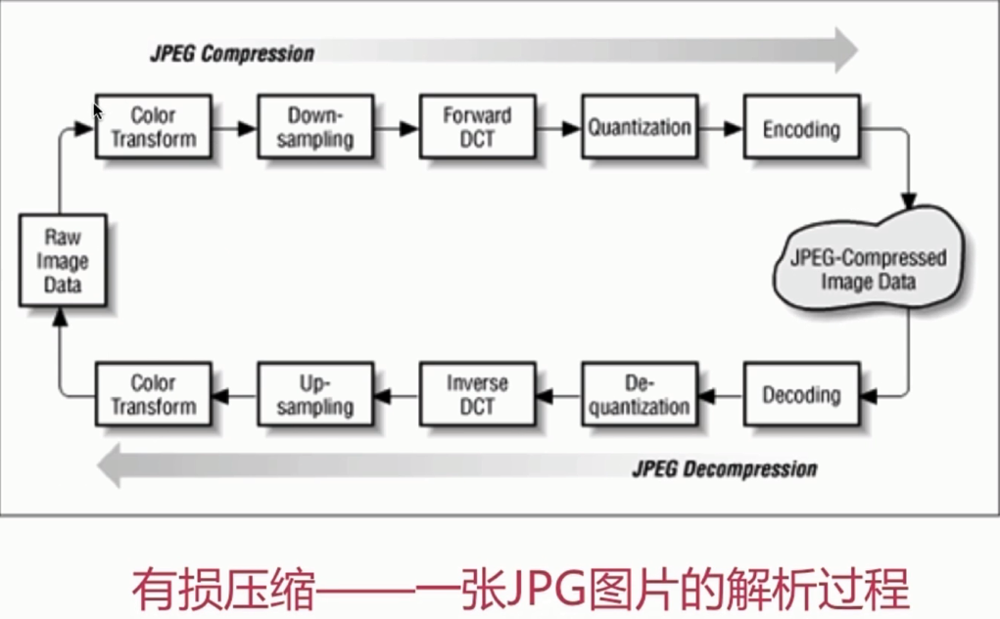
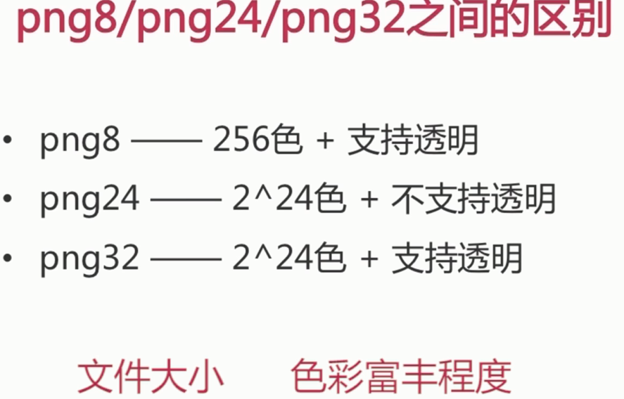
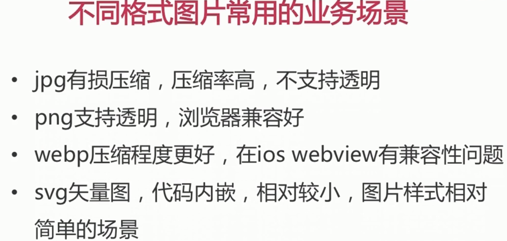
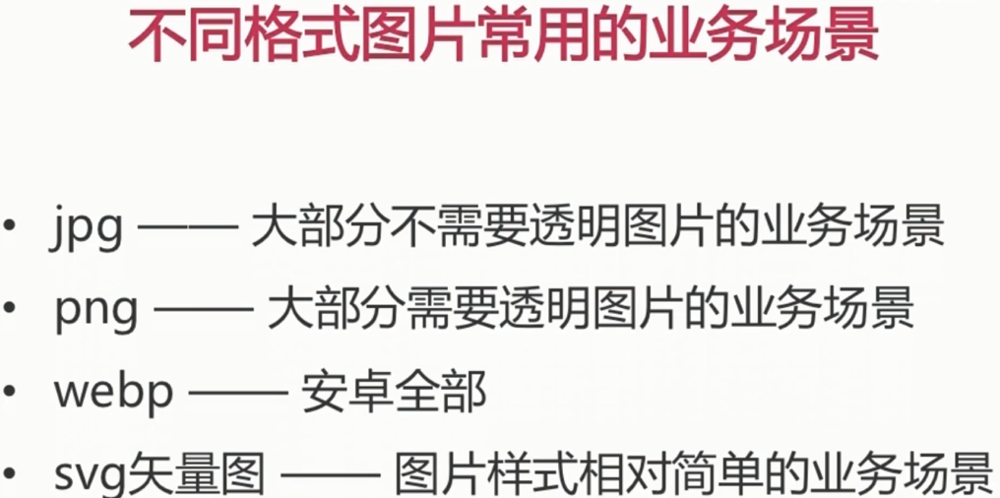
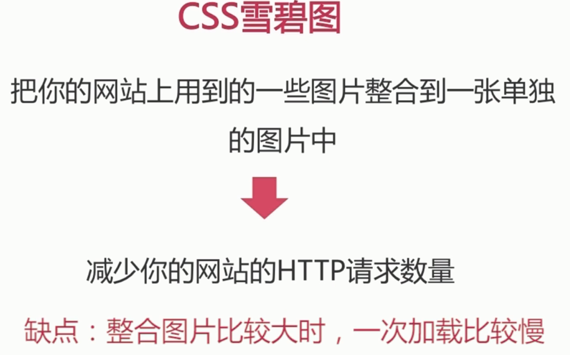
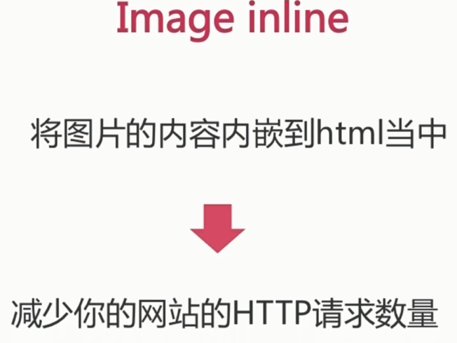
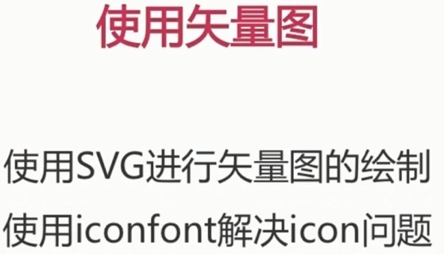
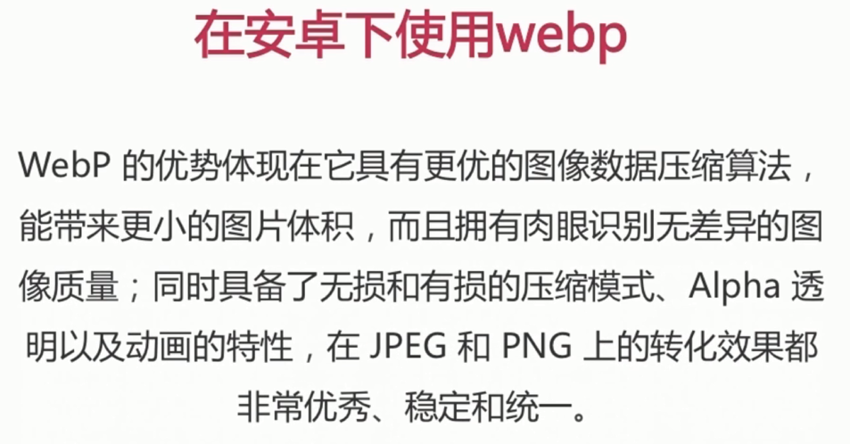
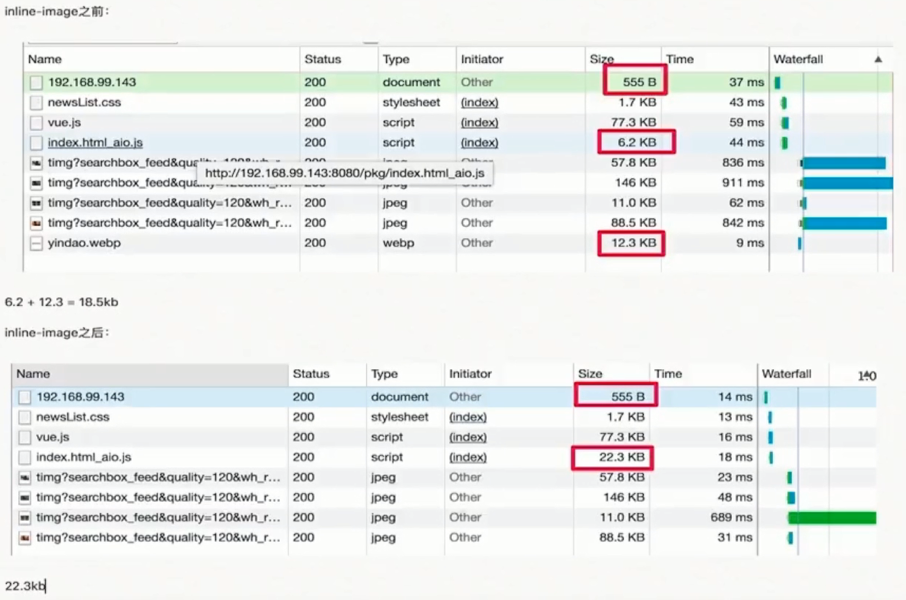

# 图片相关的优化

### 有损压缩 - 一张 JPG 图片的解析过程

### PNG8/PNG24/PNG32 之间的区别

每种图片格式都有自己的特点, 针对不同的业务场景选择不同的图片格式很重要

### 不同格式图片常用的业务场景

### 进行图片压缩

针对真实图片情况, 舍弃一些相对无关紧要的色彩信息

- 雪碧图

- image inline (base64)

- 使用矢量图

- 在安卓下使用 webp

### 淘宝实战

- 图片降级

webp -> jpg

`https://img.alicdn.com/imgextra/TB2H75AsbwrBKNjSZPcXXXpapXa_!!133-0-luban.jpg_320x320q90.jpg_.webp`

- base64

- 透明用 png

- svg

png 11KB 大致对应 svg 5KB

- 在线图片压缩网站 `tinypng.com`

11KB 能压缩到 4KB.

### 图片压缩实战

- PNG 转 webp

`https://zhitu.isux.us/`

原图 37.6K 转到了 18.8K

fis3 等压缩设置图片质量低一点可以到 9KB

- 转 base64

size 会变大, 但是减少了一次 http 请求.

小于 8KB  一般使用 base64.

- 使用 雪碧图

- 使用 SVG