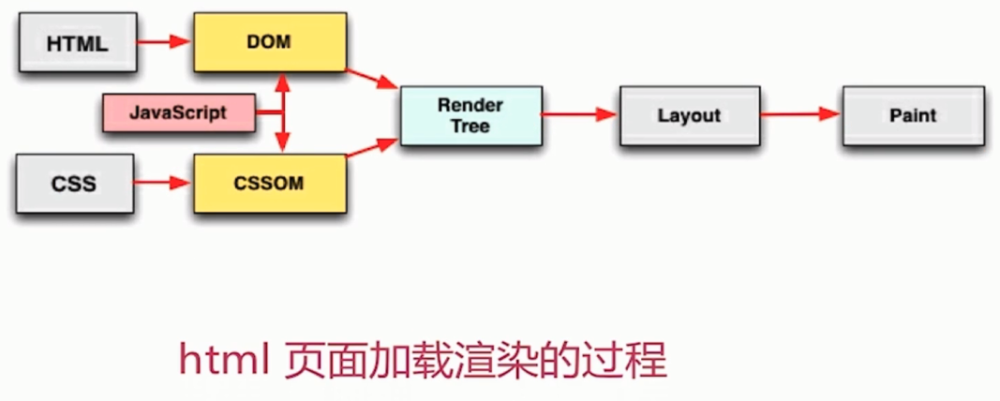

# CSS 和 JS 的装载与执行

### 一个网站在浏览器端是如何进行渲染的

### HTML 渲染过程的一些特点

- 顺序执行、并发加载

- 是否阻塞

- 依赖关系

- 引入方式

### 顺序执行、并发加载

- 词法分析

- 并发加载

- 并发上限

### CSS 阻塞

- css head 中阻塞页面的渲染

- css 阻塞 js 的执行

- css 不阻塞外部脚本的加载

### JS 阻塞

- 直接引入的 js 阻塞页面的渲染

- js 不阻塞资源的加载

- js 顺序执行, 阻塞后续 js 逻辑的执行