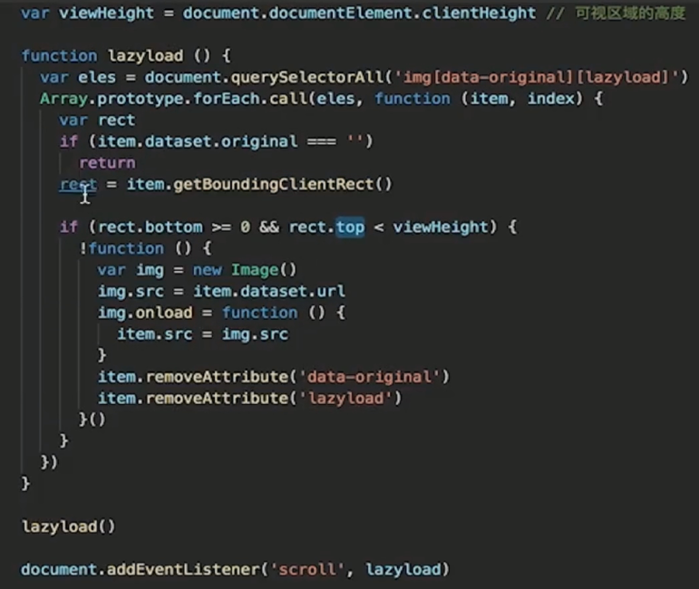
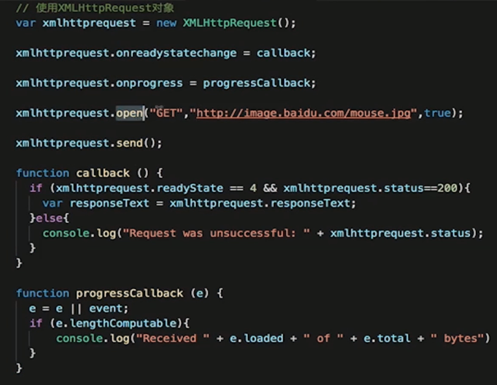
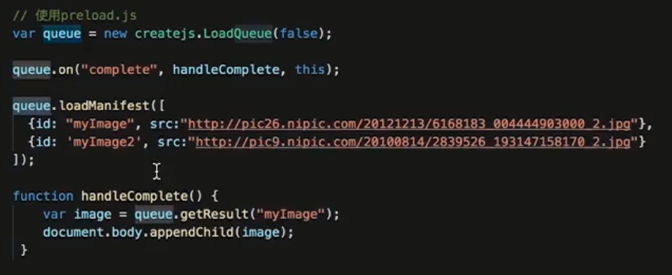

# 懒加载和预加载

### 懒加载

- 图片进入可视区域之后请求图片资源

- 对于电商等图片很多, 页面很长的业务场景适用

- 减少无效资源的加载

- 并发加载的资源过多会阻塞 js 的加载, 影响网站的正常使用

### 预加载

- 图片等静态资源在使用之前的提前请求

- 资源使用到时能从缓存中加载, 提升用户体验

- 页面展示的依赖关系维护

### 懒加载实战

### 预加载实战

- `img` `src` `display:none`

- new Image

- XMLHttpRequest

会有跨域问题

- preload.js

