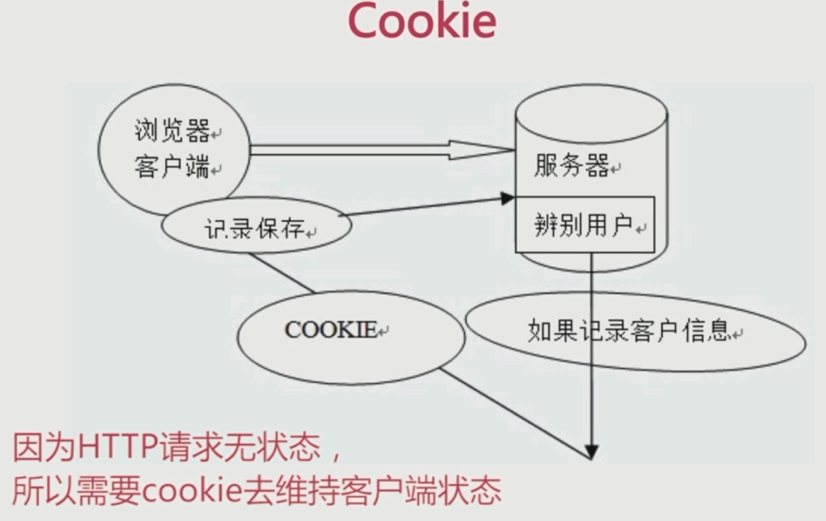
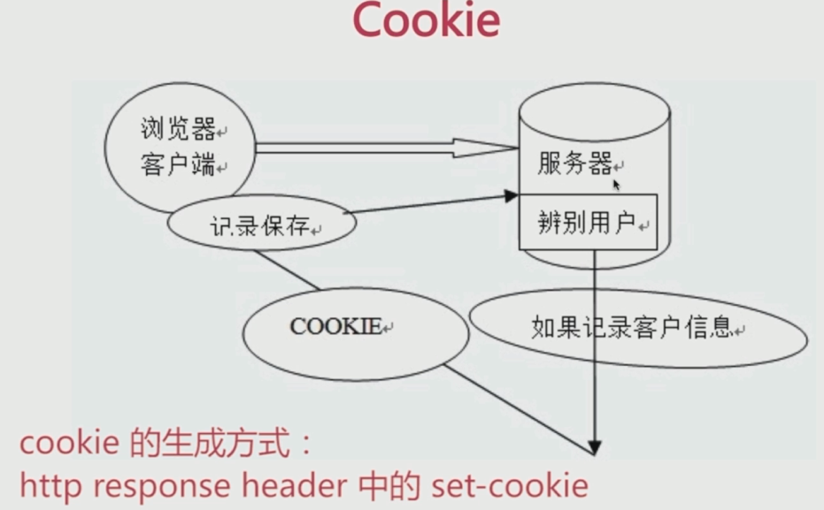
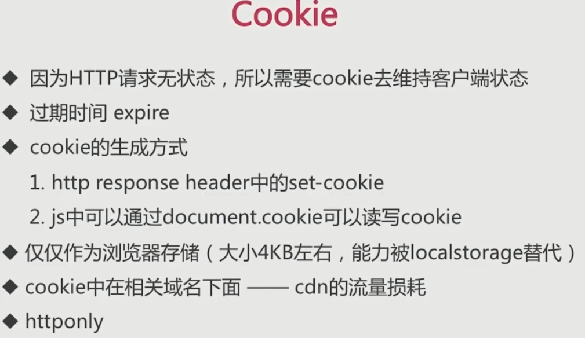
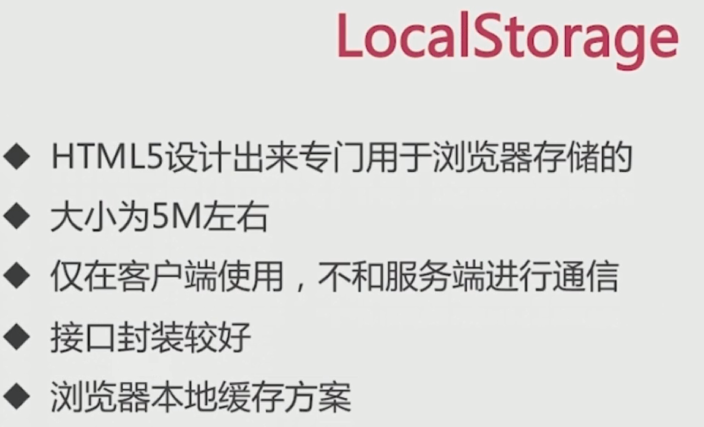
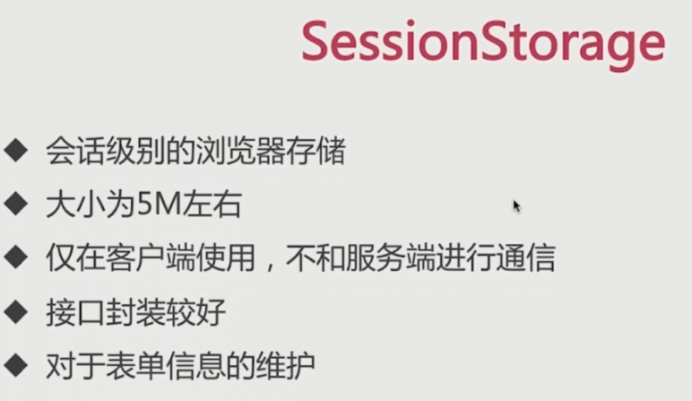
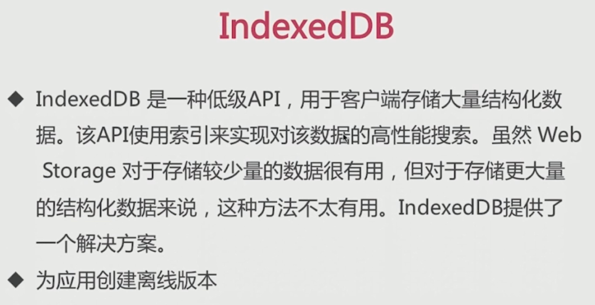
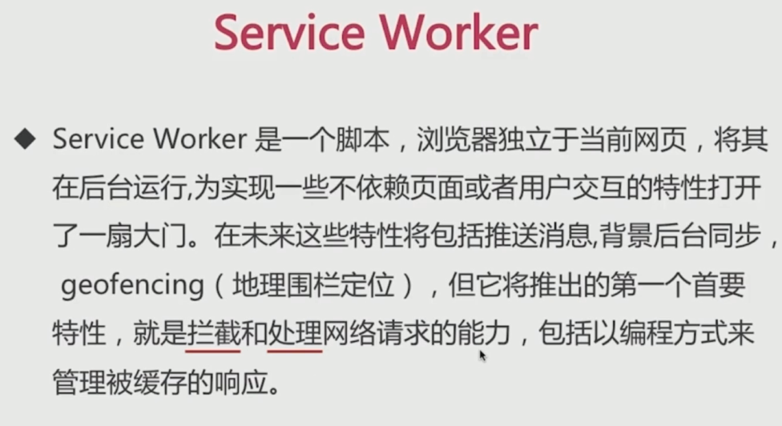
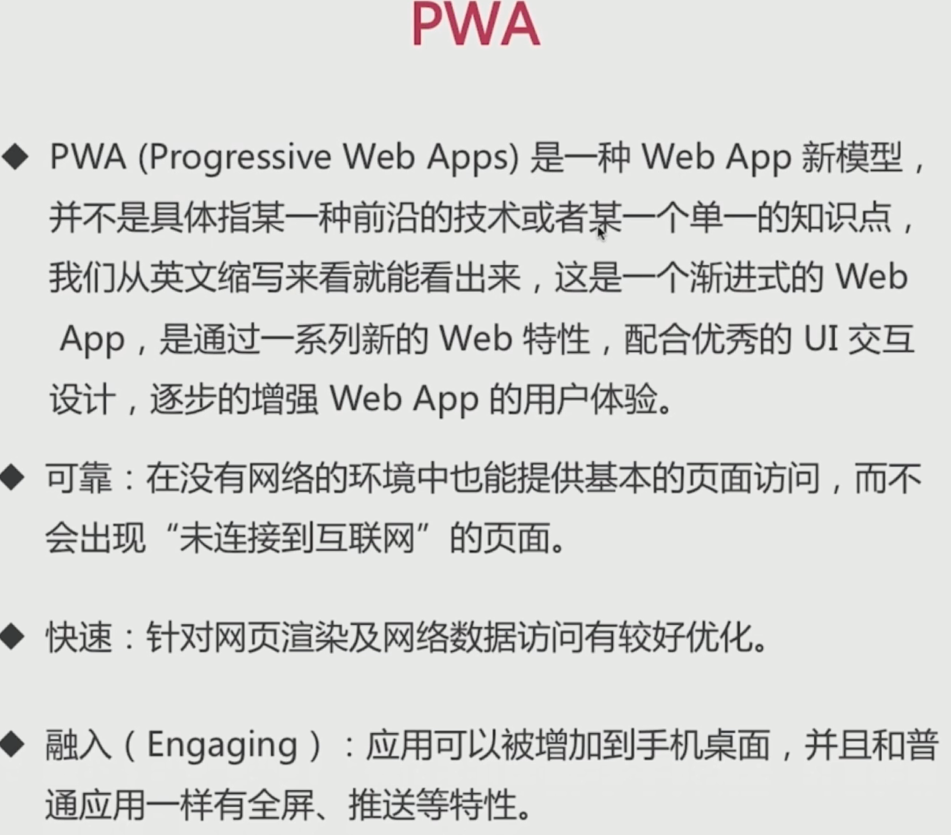

# 浏览器存储

### cookie

初衷是维护客户端和服务端状态, 但是也可以用作存储

- 用于浏览器端和服务端的交互

- 客户端自身数据的存储

### cookie 重要属性

- 作为浏览器存储, 大小 4KB 左右

- 需要设置过期时间 expire

cookie 存储数据能力被 localStorage 替代

- httponly

- cookie 中在相关域名下面 - cdn 的流量损耗

请求都会携带 cookie

解决办法: `cdn 的域名和主站的域名要分开`

### localStorage

### sessionStorage

浏览器一个 `tab` 一个 `session`, 比如用于表单信息填写实时存储.

### IndexedDB

### Service Workers

生命周期:

### PWA

