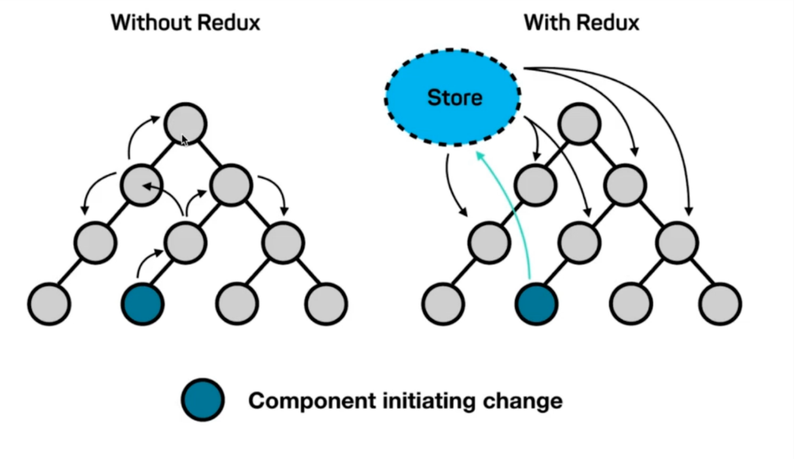

# redux 介绍

`react` 是视图层框架, `redux` 是数据层框架的一种.

以前传值是通过 `props`, 当组件层级较深, 传值会非常不方便. 比如下图深色节点跟顶层节点通信就很麻烦.

- `redux`

`Redux = Reducer + Flux` (官方推出最原始的数据框架, 不是特别好用)

**redux 设计理念:** 数据存放在 `store` 中, 一个数据改变 `store` 的内容, 其他组件感知 `store` 变化取到最新数据.

- 只有一个 `store`

- 只有 `store` 能够改变自己的内容

- `reducer` 必须是纯函数

纯函数: 给了固定的输入, 就一定会与固定的输出, 而且不会有任何副作用.

- `createStore`

- `store.dispatch`

- `store.getState`