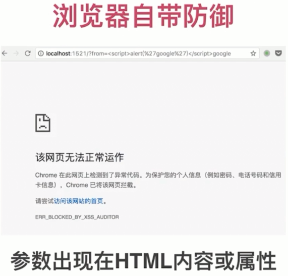
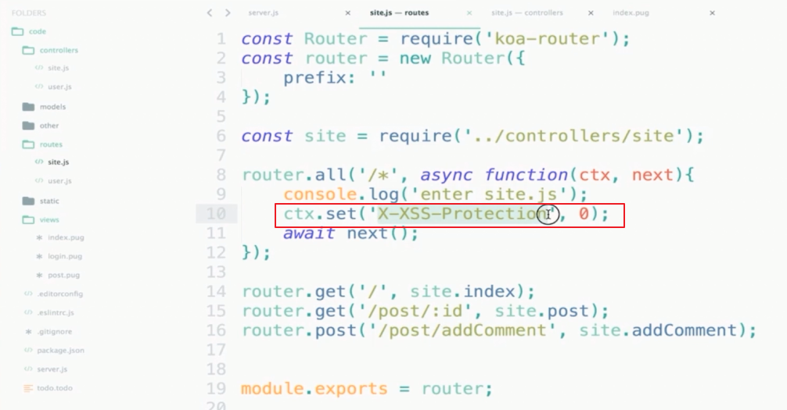
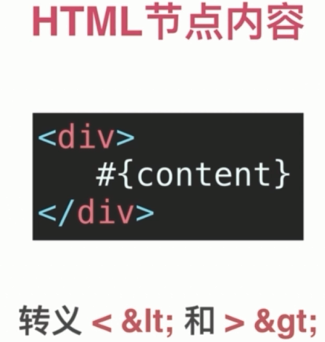
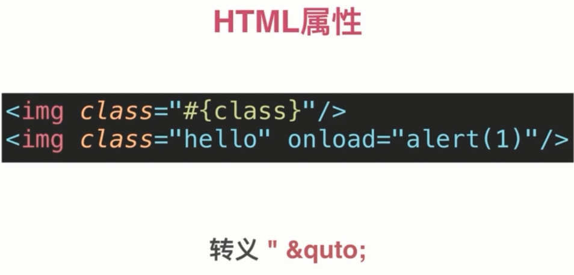
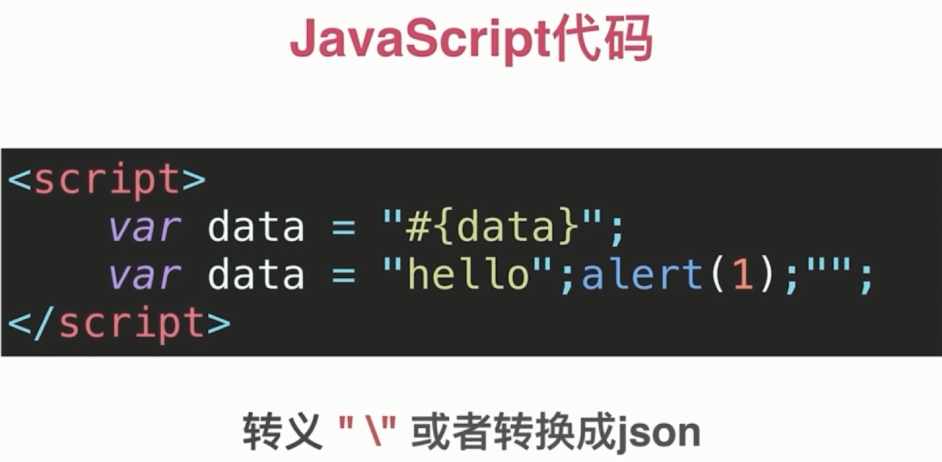

# XSS 防御

### 浏览器自带防御, 针对 HTML 内容和属性

不是所有浏览器都支持, `firfox` 就不行, chrome 可以.



演示是因为代码手动关闭了:



浏览器自带的防御只防御反射型 XSS, 只防御参数出现在 HTML 内容或属性的攻击.

### HTML 节点内容



转义内容: `>` `<`

```js
var escapeHtml = function (str) {
  str = str.replace(/</g, '&lt;');
  str = str.replace(/>/g, '&gt;');
  return str;
}
```

转义时机:

进入数据库之前或显示时候转义.

### HTML 属性

转义内容: `"` 和 `'`

`html` 属性不要引号也可以, 所以也要转义下空格

```js
var escapeHtmlProperty = function (str) {
  if(!str) return '';
  str = str.replace(/"/, '&quto;');
  str = str.replace(/'/, '&#39;');
  str = str.replace(/ /, '&#32;');
  return str;
}
```



### JavaScript 代码防御



```js
var escapeForJs = function (str) {
  if(!str) return '';
  str = str.replace(/\\/g, '\\\\');
  str = str.replace(/"/g, '\\"');
  return str;
}
```

上面代码不够完全, 最保险是用 `JSON.stringify()`

### 富文本

黑名单和白名单. 因为 `html` 太杂, XSS 变种太多, 黑名单不太好用.

- 黑名单方式

```js
var xssFilter = function (html) {
  if(!html) return '';
  html = html.replace(/<\s*\/?script\s*>/g, '');
  html = html.replace(/javascript:[^'"]*/g, '');
  html = html.replace(/onerror\s*=\s*['"]?[^'"]*['"]?/g, '');
  // 太多了... 风险也大, 有可能屏蔽了正常的
  return html;
}
```

- 按白名单保留部分标签和属性

一般是入库之前做.

这里演示的是显示之前做.

`cheerio` 解析 `html`, 返回类似 `jquery` 对象, 对属性和对象进行解析, 移除白名单之外的

```js
var xssFilter = function (html) {
  if(!html) return '';
  var cheerio = require('cheerio');
  var $ = cheerio.load(html);

  // 白名单
  var whiteList = {
    'img': ['src'],
    'font': ['color', 'size'],
    'a': ['href']
    //...
  };

  $('*').each(function (index, elem) {
    if(!whiteList[elem.name]){
      $(elem).remove();
      return;
    }
    for(var attr in elem.attribs){
      if(whiteList[elem.name].indexOf(attr) === -1){
        $(elem).attr(attr, null);
      }
    }
  });

  return $.html();
}
```

- 第三方白名单过滤

[根据白名单过滤 HTML(防止 XSS 攻击)](https://github.com/leizongmin/js-xss/blob/master/README.zh.md)