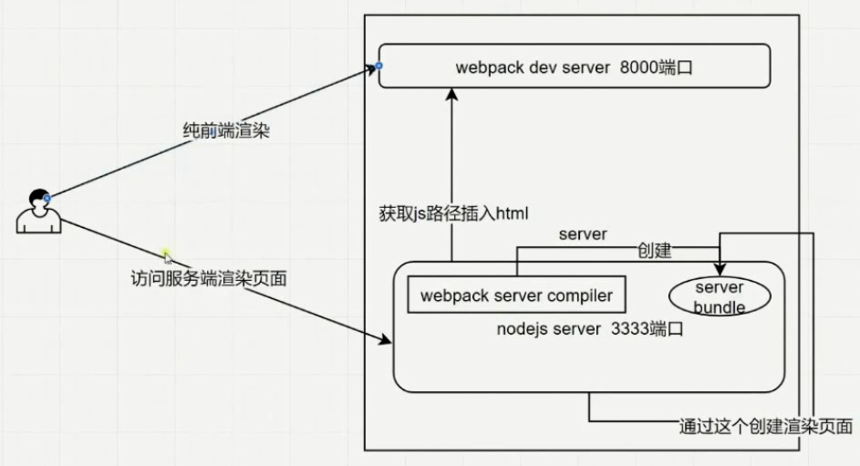

# 服务端渲染配置

### 原理




### 安装

`npm i vue-server-render -S`

### webpack.config.server.js

- `build/webpack.config.server.js`

```js
const path = require('path')
const ExtractPlugin = require('extract-text-webpack-plugin')
const webpack = require('webpack')
const merge = require('webpack-merge')
const baseConfig = require('./webpack.config.base')
const VueServerPlugin = require('vue-server-renderer/server-plugin')

let config

const isDev = process.env.NODE_ENV === 'development'

const plugins = [
  new ExtractPlugin('styles.[contentHash:8].css'),
  new webpack.DefinePlugin({
    'process.env.NODE_ENV': JSON.stringify(process.env.NODE_ENV || 'development'),
    'process.env.VUE_ENV': '"server"'
  })
]

if (isDev) {
  plugins.push(new VueServerPlugin())
}

config = merge(baseConfig, {
  target: 'node',
  entry: path.join(__dirname, '../client/server-entry.js'),
  devtool: 'source-map',
  output: {
    libraryTarget: 'commonjs2',
    filename: 'server-entry.js',
    path: path.join(__dirname, '../server-build')
  },
  externals: Object.keys(require('../package.json').dependencies),
  module: {
    rules: [
      {
        test: /\.styl/,
        use: ExtractPlugin.extract({
          fallback: 'vue-style-loader',
          use: [
            'css-loader',
            {
              loader: 'postcss-loader',
              options: {
                sourceMap: true
              }
            },
            'stylus-loader'
          ]
        })
      }
    ]
  },
  plugins
})

config.resolve = {
  alias: {
    'model': path.join(__dirname, '../client/model/server-model.js')
  }
}

module.exports = config
```

### server-entry.js

- `server-entry.js`

```js
import createApp from './create-app'

export default context => {
  return new Promise((resolve, reject) => {
    const { app, router, store } = createApp()

    if (context.user) {
      store.state.user = context.user
    }

    router.push(context.url)

    router.onReady(() => {
      const matchedComponents = router.getMatchedComponents()
      if (!matchedComponents.length) {
        return reject(new Error('no component matched'))
      }
      Promise.all(matchedComponents.map(Component => {
        if (Component.asyncData) {
          return Component.asyncData({
            route: router.currentRoute,
            router,
            store
          })
        }
      })).then(data => {
        context.meta = app.$meta()
        context.state = store.state
        context.router = router
        resolve(app)
      })
    })
  })
}
```