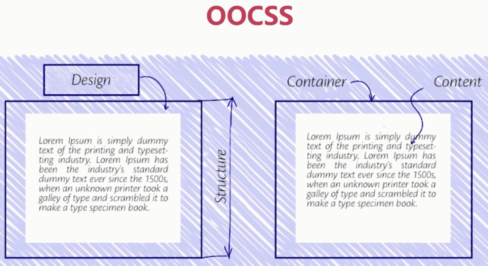
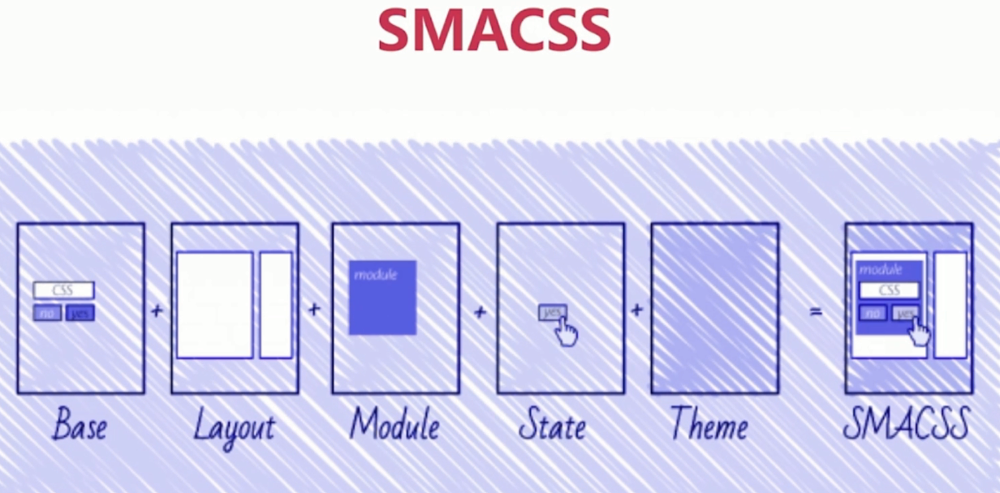
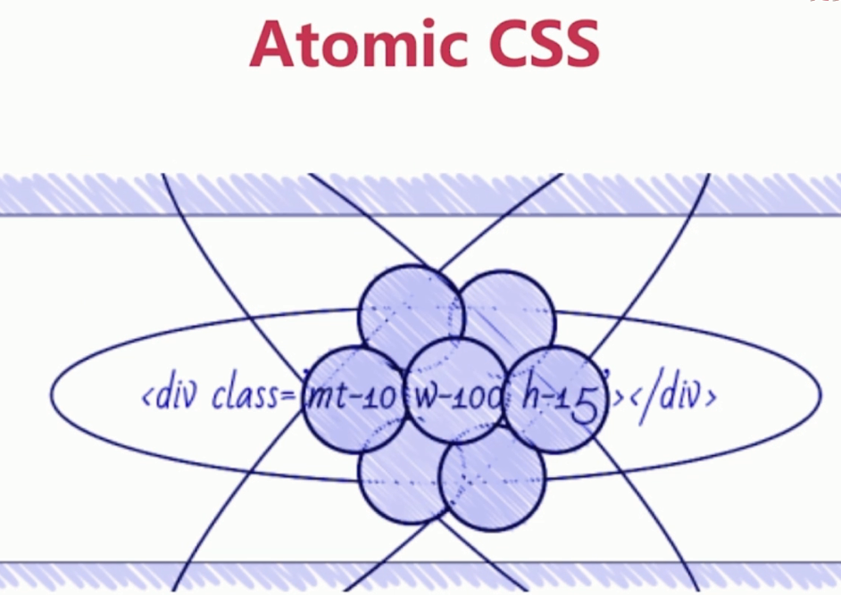
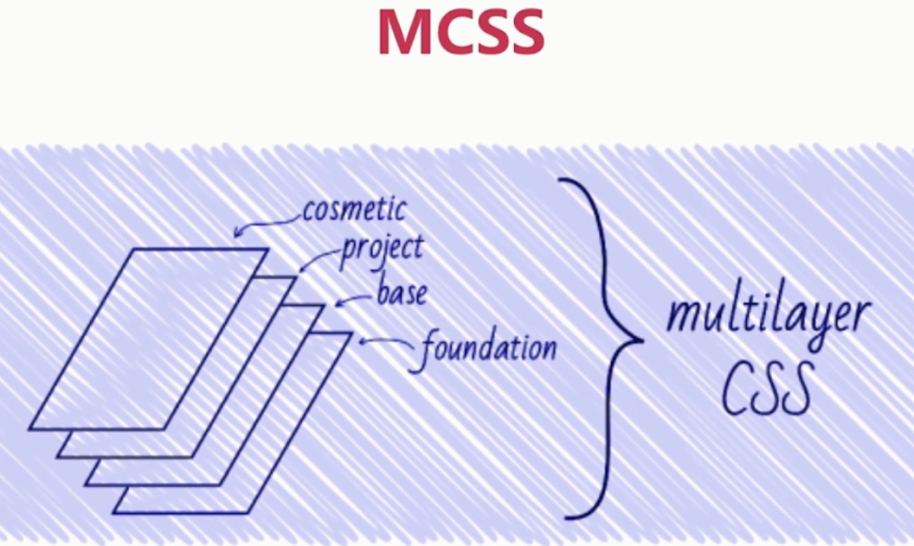
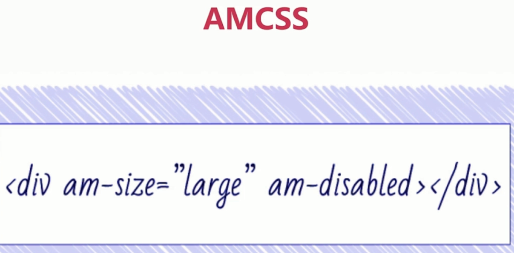
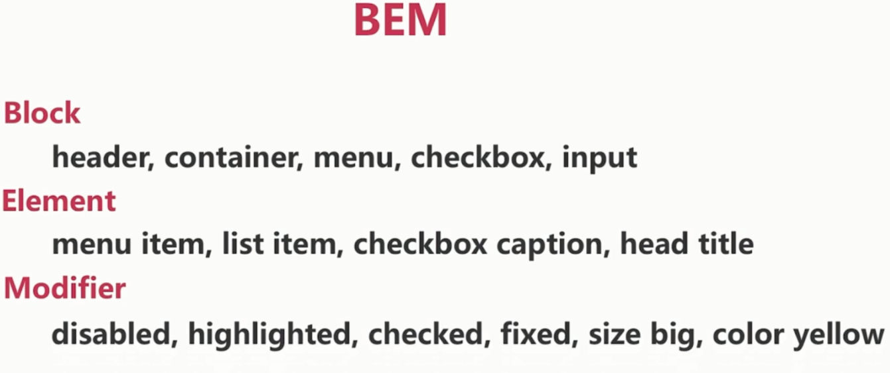
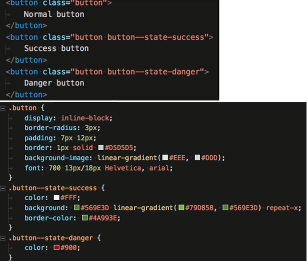

# CSS 模块化

### CSS 设计模式

- OOCSS

面向对象的 CSS, 结构和设计的分离, 容器和内容的分离

- SMACSS

可扩展和模块化 CSS, 节省代码量, 简化代码维护

- Atomic CSS

原子 CSS, 每个 CSS 作用定义一个 class, 原子细小化

- MCSS

多层级 CSS

- AMCSS

针对属性编码

- BEM

### CSS Modules