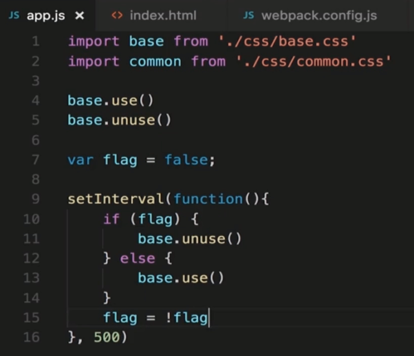
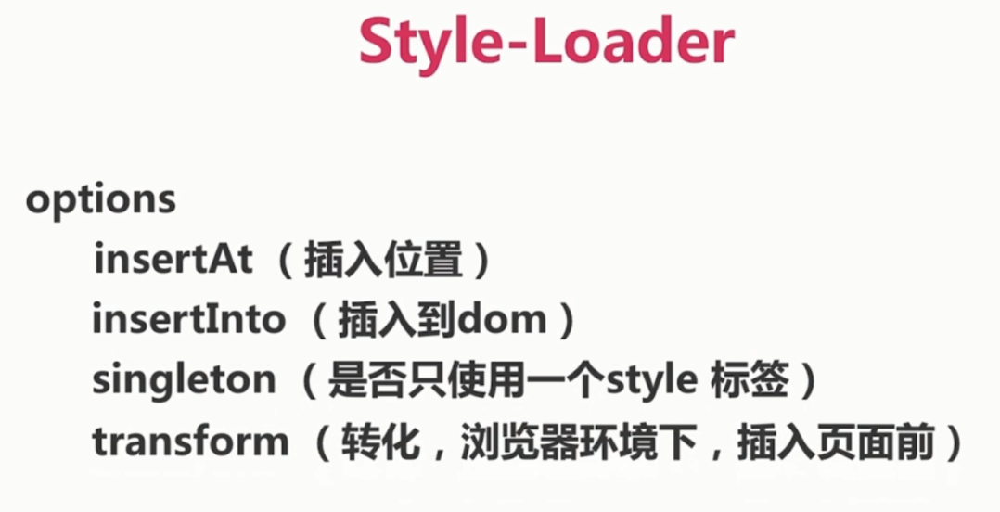
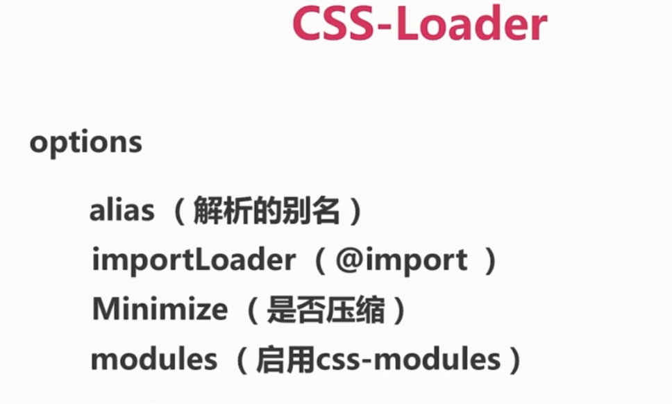
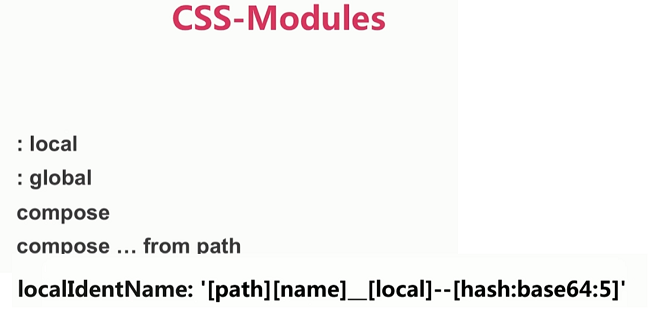

# 处理 CSS

引入

CSS modules

配置 less/sass

提取 CSS 代码

### style-loader

创建标签

- style-loader

在浏览器中是一个 `<style></style>` 标签

```js
module: {
  rules: [
    {
      test: /\.css$/,
      use: [
        {
          loader: 'style-loader',
        },
        {
          loader: 'css-loader' // 摆在后面先加载
        }
      ]
    }
  ]
}
```

- style-loader/url

在浏览器中是一个 `<link></link>` 标签, 注意配置 `publicPath`

```js
module: {
  rules: [
    {
      test: /\.css$/,
      use: [
        {
          loader: 'style-loader/url',
        },
        {
          loader: 'file-loader' // 需要先安装
        }
      ]
    }
  ]
}
```

- style-loader/useable

控制页面是否插入 `<style></style>` 标签



#### style-loader 配置



### css-loader

让 js 可以 import 样式文件

#### css-loader 配置





### 安装

`npm i style-loader css-loader -D`

### 配置 less/sass

安装 less: `npm i less-loader lee -D`

安装 sass: `npm i sass-loader node-sass -D`

```js
module: {
  rules: [
    {
      test: /\.less$/,
      use: [
        {
          loader: 'style-loader',
        },
        {
          loader: 'css-loader'
        },
        {
          loader: 'less-loader'
        }
      ]
    }
  ]
}
```

### 提取 CSS

方式一: extract-loader

方式二: ExtractTextWebpackPlugin

这里只介绍第二种常用的方式.

安装: `npm i webpack extract-text-webpack-plugin -D`

```js
var path = require('path')
var ExtractTextWebpackPlugin = require('extract-text-webpack-plugin')

module.exports = {
  entry: {
    'pageA': './pageA',
  },
  output: {
    path: path.resolve(__dirname, './dist'),
    publicPath: './dist/',
    filename: '[name].bundle.js',
  },
  module: {
    rules: [
      {
        test: /\.less$/,
        use: ExtractTextWebpackPlugin.extract({
          fallback: {
            loader: 'style-loader',
          },
          use: [
            {
              loader: 'css-loader',
              options: {
                minimize: true
              }
            },
            {
              loader: 'less-loader'
            }
          ]
        })
      }
    ]
  },
  plugins: [
    new ExtractTextWebpackPlugin({
      filename: '[name].min.css',
      allChunks: false
    })
  ]
}
```

需要手动在 html link 方式引入 css 文件