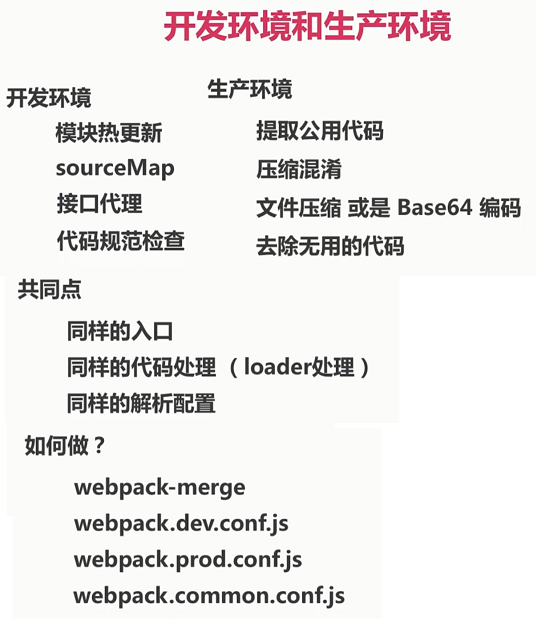

# 区分开发环境和生产环境



- package.json 指定环境

```js
{
  "scripts": {
    "server": "webpack-dev-server --env development --open --config build/webpack.common.conf.js",
    "build": "webpack --env production --config build/webpack.common.conf.js"
  },
}
```

- `.babelrc`

```js
{
  "presets": [
    "env"
  ]
}
```

- `build/webpack.common.conf.js`

```js
const webpack = require("webpack");
const merge = require("webpack-merge");
const ExtractTextPlugin = require("extract-text-webpack-plugin");
const HtmlWebpackPlugin = require("html-webpack-plugin");

const path = require("path");

const productionConfig = require("./webpack.prod.conf");
const developmentConfig = require("./webpack.dev.conf");

const generateConfig = env => {
  let scriptLoader = [
    {
      loader: "babel-loader"
    }
  ];
  let scssLoader = [
    {
      loader: "css-loader",
      options: {
        minimize: true,
        sourceMap: env === "development" ? true : false
      }
    },
    {
      loader: "sass-loader",
      options: { sourceMap: env === "development" ? true : false }
    }
  ];
  let styleLoader =
    env === "production"
      ? ExtractTextPlugin.extract({
          fallback: {
            loader: "style-loader"
          },
          use: scssLoader
        })
      : [
          {
            loader: "style-loader",
            options: { sourceMap: env === "development" ? true : false }
          }
        ].concat(scssLoader);

  return {
    entry: { app: "./src/app.js" },
    output: {
      publicPath: env === "development" ? "/" : __dirname + "/../dist/",
      path: path.resolve(__dirname, "../dist"),
      filename: "[name]-[hash:5].bundle.js",
      chunkFilename: "[name]-[hash:5].chunk.js"
    },
    module: {
      rules: [
        { test: /\.js$/, exclude: /(node_modules)/, use: scriptLoader },
        { test: /\.scss$/, use: styleLoader }
      ]
    },
    plugins: [
      new HtmlWebpackPlugin({
        filename: "index.html",
        template: "./index.html",
        chunks: ["app"],
        minify: {
          collapseWhitespace: true
        }
      }),
      new webpack.ProvidePlugin({ $: "jquery" })
    ]
  };
};

module.exports = env => {
  let config = env === "production" ? productionConfig : developmentConfig;
  return merge(generateConfig(env), config);
};
```

- `build/webpack.dev.conf.js`

```js
const webpack = require("webpack");

const path = require("path");

module.exports = {
  devtool: "source-map",
  devServer: {
    contentBase: path.join(__dirname, "../dist/"),
    port: 8000,
    hot: true,
    overlay: true,
    proxy: {
      "/comments": {
        target: "https://m.weibo.cn",
        changeOrigin: true,
        logLevel: "debug",
        headers: {
          Cookie: ""
        }
      }
    }
  },
  plugins: [
    new webpack.HotModuleReplacementPlugin(),
    new webpack.NamedModulesPlugin()
  ]
};
```

- `build/webpack.prod.conf.js`

```js
const ExtractTextPlugin = require("extract-text-webpack-plugin");
const CleanWebpackPlugin = require("clean-webpack-plugin");

const path = require("path");

module.exports = {
  plugins: [
    new ExtractTextPlugin({
      filename: "[name].min.css",
      allChunks: false // 只包括初始化css, 不包括异步加载的CSS
    }),
    new CleanWebpackPlugin(["dist"], {
      root: path.resolve(__dirname, "../"),
      verbose: true
    })
  ]
};
```