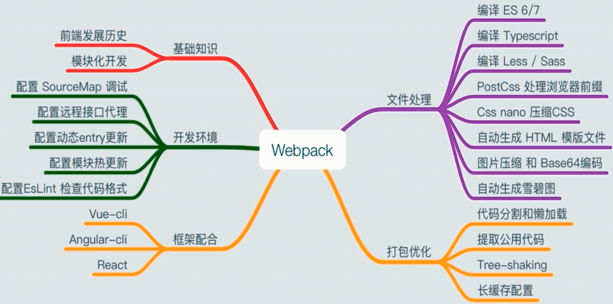
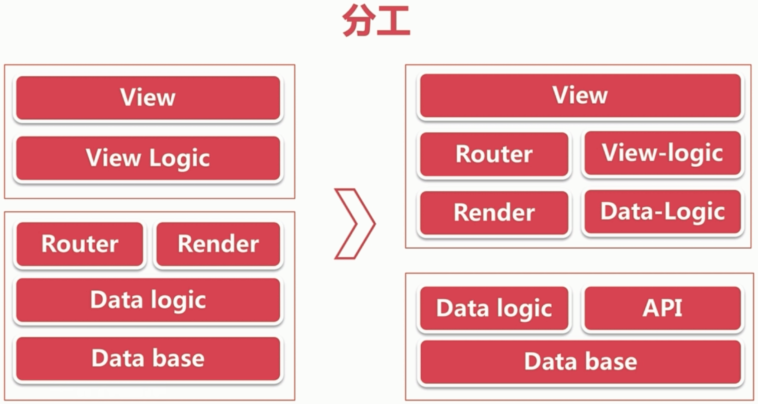
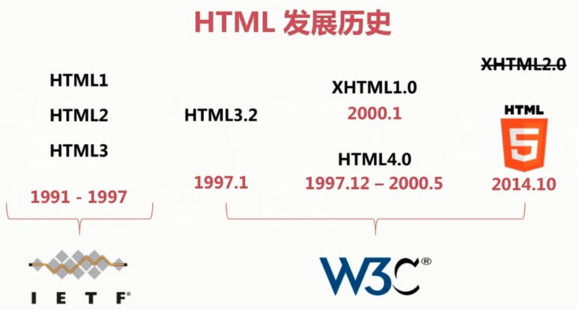
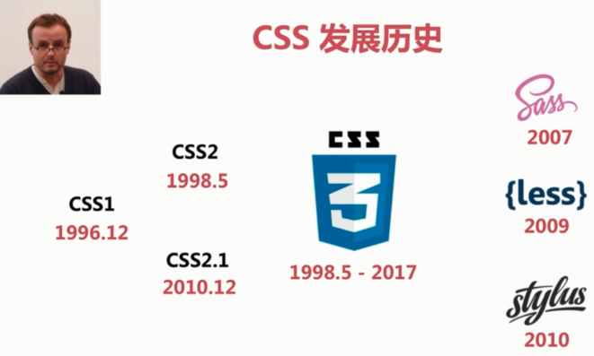
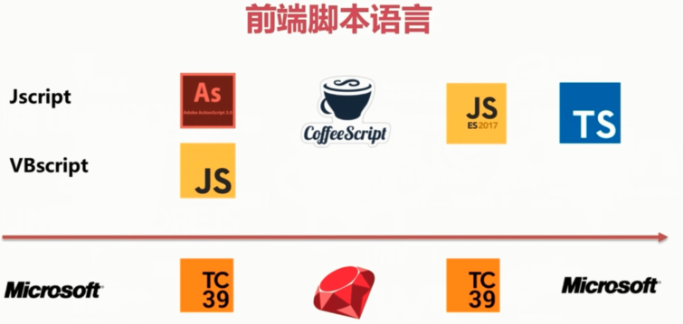

# Webpack 介绍

### webpack 由来

Tobias Koppers(Java开发) -> 喜欢 GWT(Google Web Toolkit) 的代码分隔 -> 提交 Pull request 未被接受 -> 自己创建 Webpack -> Instagram 支持维护

### 前端的变化

- 开发分工变化

- 框架的变化

JS 库 -> MVC -> MV*

- 语言的变化

- 环境的变化

早期只有浏览器 -> 同构(浏览器 + Node + RN)

- 社区的变化

现在都是 github + npm

- 工具的变化

### 为什么需要构建

- 开发复杂化

- 框架去中心化

- 语言编译化

- 开发模块化

### 为什么是 Webpack

vue-cli/react-starter/angular-cli 都是用 Webpack

code-splitting 代码分割

天生的模块化

...