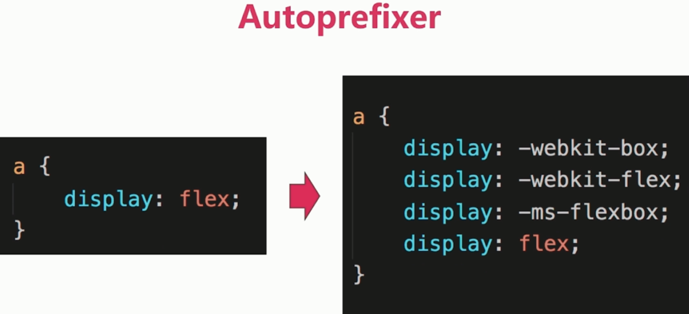
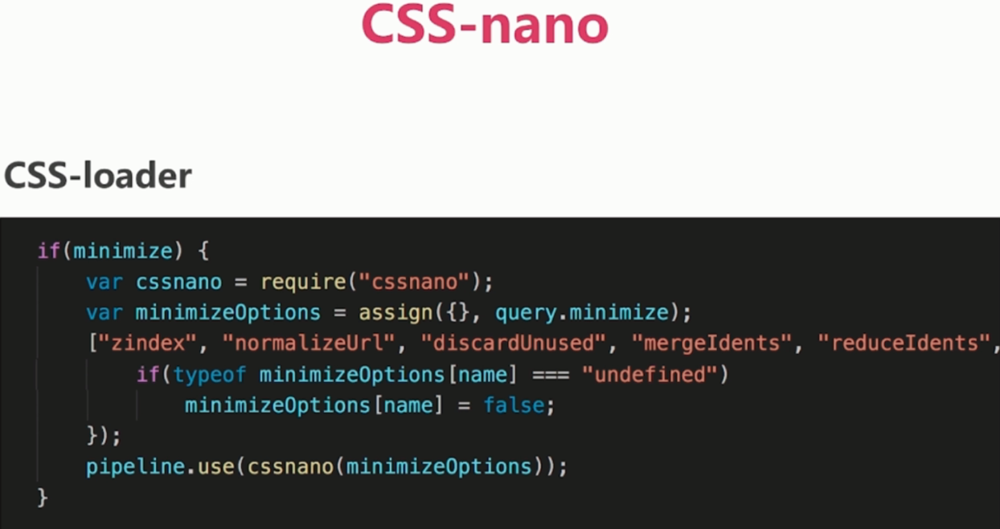

# PostCSS

PostCSS、Autoprefixer、CSS-nano、CSS-next 类似工具.

PostCSS 处理 CSS 的工具.

Autoprefixer: 浏览器前缀



CSS-nano: 优化、压缩 (CSS-loader 有)



CSS-next: 新语法转换, css variables、custome selectors、calc()

### 实战

安装: `npm i postcss postcss-loader autoprefixer cssnano post-cssnext -D`

配置:

```js
module: {
    rules: [
      {
        test: /\.less$/,
        use: ExtractTextWebpackPlugin.extract({
          fallback: {
            loader: 'style-loader',
          },
          use: [
            {
              loader: 'css-loader',
              options: {
                minimize: true
              }
            },
            {
              loader: 'postcss-loader', // 注意 postcss-loader 书写的位置
              options: {
                ident: 'postcss',
                plugins: [
                  // require('autoprefixer')(),
                  require('postcss-cssnext')(), // 已经包含 autoprefixer
                ]
              }
            }
            {
              loader: 'less-loader'
            }
          ]
        })
      }
    ]
  },
```

### browserslist

所有插件都共用:

方式一, 在 package.json 设置

```json
"browserslist": [
    ">= 1%",
    "last 2 versions"
]
```

方式二, 新增 .browserslistrc 文件