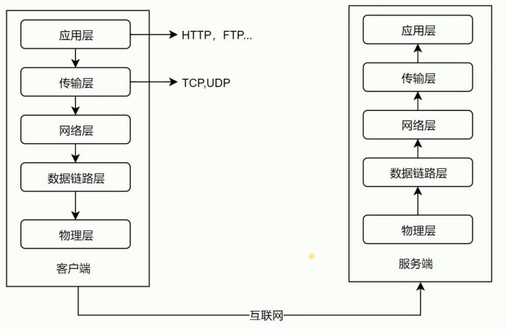

# 五层网络模型

### 低三层

- 物理层主要作用是定义物理设备如何传输数据

- 数据链路层在通信的实体间建立数据链路连接

- 网络层为数据在结点之间传输创建逻辑链路

### 传输层

主要有两个协议 `tcp` 和 `udp`.

向用户提供可靠的端到端(`End-to-End`)服务

传输层向高层屏蔽了下层数据通信的细节

### 应用层

`http` 协议就在这一层

为应用软件提供了很多服务

构建于 `TCP` 协议之上

屏蔽网络传输相关细节