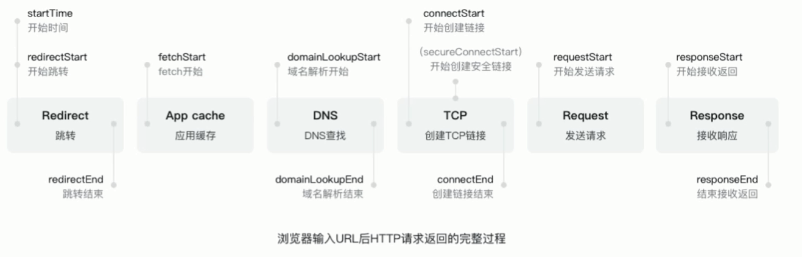
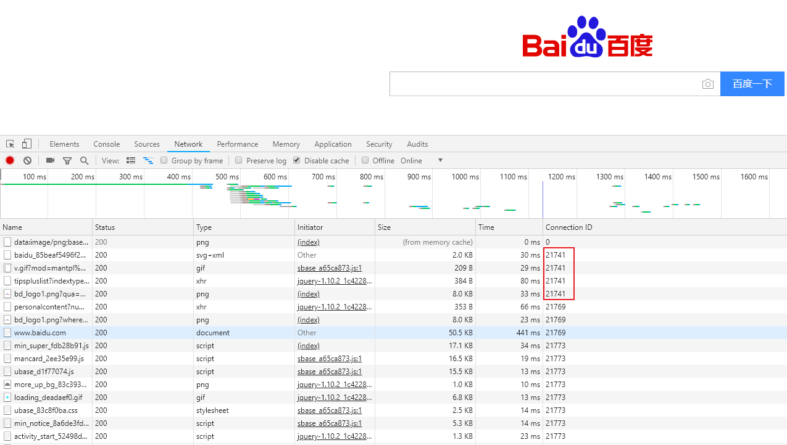
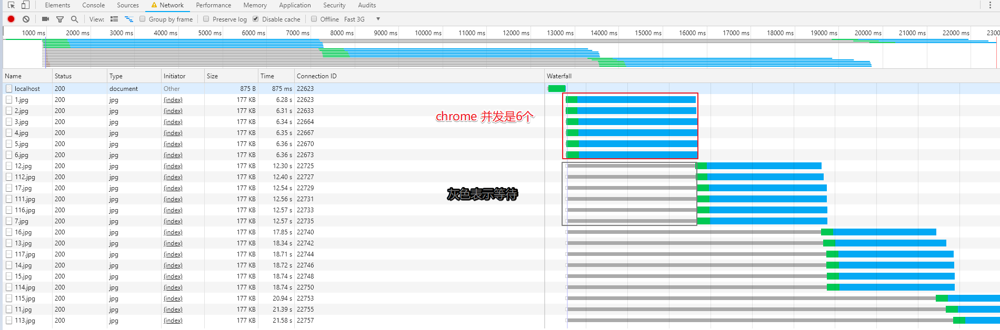
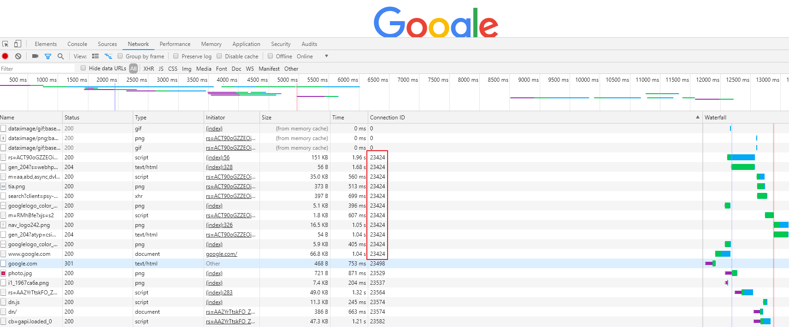
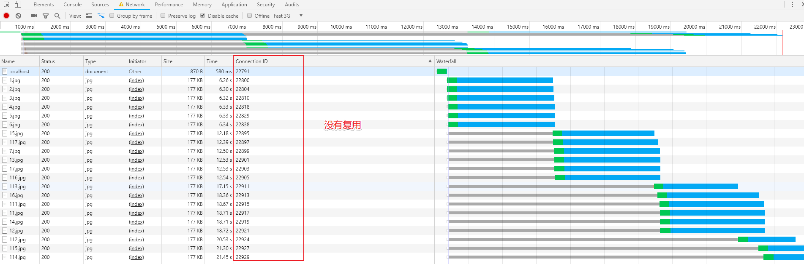

# HTTP 长连接

在一个 `tcp` 连接发 多个 `http` 请求.



创建连接消耗性能



`chrome` 一般一次连接并发是 `6个`.

`Connection: keep-alive`

### 演示

- `server.js`

```js
const http = require('http')
const fs = require('fs')
http.createServer(function (request, response) {
  console.log('request come', request.url)
  const html = fs.readFileSync('test.html', 'utf-8')
  const img = fs.readFileSync('1.jpg')

  if(request.url === '/'){
      response.writeHead(200, {
        'Content-Type': 'text/html',
      })
    response.end(html)
  } else {
    response.writeHead(200, {
      'Content-Type': 'image/jpg',
    })
    response.end(img)
  }
}).listen(8888)

console.log('server run 8888')
```

- `test.html`

```html
<!DOCTYPE html>
<html lang="en">
<head>
  <meta charset="UTF-8">
  <title>Document</title>
</head>
<body>
  
  
  
  
  
  
  
  
  
  
  
  
  
  
  
  
  
  
  
  
  
</body>
</html>
```

- 长连接会复用 `tcp` 连接, `chrome` 并发是 `6个`.



- 默认是开启的



`Connection: keep-alive` 表示长连接开启.

`'Connection': 'close'` 关闭常长连接:

```js
response.writeHead(200, {
  'Content-Type': 'image/jpg',
  'Connection': 'close'
})
```

