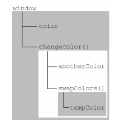

# 作用域链

如果这个变量在自己的作用域中没有，那么它会寻找父级的，直到最顶层。

```js
var color = "blue";

function changeColor() {
  var anotherColor = "red";

  function swapColors() {
    var tempColor = anotherColor;
    anotherColor = color;
    color = tempColor;

    // 这里可以访问 color、anotherColor 和 tempColor
  }

  // 这里可以访问 color 和 anotherColor, 但不能访问 tempColor
  swapColors();
}

// 这里只能访问 color
changeColor();
```



内部环境可以通过作用域链访问所有的外部环境, 外部环境不能访问内部环境中的任何变量和函数.

每个环境都可以向上搜索作用域链, 以查询变量和函数名; 但任何环境都不能通过向下搜索作用域链而进入另一格执行环节.

下图只考虑浏览器环境


::: tip 相关链接:
[https://book.douban.com/subject/10546125/](https://book.douban.com/subject/10546125/), by 《JavaScript 高级程序设计》.
:::