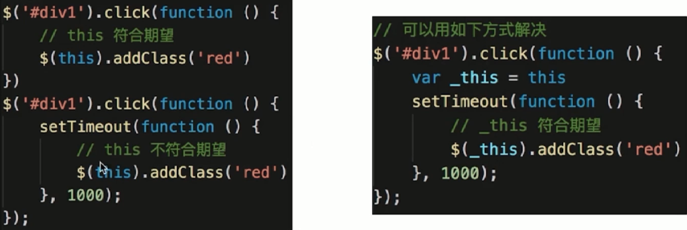

# 代理模式

- 使用者无权访问目标对象

- 中间加代理, 通过代理做授权和控制

### 设计原则验证

- 代理类和目标类分离, 隔离开目标类和使用者

- 符合开放封闭原则

### 实例代码

```js
class ReadImg {
  constructor(fileName) {
    this.fileName = fileName
    this.loadFromDisk() // 初始化从硬盘加载
  }
  display() {
    console.log('display...' + this.fileName)
  }
  loadFromDisk() {
    console.log('loading...' + this.fileName)
  }
}

class ProxyImg {
  constructor(fileName) {
    this.realImg = new ReadImg(fileName)
  }
  display() {
    this.realImg.display()
  }
}

let proxyImg = new ProxyImg('1.png')

// loading...1.png
// display...1.png
proxyImg.display()
```

### 代理模式 VS 适配器模式

适配器模式: 提供一个不同的接口(如不同版本的插头)

代理模式: 提供一模一样的接口

### 代理模式 VS 装饰器模式

装饰器模式: 扩展功能, 原有功能不变且可直接使用

代理模式: 显示原有功能, 但是经过限制或者阉割之后的

### 场景 - 网页事件代理

```html
<!DOCTYPE html>
<html lang="en">

<head>
  <meta charset="UTF-8">
  <meta name="viewport" content="width=device-width, initial-scale=1.0">
  <meta http-equiv="X-UA-Compatible" content="ie=edge">
  <title>Document</title>
</head>

<body>
  <div id="div1">
    <a>a1</a>
    <a>a2</a>
    <a>a3</a>
    <a>a4</a>
    <a>a5</a>
  </div>

  <script src="https://cdn.bootcss.com/jquery/3.3.1/jquery.min.js"></script>
  <script>
    var div1 = document.getElementById('div1')
    div1.addEventListener('click', function (e) {
      var target = e.target
      if (target.nodeName === 'A') {
        console.log(target)
      }
    })
  </script>
</body>

</html>
```

### 场景 - jQuery $.proxy



推荐

```js
// 推荐使用 $.proxy 解决, 这样就少定义一个变量
$('#div1').click(function(){
  setTimeout($.proxy(function(){
    // this 符合期望
    $(this).addClass('red')
  }, this), 1000)
})
```

### 场景 - ES6 Proxy

```js
// 明星
let star = {
    name: '张XX',
    age: 25,
    phone: '139111111'
}

// 经纪人
let agent = new Proxy(star, {
    get: function (target, key) {
        if (key === 'phone') {
            // 返回经纪人自己的手机号
            return '18611112222'
        }
        if (key === 'price') {
            // 明星不报价，经纪人报价
            return 120000
        }
        return target[key]
    },
    set: function (target, key, val) {
        if (key === 'customPrice') {
            if (val < 100000) {
                // 最低 10w
                throw new Error('价格太低')
            } else {
                target[key] = val
                return true
            }
        }
    }
})

// 主办方
console.log(agent.name)
console.log(agent.age)
console.log(agent.phone)
console.log(agent.price)

// 想自己提供报价（砍价，或者高价争抢）
agent.customPrice = 150000

// agent.customPrice = 90000  // 报错：价格太低
console.log('customPrice', agent.customPrice)
```