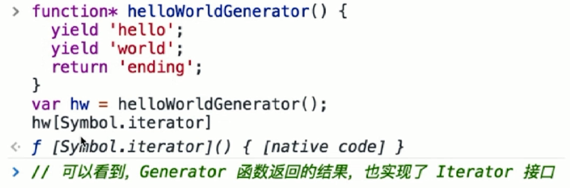

# 迭代器模式

- 顺序访问一个集合

- 使用者无需知道集合的内部结构(封装)

### 设计原则验证

- 迭代器对象和目标对象分离

- 迭代器将使用者与目标对象隔离开

- 符合开放封闭原则

### 代码

```html
<!DOCTYPE html>
<html lang="en">

<head>
  <meta charset="UTF-8">
  <title>Iterator</title>
</head>

<body>
  <p>jquery each</p>
  <p>jquery each</p>
  <p>jquery each</p>

  <script src="https://cdn.bootcss.com/jquery/3.3.1/jquery.min.js"></script>
  <script>
    // 三种不同的数据结构, 需要三种不同 api

    // 第一个, 数组
    var arr = [1, 2, 3]

    arr.forEach(function (item) {
      console.log(item)
    })
    // 第二个, 类数组
    var nodeList = document.getElementsByTagName('p')

    var i, length = nodeList.length
    for (i = 0; i < length; i++) {
      console.log(nodeList[i])
    }

    // 第三个, 对象
    var $p = $('p')

    $p.each(function (key, p) {
      console.log(key, p)
    })
  </script>
</body>

</html>
```

`能否写一个函数去支持上面三种数据结构?`

```js
var arr = [1, 2, 3]
var nodeList = document.getElementsByTagName('p')
var $p = $('p')

// 顺序遍历有序集合
// 使用者不必知道集合的内部结构

function each(data){
  var $data = $(data)
  $data.each(function(key, val){
    console.log(key, val)
  })
}

each(arr)
each(nodeList)
each($p)
```

### Iterator 封装

```js
class Iterator {
  constructor(container) {
    this.list = container.list
    this.index = 0
  }
  next() {
    if (this.hasNext()) {
      return this.list[this.index++]
    }
    return null
  }
  hasNext() {
    if (this.index >= this.list.length) {
      return false
    }
    return true
  }
}

class Container {
  constructor(list) {
    this.list = list
  }
  // 生成遍历器
  getIerator() {
    return new Iterator(this)
  }
}

let arr = [1, 2, 3, 4, 5, 6]
let container = new Container(arr)
let iterator = container.getIerator()

while (iterator.hasNext()) {
  console.log(iterator.next())
}

/*
输出:
1
2
3
4
5
6
*/
```

### 场景 - jQuery each

```js
function each(data){
  var $data = $(data)
  $data.each(function(key, val){
    console.log(key, val)
  })
}

each(arr)
each(nodeList)
each($p)
```

### 场景 - ES6 Iterator

#### ES6 Iterator 为何存在

- `ES6` 语法中, 有序集合的数据类型已经有很多

- `Array` `Map` `Set` `String` `typedArray` `arguments` `NodeList`

- 需要有一个统一的遍历接口来遍历所有的数据类型

- `object` 不是有序集合, 可以用 `map` 代替

#### ES6 Iterator 是什么

- 以上数据类型, 都有 `[Symbol.iterator]` 属性

- 属性值是函数, 执行函数返回一个迭代器

- 这个迭代器就有 `next` 方法可顺序迭代子元素

- 可运行 `Array.prototype[Symbol.iterator]` 来测试

```js
Array.prototype[Symbol.iterator]
ƒ values() { [native code] }

Array.prototype[Symbol.iterator]()
Array Iterator {}

Array.prototype[Symbol.iterator]().next()
{value: undefined, done: true}
```

```js
function each(data) {
  // 生成遍历器
  let iterator = data[Symbol.iterator]()

  // console.log(iterator.next())  // 有数据时返回 {value: 1, done: false}
  // console.log(iterator.next())
  // console.log(iterator.next())
  // console.log(iterator.next())
  // console.log(iterator.next())  // 没有数据时返回 {value: undefined, done: true}

  let item = {done: false}
  while (!item.done) {
    item = iterator.next()
    if (!item.done) {
      console.log(item.value)
    }
  }
}
```

#### ES6 Iterator 示例

```js
let arr = [1, 2, 3, 4]
let nodeList = document.getElementsByTagName('p')

let m = new Map()
m.set('a', 100)
m.set('b', 200)

each(arr)
each(nodeList)
each(m)
```

#### ES6 Iterator 示例 - for...of

```js
// Symbol.iterator 并不是人人都知道
// 也不是每个人都需要封装一个 each 方法
// 因此有了 for...of 语法
function each(data) {
    for (let item of data) {
        console.log(item)
    }
}

each(arr)
each(nodeList)
each(m)
```

#### ES6 Iterator 与 Generator

- `Iterator` 的价值不限于上述几个类型的遍历

- 还有 `Generator` 函数的使用

- 即只要返回的数据符合 `Iterator` 接口的要求

- 即可使用 `Iterator` 语法, 这就是迭代器模式

