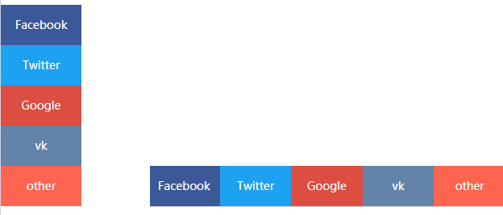

# 响应式布局

一个页面可以响应所有平台(PC端、Pad端、手机端)

结论: 小网站挺好(落地页), 大网站不适合(PC的淘宝和手机的淘宝, 分域名自动访问 `www.taobao.com` 或者 `m.taobao.com`)

响应式实现技术: 媒体查询, `@media` 就是个 `if`, 本质就是样式的优先级.

```css
@media(条件){
  css代码 /*注意优先级*/
}

@media (max-width:800px) {
  .box {background: red;}
}
```

`media` **其他方式**:

```html
<!-- 屏幕版 -->
<style media="screen">
  .box{height: 300px; background: green；}
</style>

<!-- 打印版 -->
<style media="print">
  .box{height: 300px; background: yellow；}
</style>
```

**案例**:



```html
<!DOCTYPE html>
<html lang="en">
<head>
  <meta charset="UTF-8">
  <meta name="viewport" content="width=device-width, initial-scale=1.0">
  <meta http-equiv="X-UA-Compatible" content="ie=edge">
  <title>Document</title>
  <style>
    *{margin: 0;padding: 0;list-style: none;}
    #aside {height: 250px;position: fixed;left: 0;top: 50%;margin-top: -125px; }
    #aside li {width: 100px;height: 50px;text-align: center;line-height: 50px;transition: .3s; color: white}
    #aside li:hover {width: 150px;}

    #aside li.b1 {background: #3b5998;}
    #aside li.b2 {background: #1da1f1;}
    #aside li.b3 {background: #db4e41;}
    #aside li.b4 {background: #6383a8;}
    #aside li.b5 {background: #fe6550;}

    @media (max-width: 800px){
      #aside {height: 50px; display: flex; width: 100%; bottom: 0; top: auto; margin-top: 0;}
      #aside li {flex: 1; width: auto}
      #aside li:hover {width: 150px; width: auto}
    }
  </style>
</head>
<body>
  <ul id="aside">
    <li class="b1">Facebook</li>
    <li class="b2">Twitter</li>
    <li class="b3">Google</li>
    <li class="b4">vk</li>
    <li class="b5">other</li>
  </ul>
</body>
</html>
```

**其他方案**:

```css
@media (min-width: 1200px) {
  /* 大屏 */
}

@media (min-width: 992px and max-width: 1200px) {
  /* 中等屏幕 */
}

@media (min-width: 768px and max-width: 992px) {
  /* 中屏 */
}

@media (max-width: 768px) {
  /* 小屏 */
}
```
