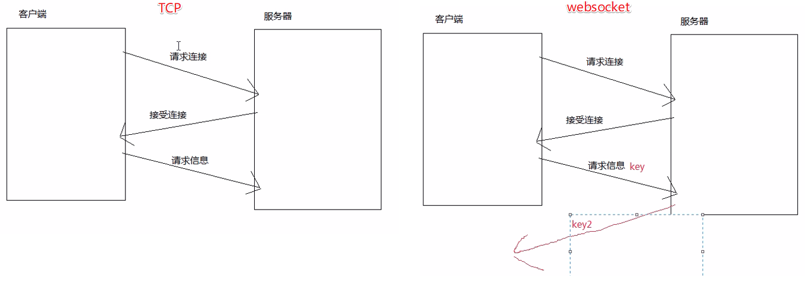
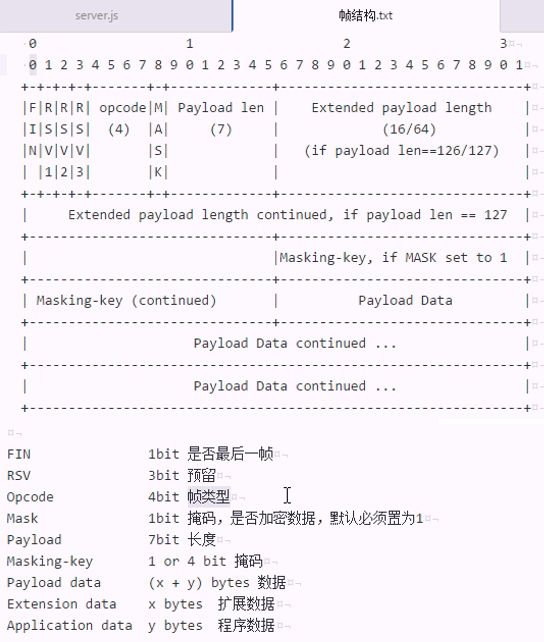

# WebSocket

1. `socket.io` 特别好用
2. JS 之类的高级语言特别不擅长处理2进制数据
3. WebSocket 基于 http 的是指 WebSocket 建立连接的部分, 连接建立之后, 就变成2进制的连接了

WebSocket 更像 socket(套接字).

node 做 socket 通信.

`OSI` 7层 `参考` 交换模型, 实际用的是5层.

```md
物理层  编码、材质、造价、电压                        CDMA
链路层  内网传输, 内网寻址                           arp
网络层  外网传输, 外网路由                           ip
传输层  传输质量  可靠连接(保证达到、保证正确、保证顺序)  TCP
表现层  屏蔽不同网络类型之间的差异    (5层模型去掉了)x
会话层  保持双方的状态              (5层模型去掉了)x
应用层  具体应用相关的功能                            http/ftp/pop3/smtp/WebSocket
```

TCP 协议:

Transmission Control Protocol, 保证质量

socket 就是一个 tcp 协议. node 的 net api就是 tcp协议.  `socket == tcp == node 的 net`

`web socket` `ws: //`

`web socket security` `wss://`



tcp 三次握手, websocket 四次握手

- `server.js`

```JS
const net = require('net')
const crypto = require('crypto')

// 1. 创建一个 tcp 服务器
let server = net.createServer(socket => {
  console.log('有人来连我了')

  // 3. 接受浏览器发过来的特殊头, 处理、返回处理结果
  socket.once('data', data => {
    // 第一次

    // 第一步: 把数据转换成 headers 的 json
    let str = data.toString()
    let aHeaders = str.split('\r\n')

    aHeaders.shift()
    aHeaders.pop()
    aHeaders.pop()

    let headers = {}

    aHeaders.forEach(str=>{
      let [name, value] = str.split(': ')

      headers[name] = value
    })

    console.log(headers)
    // 第二步: 校验
    if(headers['Connection'] != 'Upgrade' || headers['Upgrade'] != 'websocket'){
      console.log('接到了一个 ws 以外的协议, 扔了')
      socket.end()
    }else{
      // 第三步: 处理 websocket 专有头
      if(headers['Sec-WebSocket-Version'] != 13){
        console.log('版本不是想要的')
      }else{
        // 第四步: 处理 key
        // C -> S, 客户端发给服务端: "IRecy6Hbx+H25YloLAqpaA=="
        // S -> C, 服务端发给客户端: base64(sha1("IRecy6Hbx+H25YloLAqpaA==" + "258EAFA5-E914-47DA-95CA-C5AB0DC85B11"))
        // 258EAFA5-E914-47DA-95CA-C5AB0DC85B11 是作者随便搞的, 这个是神奇的 GUID, 都是用的他

        let hash = crypto.createHash('sha1')
        hash.update(headers['Sec-WebSocket-Key']+"258EAFA5-E914-47DA-95CA-C5AB0DC85B11")
        // 输出
        let bash64Key = hash.digest('base64')

        // bash64Key 发给客户端
        // 101 切换协议
        socket.write(
          `HTTP/1.1 101 Switching protocols\r\nUpgrade: websocket\r\nConnection: Upgrade\r\nSec-WebSocket-Accept: ${bash64Key}\r\n\r\n`
        )

        console.log('握手完成')
      }

      // 后续
      socket.on('data', data => {
        // 帧结构 if(data[0]&0x0001){ alert('最后一个') }
        console.log(data)
      })
    }


    // 其他
  })
  socket.on('end', function() {
    console.log('连接已断开')
  })
})


server.listen(8080)
```

- `client.html`

```html
<!DOCTYPE html>
<html lang="en">
<head>
  <meta charset="UTF-8">
  <title>Document</title>
  <script>
    // 2. 连接到服务器
    let ws = new WebSocket('ws://localhost:8080')

    ws.onopen=function(){
      alert('连接已打开')
      ws.send('abc')
    }
    ws.onmessage=function(){
      alert('有消息过来')
    }
    ws.onclose=function(){
      alert('连接已断开')
    }
    ws.onerror=function(){
      alert('连接出错了')
    }
  </script>
</head>
<body>
  
</body>
</html>
```

- 请求头

```JS
Sec-WebSocket-Extensions: permessage-deflate; client_max_window_bits

// websocket 校验身份的
Sec-WebSocket-Key: I6AYwNLmYNF+8e3V292Byg==

Sec-WebSocket-Version: 13

// 告诉服务器是升级版的协议: websocket
Upgrade: websocket
Connection: Upgrade
```

**第一次数据比较特殊, 还是 http 的头**:

拿到的是个字符串: `\r\n` 换行, 最后 `两个` 多余空行

```JS
GET / HTTP/1.1
Host: localhost:8080
Connection: Upgrade
Pragma: no-cache
Cache-Control: no-cache
User-Agent: Mozilla/5.0 (Windows NT 10.0; WOW64) AppleWebKit/537.36 (KHTML, like Gecko) Chrome/69.0.3497.100 Safari/537.36
Upgrade: websocket
Origin: file://
Sec-WebSocket-Version: 13
Accept-Encoding: gzip, deflate, br
Accept-Language: zh-CN,zh;q=0.9,en;q=0.8
Sec-WebSocket-Key: IRecy6Hbx+H25YloLAqpaA==
Sec-WebSocket-Extensions: permessage-deflate; client_max_window_bits


```

`sha` 和 `md5` 散列算法, 签名算法. `node` `crypto` 模块就是做这些

原生 WebSocket:

1. node 的 net 模块(java 用 javax.websocket、PHP 用 socket、c 用 socket、python 用 net)

2. 增加一步校验

C -> S , Key

S -> C , base64(sha1(key+guid)), guid 每个版本不一样

----------------------------

解析二进制:

```md
`<Buffer 81 83 db 67 b1 06 ba 05 d2>`

十六进制  二进制
81      10000001
83      10000011
67      01100111
b1      10110001
06      00000110
ba      10111010
05      00000005
d2      11010010


81        10000001 对应下面的

FIN       1
RSV1~3    000
opencode  0001

83      10000011  对应下面的

MASK        1
Payload len 0000011(十进制的3, 载荷的长度)
```



[W3C websocket](https://www.w3.org/TR/2009/WD-websockets-20091222/)