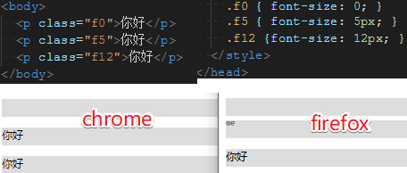

# font-size 最小 12px



## 为什么不建议将 font-size 设置为 12px 以下

因为 `Chrome` 这款任性的浏览器做了如下限制：

- `font-size` 有一个最小值 `12px`（不同操作系统、不同语言可能限制不一样），低于 `12px` 的，一律按 `12px` 显示。理由是 `Chrome` 认为低于 `12px` 的中文对人类是不友好的.

- 但是允许你把 `font-size` 设置为 `0`.

- 这个 `12px` 的限制用户是可以自行调整的，进入 `chrome://settings/fonts` 设置，滚动到最下方你就可以调整 `12px` 为其他值.

## 如果我一定要设置小于 12px 的字体怎么办

1. Chrome `29` 版本之前，你可以使用 `-webkit-text-size-adjust: none;` 来解除这个限制.`29` 版本后，就不能这样做了.

2. 你可以先设置 `12px`，然后使用 `transform: scale(0.833333)` 将元素缩小，效果跟 `10px` 很接近.**不过要注意的是，transform: scale 出了缩小 font-size，也会缩小其他一些属性，需要多测试**.

3. 用图片：如果是展示的内容基本是固定不变的话，可以直接切图兼容性也完美(不到万不得已，不建议).

4. 找 UI 设计师沟通：为了兼容各大主流浏览器，避免后期设计师来找你撕逼，主动找TA沟通，讲明原因.

`transform:scale()` 这个属性只可以缩放可以定义宽高的元素，而行内元素是没有宽高的，我们可以加上一个 `display:inline-block;` 属性就好啦。

如果要兼容 `IE`:

```html
.small-font{
  font-size: 12px;
  -webkit-transform: scale(0.5);
}
.smallsize-font{
  Font-size: 6px;
}

<p class=“small-font samllsize-font”>温馨提示</p>
```

:::tip 原文链接
[前端开发面试题汇总](https://juejin.im/post/5ba6e77e6fb9a05d0b14359b), by 苏南.

[为什么不建议将 font-size 设置为 12px 以下？](https://zhuanlan.zhihu.com/p/22374961), by 方应杭.
:::