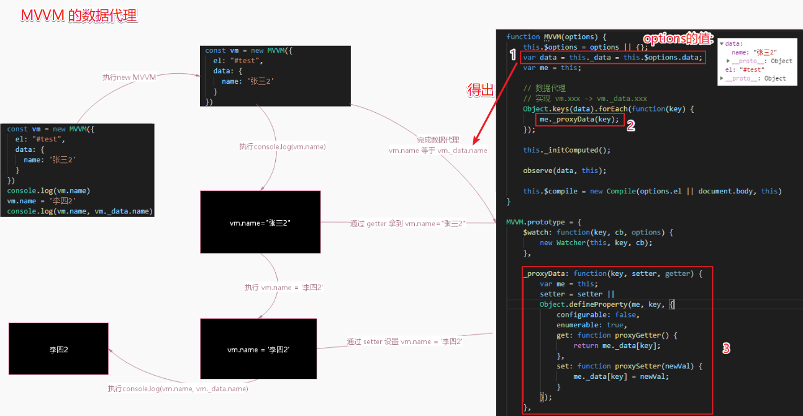

# 数据代理

## 数据代理原理

一句话概括 `数据代理`: `访问 vm.a 等价于访问 vm.$data.a`.

```js
实例创建之后，可以通过 vm.$data 访问原始数据对象。Vue 实例也代理了 data 对象上所有的属性，因此访问 vm.a 等价于访问 vm.$data.a
```

具体如下:

- 数据代理: 通过一个对象代理对另一个对象(在前一个对象内部)中属性的操作(读/写)
- `vue` 数据代理: 通过 `vm` 对象来代理 `data` 对象中所有属性的操作
- 好处: 更方便的操作 `data` 中的数据
- 基本实现流程
  - 通过 `Object.defineProperty()` 给 `vm` 添加与 `data` 对象的属性对应的属性描述符
  - 所有添加的属性都包含 `getter/setter`
  - `getter/setter` 内部去操作 `data` 中对应的属性数据

## 数据代理过程解析

注意: `vue` 源码是通过 `$data`, 而以下代码是自己模拟实现 `MVVM` 用 `_data`, 明白思路就好.

```js
const vm = new MVVM({
  el: "#test",
  data: {
    name: '张三2'
  }
})
console.log(vm.name)  // 读取的是 data 中的 name,  vm 代理对 data 的读操作
vm.name = '李四2' // 数据保存到 data 中的 name 上, vm 代理对 data 的写操作
console.log(vm.name, vm._data.name)
```



## 模拟数据代理实现

- `mvvm.js`

自己实现 `mvvm` 实现数据代理:

```js
/*
相关于Vue的构造函数
 */
function MVVM(options) {
  // 将选项对象保存到vm
  this.$options = options;
  // 将data对象保存到vm和datq变量中
  var data = this._data = this.$options.data;
  //将vm保存在me变量中
  var me = this;
  // 遍历data中所有属性
  Object.keys(data).forEach(function (key) { // 属性名: name
    // 对指定属性实现代理
    me._proxy(key);
  });

  // 对data进行监视
  observe(data, this);

  // 创建一个用来编译模板的compile对象
  this.$compile = new Compile(options.el || document.body, this)
}

MVVM.prototype = {
  $watch: function (key, cb, options) {
    new Watcher(this, key, cb);
  },

  // 对指定属性实现代理
  _proxy: function (key) {
    // 保存vm
    var me = this;
    // 给vm添加指定属性名的属性(使用属性描述)
    Object.defineProperty(me, key, {
      configurable: false, // 不能再重新定义
      enumerable: true, // 可以枚举
      // 当通过vm.name读取属性值时自动调用
      get: function proxyGetter() {
        // 读取data中对应属性值返回(实现代理读操作)
        return me._data[key];
      },
      // 当通过vm.name = 'xxx'时自动调用
      set: function proxySetter(newVal) {
        // 将最新的值保存到data中对应的属性上(实现代理写操作)
        me._data[key] = newVal;
      }
    });
  }
};
```