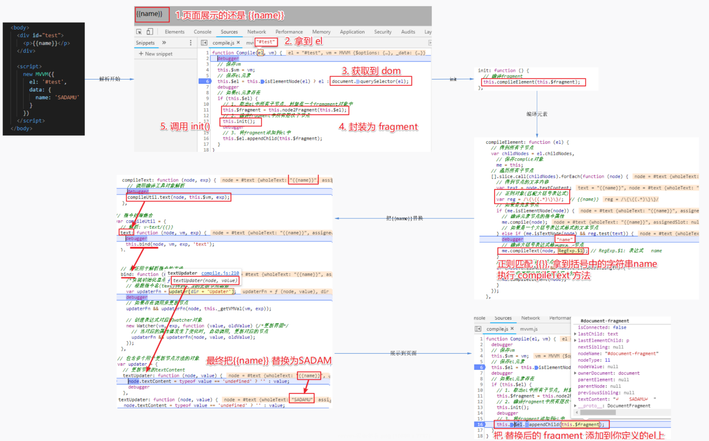

# 模版解析

## 模板解析的基本流程

- 将 `el` 的所有子节点取出, 添加到一个新建的文档 `fragment` 对象中
- 对 `fragment` 中的所有层次子节点递归进行编译解析处理
  - 对大括号表达式文本节点进行解析
  - 对元素节点的指令属性进行解析
  - 事件指令解析
  - 一般指令解析
  - 将解析后的 `fragment` 添加到 `el` 中显示

## 模板解析(1): 大括号表达式解析

1. 根据正则对象得到匹配出的表达式字符串: `子匹配/RegExp.$1` `name`
2. 从 `data` 中取出表达式对应的属性值
3. 将属性值设置为文本节点的 `textContent`

## 模板解析(1): 大括号表达式解析 - 流程分析

这里先介绍初始化展示的, 后面在其他地方再介绍数据改变再解析.

```html
<body>
  <div id="test">
    <p>{{name}}</p>
  </div>

  <script>
    new MVVM({
      el: '#test',
      data: {
        name: 'SADAMU'
      }
    })
  </script>
</body>
```



## 模板解析(2): 事件指令解析

1. 从指令名中取出`事件名`
2. 根据指令的值(表达式)从 `methods` 中得到对应的事件处理函数对象
3. 给当前元素节点绑定指定事件名和回调函数的 `dom 事件监听`
4. 指令解析完后, `移除此指令属性`

## 模板解析(3): 一般指令解析

1. 得到指令名和指令值(表达式) `text/html/class msg/myClass`
2. 从 `data` 中根据表达式得到对应的值
3. 根据指令名确定需要操作元素节点的什么属

- `v-text`---`textContent` 属性
- `v-html`---`innerHTML` 属性
- `v-class`--`className` 属性

4. 将得到的表达式的值设置到对应的属性上
5. `移除元素的指令属性`

## 模拟模版解析实现

- `compile.js`

```js
function Compile(el, vm) {
  // 保存vm
  this.$vm = vm;
  // 保存el元素
  this.$el = this.isElementNode(el) ? el : document.querySelector(el);
  // 如果el元素存在
  if (this.$el) {
    // 1. 取出el中所有子节点, 封装在一个framgment对象中
    this.$fragment = this.node2Fragment(this.$el);
    // 2. 编译fragment中所有层次子节点
    this.init();
    // 3. 将fragment添加到el中
    this.$el.appendChild(this.$fragment);
  }
}

Compile.prototype = {
  node2Fragment: function (el) {
    var fragment = document.createDocumentFragment(),
      child;

    // 将原生节点拷贝到fragment
    while (child = el.firstChild) {
      fragment.appendChild(child);
    }

    return fragment;
  },

  init: function () {
    // 编译fragment
    this.compileElement(this.$fragment);
  },

  compileElement: function (el) {
    // 得到所有子节点
    var childNodes = el.childNodes,
      // 保存compile对象
      me = this;
    // 遍历所有子节点
    [].slice.call(childNodes).forEach(function (node) {
      // 得到节点的文本内容
      var text = node.textContent;
      // 正则对象(匹配大括号表达式)
      var reg = /\{\{(.*)\}\}/;  // {{name}}
      // 如果是元素节点
      if (me.isElementNode(node)) {
        // 编译元素节点的指令属性
        me.compile(node);
        // 如果是一个大括号表达式格式的文本节点
      } else if (me.isTextNode(node) && reg.test(text)) {
        // 编译大括号表达式格式的文本节点
        me.compileText(node, RegExp.$1); // RegExp.$1: 表达式   name
      }
      // 如果子节点还有子节点
      if (node.childNodes && node.childNodes.length) {
        // 递归调用实现所有层次节点的编译
        me.compileElement(node);
      }
    });
  },

  compile: function (node) {
    // 得到所有标签属性节点
    var nodeAttrs = node.attributes,
      me = this;
    // 遍历所有属性
    [].slice.call(nodeAttrs).forEach(function (attr) {
      // 得到属性名: v-on:click
      var attrName = attr.name;
      // 判断是否是指令属性
      if (me.isDirective(attrName)) {
        // 得到表达式(属性值): test
        var exp = attr.value;
        // 得到指令名: on:click
        var dir = attrName.substring(2);
        // 事件指令
        if (me.isEventDirective(dir)) {
          // 解析事件指令
          compileUtil.eventHandler(node, me.$vm, exp, dir);
        // 普通指令
        } else {
          // 解析普通指令
          compileUtil[dir] && compileUtil[dir](node, me.$vm, exp);
        }

        // 移除指令属性
        node.removeAttribute(attrName);
      }
    });
  },

  compileText: function (node, exp) {
    // 调用编译工具对象解析
    compileUtil.text(node, this.$vm, exp);
  },

  isDirective: function (attr) {
    return attr.indexOf('v-') == 0;
  },

  isEventDirective: function (dir) {
    return dir.indexOf('on') === 0;
  },

  isElementNode: function (node) {
    return node.nodeType == 1;
  },

  isTextNode: function (node) {
    return node.nodeType == 3;
  }
};

// 指令处理集合
var compileUtil = {
  // 解析: v-text/{{}}
  text: function (node, vm, exp) {
    this.bind(node, vm, exp, 'text');
  },
  // 解析: v-html
  html: function (node, vm, exp) {
    this.bind(node, vm, exp, 'html');
  },

  // 解析: v-model
  model: function (node, vm, exp) {
    this.bind(node, vm, exp, 'model');

    var me = this,
      val = this._getVMVal(vm, exp);
    node.addEventListener('input', function (e) {
      var newValue = e.target.value;
      if (val === newValue) {
        return;
      }

      me._setVMVal(vm, exp, newValue);
      val = newValue;
    });
  },

  // 解析: v-class
  class: function (node, vm, exp) {
    this.bind(node, vm, exp, 'class');
  },

  // 真正用于解析指令的方法
  bind: function (node, vm, exp, dir) {
    /*实现初始化显示*/
    // 根据指令名(text)得到对应的更新节点函数
    var updaterFn = updater[dir + 'Updater'];
    // 如果存在调用来更新节点
    updaterFn && updaterFn(node, this._getVMVal(vm, exp));

    // 创建表达式对应的watcher对象
    new Watcher(vm, exp, function (value, oldValue) {/*更新界面*/
      // 当对应的属性值发生了变化时, 自动调用, 更新对应的节点
      updaterFn && updaterFn(node, value, oldValue);
    });
  },

  // 事件处理
  eventHandler: function (node, vm, exp, dir) {
    // 得到事件名/类型: click
    var eventType = dir.split(':')[1],
      // 根据表达式得到事件处理函数(从methods中): test(){}
      fn = vm.$options.methods && vm.$options.methods[exp];
    // 如果都存在
    if (eventType && fn) {
      // 绑定指定事件名和回调函数的DOM事件监听, 将回调函数中的this强制绑定为vm
      node.addEventListener(eventType, fn.bind(vm), false);
    }
  },

  // 得到表达式对应的value
  _getVMVal: function (vm, exp) {
    var val = vm._data;
    exp = exp.split('.');
    exp.forEach(function (k) {
      val = val[k];
    });
    return val;
  },

  _setVMVal: function (vm, exp, value) {
    var val = vm._data;
    exp = exp.split('.');
    exp.forEach(function (k, i) {
      // 非最后一个key，更新val的值
      if (i < exp.length - 1) {
        val = val[k];
      } else {
        val[k] = value;
      }
    });
  }
};

// 包含多个用于更新节点方法的对象
var updater = {
  // 更新节点的textContent
  textUpdater: function (node, value) {
    node.textContent = typeof value == 'undefined' ? '' : value;
  },

  // 更新节点的innerHTML
  htmlUpdater: function (node, value) {
    node.innerHTML = typeof value == 'undefined' ? '' : value;
  },

  // 更新节点的className
  classUpdater: function (node, value, oldValue) {
    var className = node.className;
    className = className.replace(oldValue, '').replace(/\s$/, '');

    var space = className && String(value) ? ' ' : '';

    node.className = className + space + value;
  },

  // 更新节点的value
  modelUpdater: function (node, value, oldValue) {
    node.value = typeof value == 'undefined' ? '' : value;
  }
};
```