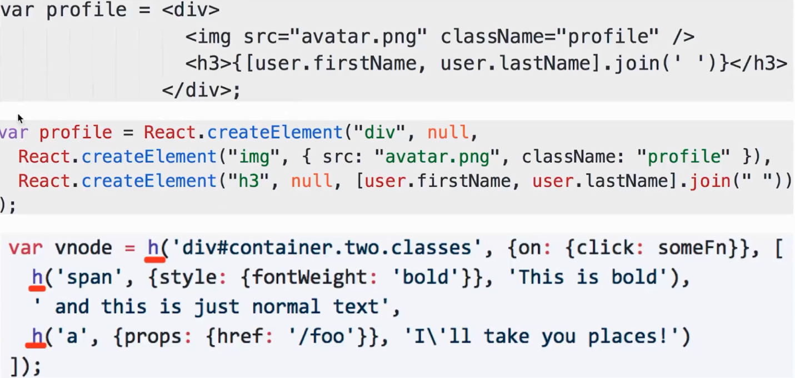
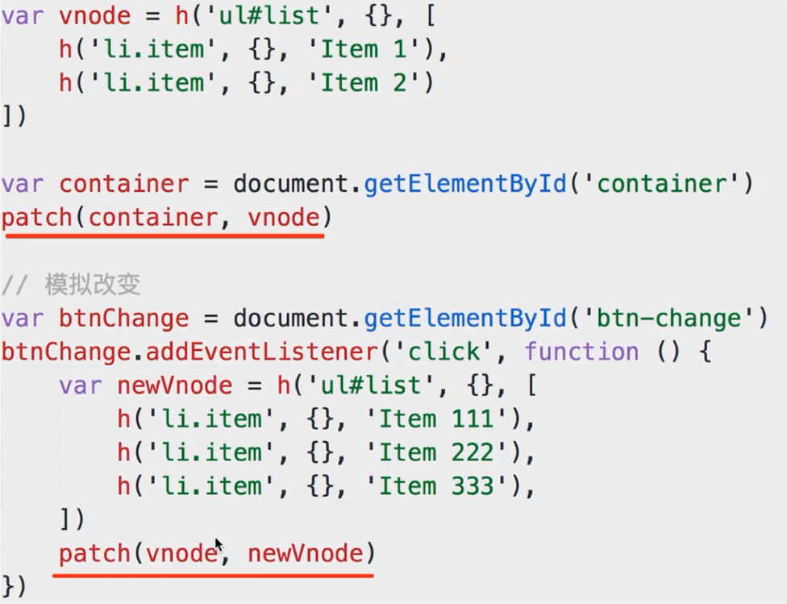
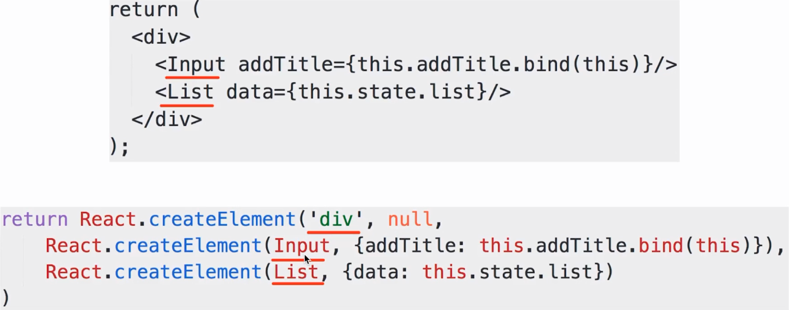

# JSX 和 vdom

### 为何需要 vdom

`vdom` 是 `React` 初次推广开来的, 结合 `JSX`

`JSX` 就是模版, 最终要渲染成 `html`

初次渲染 + 修改 `state` 后的 `re-render`

正好符合 `vdom` 的应用场景


### React.createElement 和 h




### 何时 pacth

- 初次渲染 - `ReactDOM.render(<App/>, container)`

- 会触发 `patch(container, vnode)`

- `re-render` - `setState`

- 会触发 `patch(vnode, newVnode)`



### 自定义组件的解析

- `'div'` - 直接渲染 `<div>` 即可, `vdom` 可以做到

- `Input` 和 `List`, 是自定义组件(`class`), `vdom` 默认不认识

- 因此 `Input` 和 `List` 定义的时候必须声明 `render` 函数

- 根据 `props` 初始化实例, 然后执行实例的 `render` 函数

- `render` 函数返回的还是 `vnode` 对象

```js
import Input from './input/index.js'
import List from './list/index.js'

function render() {
  return (
    <div>
      <p>this is demo</p>
      <Input addTitle={this.addTitle.bind(this)}/>
      <List data={this.state.list}/>
    </div>
  )
}
```

执行 `babel --plugins transform-react-jsx demo.jsx` 后输出如下:

```js
import Input from './input/index.js';
import List from './list/index.js';

function render() {
  return React.createElement(
    'div',
    null,
    React.createElement(
      'p',
      null,
      'this is demo'
    ),
    React.createElement(Input, { addTitle: this.addTitle.bind(this) }),
    React.createElement(List, { data: this.state.list })
  );
}
```

